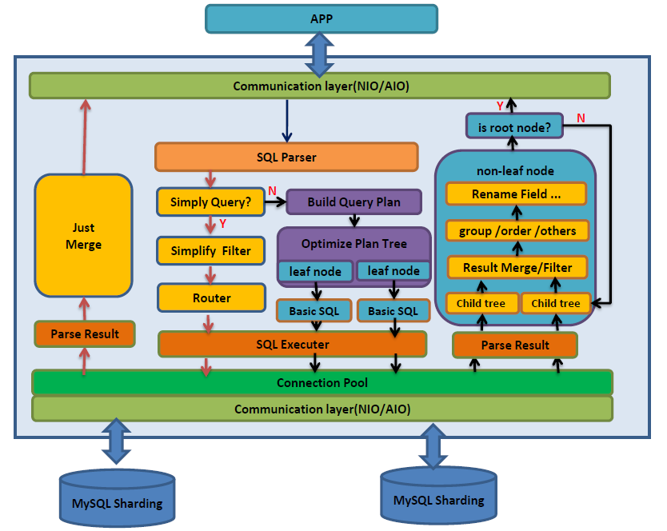

## 0.1 dble 简介与整体架构
### 0.1.1 dble简介
dble是[上海爱可生信息技术股份有限公司](http://www.actionsky.com/)基于mysql的高可扩展性的分布式中间件，存在以下几个优势特性：

+ **数据水平拆分** 随着业务的发展，您可以使用dble来替换原始的单个MySQL实例。

+ **兼容Mysql** 与MySQL协议兼容，在大多数情况下，您可以用它替换MySQL来为你的应用程序提供新的存储，而无需更改任何代码。

+ **高可用性** dble服务器可以用作集群，业务不会受到单节点故障的影响。

+ **SQL支持** 支持SQL 92标准和MySQL方言。我们支持复杂的SQL查询，如group by，order by，distinct，join，union，sub-query等等。

+ **复杂查询优化** 优化复杂查询，包括但不限于全局表连接分片表，ER关系表，子查询，简化选择项等。

+ **分布式事务支持** 使用两阶段提交的分布式事务。您可以为了性能选择普通模式或者为了数据安全采用XA模式。当然，XA模式依赖于MySQL-5.7的XA Transaction，MySQL节点的高可用性和数据的可靠性。

###  0.1.2 dble由来
 
 + dble 是基于开源项目MyCat的，在此对于MyCat的贡献者们致以由衷的感谢。
 + 对我们来说，专注于MySQL是一个更好的选择。 所以我们取消了对其他数据库的支持，对兼容性，复杂查询和分布式事务的行为进行了深入的改进/优化。 当然，还修复了一些bugs。详情可见[dble对MyCat做的改进](0.2_dble_enhance_MyCat.md)
 
###  0.1.3 dble内部架构

  
