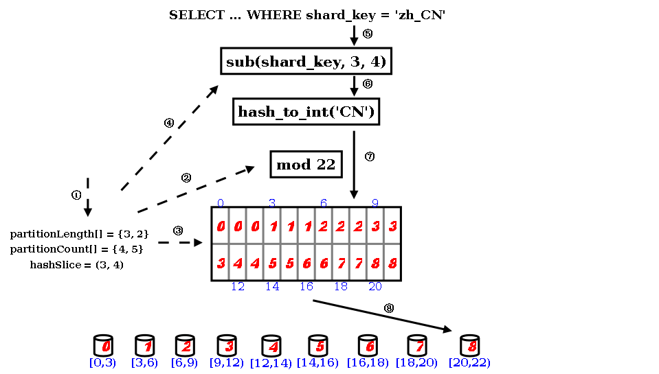

## 1.5 sharding.xml 配置

### 1.5.1 整体XML结构

+ schema (虚拟schema，可配置多个)  
+ shardingNode (虚拟分片，可配置多个)
+ function (拆分算法，可配置多个) 
	

### 1.5.2 schema

### 1.5.3 schema配置

+ schema  

<table>
<tr>
<th >配置名称</th>
<th >配置内容</th>
<th >可选项/默认值</th>
<th >详细描述</th>
</tr>
<tr>
<td >name</td>
<td >schema名称</td>
<td ></td>
<td >schema的唯一标识，不允许重复</td>
</tr>
<tr>
<td >shardingNode</td>
<td >涉及的数据点</td>
<td >缺省无，最多一个</td>
<td >未配置则只加载xml中的table子节点;<br/>若配置后：1.table子节点的配置会覆盖schema中的配置，2.物理schema下存在的,并且不在配置内的table被视为single node table</td>
</tr>
<tr>
<td >sqlMaxLimit</td>
<td >最大返回结果集限制</td>
<td >默认-1</td>
<td >当且仅当查询的SQL符合下列条件时，产生效果<br/>1 整个查询属于单表查询，包括简单查询以及(order/group/聚合函数)
<br/>2 表格对应的shema需要有对应的sqlMaxLimit配置<br/></td>
</tr>
<tr>
<td >shardingTable</td>
<td >子属性，拆分表，详见shardingTable配置选项</td>
<td >可配置多个</td>
<td >每个表格的详细配置信息</td>
</tr>
<tr>
<td >globalTable</td>
<td >子属性，全局表，详见globalTable配置选项</td>
<td >可配置多个</td>
<td >每个表格的详细配置信息</td>
</tr>
<tr>
<td >singleTable</td>
<td >子属性，单节点表，详见singleTable配置选项</td>
<td >可配置多个</td>
<td >每个表格的详细配置信息</td>
</tr>
</table>
  

+ shardingTable  

<table>
<tr>
<th >配置名称</th>
<th >配置内容</th>
<th >可选项/默认值</th>
<th >详细描述</th>
</tr>
<tr>
<td >name</td>
<td >表格名称</td>
<td >必须项</td>
<td >表名，可以配置多个使用’,’分割</td>
</tr>
<tr>
<td >shardingNode</td>
<td >表格涉及的数据节点</td>
<td >必须项</td>
<td >可使用通配符：<br>xxx$n0-n1<br>此种格式指定xxxn0, ..., xxxnm, ..., xxxn1作为该表的数据节点。<br>dn$1-6 等价于 dn1,dn2, dn3,dn4,dn5,dn6</td>
</tr>
<tr>
<td >shardingColumn</td>
<td >拆分列名</td>
<td >必须项</td>
<td >标记表格的拆分列名</td>
</tr>

<tr>
<td >function</td>
<td >使用的拆分规则</td>
<td >必须项</td>
<td >引用function节中的拆分规则名称那个</td>
</tr>
<tr>
<td >incrementColumn</td>
<td >表格自增列</td>
<td >可选项，默认无</td>
<td >指定表格自增列，指定自增列的表格会使用全局序列</td>
</tr>
<tr>
<td >sqlMaxLimit</td>
<td >最大返回结果集限制</td>
<td >可选项，继承父级schema的sqlMaxLimit</td>
<td >与schemas 中的对应配置效果相同，但是覆盖schema中配置</td>
</tr>
<td >sqlRequiredSharding</td>
<td >是否要求sql中包含拆分列条件</td>
<td >默认false</td>
<td >如果是true，sql中未包含拆分列条件，返回报错</td>
</tr>
<tr>
<td >childTable</td>
<td >关联子表信息，详见childTable选项</td>
<td >可配置多个</td>
<td >路由是通过父子关系进行ER关联</td>
</tr>
</table>

+ childTable  

<table>
<tr>
<th >配置名称</th>
<th >配置内容</th>
<th >可选项/默认值</th>
<th >详细描述</th>
</tr>
<tr>
<td >name</td>
<td >表格名称</td>
<td >必需项</td>
<td >表名，可以配置多个使用’,’分割</td>
</tr>

<tr>
<td >joinColumn</td>
<td >指定同父表进行join操作时的join键</td>
<td >必需项</td>
<td >子表和父表关联的字段</td>
</tr>

<tr>
<td >parentColumn</td>
<td >指定进行join操作时父表中的join键</td>
<td >必需项</td>
<td >如果父表为非子表，在父表中该字段必须与其拆分规则/拆分键有对等关系。</td>
</tr>

<tr>
<td >incrementColumn</td>
<td >表格自增列</td>
<td >默认空</td>
<td >显式指定表格自增列</td>
</tr>
<tr>
<td >sqlMaxLimit</td>
<td >最大返回结果集限制</td>
<td >可选项，继承父级schema的sqlMaxLimit</td>
<td >与schemas 中的对应配置效果相同，但是覆盖schema中配置</td>
</tr>
<tr>
<td >childTable</td>
<td >关联子表信息，详见childTable选项</td>
<td >可配置多个</td>
<td >路由是通过父子关系进行ER关联</td>
</tr>
</table>


+ globalTable  

<table>
<tr>
<th >配置名称</th>
<th >配置内容</th>
<th >可选项/默认值</th>
<th >详细描述</th>
</tr>
<tr>
<td >name</td>
<td >表格名称</td>
<td >必须项</td>
<td >表名，可以配置多个使用’,’分割</td>
</tr>
<tr>
<td >shardingNode</td>
<td >表格涉及的数据节点</td>
<td >必须项</td>
<td >可使用通配符：<br>xxx$n0-n1<br>此种格式指定xxxn0, ..., xxxnm, ..., xxxn1作为该表的数据节点。<br>dn$1-6 等价于 dn1,dn2, dn3,dn4,dn5,dn6</td>
</tr>
 <tr>
<td >sqlMaxLimit</td>
<td >最大返回结果集限制</td>
<td >可选项，继承父级schema的sqlMaxLimit</td>
<td >与schemas 中的对应配置效果相同，但是覆盖schema中配置</td>
</tr>
<tr>
<tr>
<td >checkClass</td>
<td >全局表检查类</td>
<td >可选项</td>
<td >全局表检查自定义类名或者是缩写<br>dble自带CHECKSUM和COUNT两种默认实现</td>
</tr>
<tr>
<td >cron</td>
<td >全局表一致性检查周期</td>
<td >0 0 0 * * ?</td>
<td >quartz定时任务时间设置<br>详见：http://www.quartz-scheduler.org/api/2.4.0-SNAPSHOT/org/quartz/CronScheduleBuilder.html</td>
</tr>
</table>


+ singleTable  

<table>
<tr>
<th >配置名称</th>
<th >配置内容</th>
<th >可选项/默认值</th>
<th >详细描述</th>
</tr>
<tr>
<td >name</td>
<td >表格名称</td>
<td >必须项</td>
<td >表名，可以配置多个使用’,’分割</td>
</tr>

<tr>
<td >shardingNode</td>
<td >表格涉及的数据节点</td>
<td >必需项</td>
<td >唯一的shardingNode结点，配置多个会报错</td>
</tr>
 <tr>
<td >sqlMaxLimit</td>
<td >最大返回结果集限制</td>
<td >可选项，继承父级schema的sqlMaxLimit</td>
<td >与schemas 中的对应配置效果相同，但是覆盖schema中配置</td>
</tr>
</table>


### 1.5.4 shardingNode配置 


+ shardingNode  

<table>
<tr>
<th >配置名称</th>
<th >配置内容&amp;示例</th>
<th >详细描述</th>
</tr>
<tr>
<td >name</td>
<td >数据节点名称，唯一，例如"dn,dn&#36;0-5"</td>
<td >作为数据节点的标识以及键,节点个数的计算方法为：从值出发,以‘,’（逗号）分隔字符串,如果其中有连续几项拥有相同的字符串前缀X(不能为空)并且后续其他几位为连续的数字时（比如0到5）,可以以"X&#36;0-5"来省略表示,个数为：以逗号分隔的字符串个数加上包含$的连续个数。name的个数必须等于database与dbGroup的个数之积。</td>
</tr>
<tr>
<td >database</td>
<td >shardingNode对应的存在于mysql物理实例中的schema,可以配置单个或多个使用，例如"db,db&#36;0-5"</td>
<td >所使用的详细数据库节点,节点个数的计算方法为：从值出发,以‘,’（逗号）分隔字符串,如果其中有连续几项拥有相同的字符串前缀X(不能为空)并且后续其他几位为连续的数字时（比如0到5）,可以以"X&#36;0-5"来省略表示,个数为：以逗号分隔的字符串个数加上包含$的连续个数。</td>
</tr>
<tr>
<td >dbGroup</td>
<td >shardingNode对应的数据库组，参考db.xml中的dbGroup名称,可以配置单个或多个使用,例如"dh,dh&#36;0-5"</td>
<td >用于关联对应的Host节点,节点个数的计算方法为：从值出发，以‘,’（逗号）分隔字符串，如果其中有连续几项拥有相同的字符串前缀X(不能为空)并且后续其他几位为连续的数字时（比如0到5）,可以以"X&#36;0-5"来省略表示,个数为：以逗号分隔的字符串个数加上包含$的连续个数。</td>
</tr>
</table>

例如：   

```
<shardingNode name="dn1" dbGroup="localhost1" database="db1" />
```

name, dbGroup, database均可用如下格式在单个配置中配置多个节点：
                                  xxx$n0-n1, xxx, 
这种格式的意义为：xxxn0，... , xxxnm， ... ,xxxn1, xxx, 其中 

```
n0 < nm < n1。
```

例如：
配置 

```  
<shardingNode name="dn1$0-19" dbGroup="localhost1$0-9" database="db1$0-1" />
```  

等同于:

```  
<shardingNode name="dn10" dbGroup="localhost10" database="db10" />
<shardingNode name="dn11" dbGroup="localhost10" database="db11" />
<shardingNode name="dn12" dbGroup="localhost11" database="db10" />
<shardingNode name="dn13" dbGroup="localhost11" database="db11" />
   ...
<shardingNode name="dn119" dbGroup="localhost19" database="db11" />
``` 


注意：如果是使用通配符的配置，那么shardingNode(name)的通配符展开个数必须等于dbGroup通配符展开个数与database通配符展开个数之积,上例中,name的个数为20,dbGroup的个数为10,database的个数为2;
又例如  
```
<shardingNode name="dn,dn1$0-19,dnx" dbGroup="localhost,localhost1$0-9" database="db1$0-1" />
```
中,name的个数为22,dbGroup的个数为11,database的个数为2。

**注意**：若出现两个不同的shardingNode拥有同样的database以及dbGroup，在配置检查的时候会报错(包括从通配符批量生成的shardingNode)


### 1.5.5 function配置 

拆分算法定义有如下形式：


name: 定义分区算法名， 在分区规则定义中被引用。
class：指定分区算法实现类。
每一种分区算法要求的参数个数， 类型各不相同，property name部分用于指定相应分区算法的参数。这部分请参考各分区算法描述。

+ function


<table >
<tr>
<th >配置名称</th>
<th >配置内容</th>
<th >说明</th>
</tr>
<tr>
<td >name</td>
<td >函数的名称</td>
<td >在分区规则定义中被引用</td>
</tr>
<tr>
<td >class</td>
<td >拆分算法</td>
<td >只能是Enum,NumberRange,Hash,StringHash,Date,PatternRange,jumpStringHash之一</td>
</tr>
<tr>
<td >property</td>
<td >根据具体的function代码示例的属性进行配置参数</td>
<td >可以配置多个属性</td>
</tr>
</table>

举例：

```
<function name="rang-long""  class="com.actiontech.dble.route.function.AutoPartitionByLong">
         <property name="mapFile">auto-sharding-long.txt</property>
         ...
</function>
```

支持的分区算法：
目前，已支持的分区算法有: hash, stringhash, enum, numberrange, patternrange, date，jumpstringhash.

#### 1.5.5.1.hash分区算法

function的 class属性设置为“hash”或者“com.actiontech.dble.route.function.PartitionByLong"的分区规则应用该算法。具体配置如下：

```
<function name="hashLong" class="hash">
      <property name="partitionCount">C1[,C2, ...Cn]</property>
      <property name="partitionLength">L1[,L2, ...Ln]</property>
</function>
```

**partitionCount**:指定分区的区间数， 具体为 C1 [+C2 + ... + Cn].

**partitionLength**:指定各区间长度， 具体区间划分为 [0, L1),   [L1, 2*L1),  ...,  [(C1-1)*L1, C1*L1),   [C1*L1, C1*L1+L2),  [C1*L1+L2, C1*L1+2*L2), ... 其中，每一个区间对应一个数据节点。


<br/>

例如，配置F1：
```
<property name="partitionCount">2,3</property>
<property name="partitionLength">100,50</property>
```

将划分如下的分区：<br>
[0 , 100)
[100, 200)
[200, 250)
[250, 300)
[300, 350)

<br/>

再如,配置F2:

```
<property name="partitionCount">2</property>
<property name="partitionLength">1000</property>
```

将划分如下的分区：
[0 , 1000)
[1000, 2000)


<br/>

根据具体配置， 模的基数M有如下计算公式：C1*L1 + ... + Cn * Ln.
上面的例子中F1 的M值为350，F2的M值为2000。
在进行分片查找时， 将分区字段key和M值进行求模运算：
       value = key mod M
得到的value值再从区间分布中找到自己数据节点的序号。
例如，当配置为F1,key =805 时,value = 105,那么从5个区间内发现对应的数据节点的序号为1(从0开始)。

结点的个数N 记为  C1 [+C2 + ... + Cn].
上面的例子中F1 的N值为5，F2的N值为2。
<br/>

注意事项：
   1. M不能大于2880。2880的原因是这样的:2, 3, 4, 5, 6, 8, 9, 10, 12, 15, 16, 18, 20, 24, 30, 32, 36, 40, 45, 48, 60, 64, 72, 80, 90, 96, 120, 144, 160, 180, 192, 240, 288, 320, 360, 480, 576, 720, 960, 1440是2880的约数,这样预分片扩容方便。
   2. N必须要等于逻辑表的shardingNode属性指定的shardingNode数量之和，如shardingNode="dn1,dn2,dn3,dn4"中，N必须等于4。
   3. Cn和Ln的个数必须相等。
   4. 分区字段必须为整型字段，如果是其他类型，要求值可转化为数字。
   5. 当partitionLength为1时，hash分区算法退化为求模算法，M及N均为partitionCount的值。
   6. NULL作为分片列的值的时候数据的结果恒落在0号节点（第一个节点上）

#### 1.5.5.2.stringhash分区算法
class属性设置为“stringhash”或者“com.actiontech.dble.route.function.PartitionByString"的分区规则应用该算法。具体配置如下：
```
<function name="hashSting" class="stringhash">
       <property name="partitionCount">C1[,C2, ...Cn]</property>
       <property name="partitionLength">L1[,L2, ...Ln]</property>
       <property name="hashSlice">l:r</property>
</function>
```

**partitionCount，partitionLength**的具体意义参看hash分区算法。
**hashSlice**：指定参与hash值计算的key的子串。字符串从0开始索引计数。

<br/>

子串截取有如下计算步骤和格式：

步骤1.  子串索引区间确定

<table >
<tr>
<th class="tg-031e">格式</th>
<th >条件</th>
<th >区间</th>
</tr>
<tr>
<td class="tg-031e">n</td>
<td >n&gt;=0</td>
<td >(0,n)</td>
</tr>
<tr>
<td class="tg-031e">n</td>
<td >n&lt;0</td>
<td >(n,0)</td>
</tr>
<tr>
<td >:r</td>
<td ></td>
<td >(0,r)</td>
</tr>
<tr>
<td >l:</td>
<td ></td>
<td >(l,0)</td>
</tr>
<tr>
<td >:</td>
<td ></td>
<td >(0:0)</td>
</tr>
<tr>
<td >l:r</td>
<td ></td>
<td >(l, r)</td>
</tr>
</table>


步骤2.  子串索引区间修订

a.左边界l修订

<table >
<tr>
<th  colspan="3">第一次修订</th>
<th  colspan="2">第二次修订</th>
</tr>
<tr>
<td >修订前</td>
<td >条件</td>
<td >修订后</td>
<td >条件</td>
<td >修订后</td>
</tr>
<tr>
<td >l</td>
<td >l&gt;=0</td>
<td >l</td>
<td ></td>
<td >l</td>
</tr>
<tr>
<td >l</td>
<td >l&lt;0</td>
<td >l=l+length</td>
<td >l&lt;0</td>
<td >l=0</td>
</tr>
</table>

b.右边界r修订

<table >
<tr>
<th  colspan="3">第一次修订</th>
<th  colspan="2">第二次修订</th>
</tr>
<tr>
<td >修订前</td>
<td >条件</td>
<td >修订后</td>
<td >条件</td>
<td >修订后</td>
</tr>
<tr>
<td >r</td>
<td >r&gt;0</td>
<td >r</td>
<td >r&gt;length</td>
<td >r=length</td>
</tr>
<tr>
<td >r</td>
<td >r&lt;=0</td>
<td >r=r+length</td>
<td ></td>
<td >r</td>
</tr>
</table>

*注：length是分区字段实际串的长度.*


步骤3. 结果确定

<table >
<tr>
<th >条件</th>
<th >结果子串</th>
<th >hash值</th>
</tr>
<tr>
<td >l&lt;r</td>
<td >索引在[l, r)范围的子串</td>
<td >通过子串计算的hash值</td>
</tr>
<tr>
<td >l&gt;=r</td>
<td >空字串</td>
<td >0</td>
</tr>
</table>


这个子串截取算法只是看起来比较复杂。用简洁但不太准确的语言可描述为：区间边界为负值的，从分区字段串尾部开始计数；区间边界为正值的，从分区字段串首部开始计数；然后做一些纠错处理。

该算法与hash分区算法类似，但针对的分区字段为字符串类型。在进行分片查找时， 要先对分区字段求hash值，然后将得到的hash值做hash分区算法的分区查找运算。

注意事项：
1. 该分区算法和hash分区算法有同样的限制(注意事项3除外）
2. 分区字段为字符串类型。

算法解析：  
stringhash 按照用户定义的起点和终点去截取分片索引字段中的部分字符，根据当中每个字符的二进制 unicode 值换算出一个长整型数值，然后就直接调用内置 hash 算法求解分片路由：先求模得到逻辑分片号，再根据逻辑分片号直接映射到物理分片。

  

* 用户需要定义 partitionLength[] 和 partitionCount[] 两个数组和 hashSlice 二元组。
* 在 DBLE 的启动阶段，点乘两个数组得到模数，也是逻辑分片的数量。
* 并且根据两个数组的叉乘，得到各个逻辑分片到物理分片的映射表（物理分片数量由 partitionCount[] 数组的元素值之和）。
* 此外根据 hashSlice 二元组，约定把分片索引值中的第 4 字符到第 5 字符（字符串以 0 开始编号，编号 3 到编号 4 等于第 4 字符到第 5 字符）字符串用于 “字符串->整型”的转换。
* 在 DBLE 的运行过程中，用户访问使用这个算法的表时，WHERE 子句中的分片索引值会被提取出来，取当中的第 4 个字符到第 5 字符，送入下一步。
* 设置一个初始值为 0 的累计值，逐个取字符，把累计值乘以 31，再把这个字符的 unicode 值当成长整型加入到累计值中，如此类推直至处理完截取出来的所有字符，此时的累计值就能够代表用户的分片索引值，完成了 “字符串->整型” 的转换。
* 对上一步的累计值进行求模，得到逻辑分片号。
* 再根据逻辑分片号，查映射表，直接得到物理分片号。

#### 1.5.5.3.enum分区算法
class属性设置为“enum”或者“com.actiontech.dble.route.function.PartitionByFileMap"的分区规则应用该算法。具体配置如下：

```
<function name="enum" class="enum">
       <property name="mapFile">partition.txt</property>
       <property name="defaultNode">0</property>
       <property name="type">0</property>
</function>
```

<br/>

**mapFile**:指定配置文件名。其格式将在下面做详细说明。
**defaultNode**：指定默认节点号。默认值为-1， 不指定默认节点。
**type**：指定配置文件中key的类型。0：整型； 其它：字符串。

<br/>

配置文件格式如下：
a. type值为0时，
```
#comment //comment this line will be skiped
int1=node0
int2=node1
...
```

b. type值为非0时，
```
#comment //comment this line will be skiped
string1=node0
string2=node1
...
```

在进行分片查找时，分片字段的枚举值对应的数据节点既是目的节点。如果不能在配置映射中找到枚举值对应的数据节点：如果配置了defaultNode，则defaultNode既是目的数据节点， 否则出错。


<br/>

注意事项：
   1. 不包含“=”的行将被跳过.
   2. nodex为数据节点索引号。
   3. 重复的枚举值的分区数据节点以最后一个配置为准。
   4. 分片字段为该枚举类型。
   5. 分片字段为NULL时，数据落在defaultNode节点上，若此时defaultNode没有配置，则会报错;当真实存在于mysql的字段值为not null的时候,报错 "Sharding column can't be null when the table in MySQL column is not null"


#### 1.5.5.4.numberrange分区算法
class属性设置为“numberrange”或者“com.actiontech.dble.route.function.AutoPartitionByLong"的分区规则应用该算法。具体配置如下：

```
<function name="rangeLong" class="numberrange">
       <property name="mapFile">partition.txt</property>
       <property name="defaultNode">0</property>
</function>
```

**mapFile**:指定配置文件名。其格式将在下面做详细说明。
**defaultNode**：指定默认节点号。默认值为-1， 不指定默认节点。

配置文件格式如下：
\#comment
//comment
this line will be skiped
start1-end1=node1
start2-end2=node2
...

该分区算法相当于定义了区间序列 [start1, end1], [start2, end2], ...   每一个区间对应一个数据节点。
在进行分片查找时，分片字段的值落在的区间对应的数据节点即是目的节点。
如果不能在配置映射中找到分片字段的值所落的区间时，分两种情况：1.配置了defaultNode，则defaultNode是目的数据节点；2.没配defaultNode，出错。
注意事项：
   1. 不包含“=”的行将被跳过。
   2. nodex为数据节点索引号。
   3. 如果区间存在重合， 在对重合部分的分片字段值进行分片查找时在配置文件中最先定义的区间对应的数据节点为目的节点。
   4. 分片字段为整型。
   5. 分片字段为NULL时，数据落在defaultNode节点上，若此时defaultNode没有配置，则会报错;当真实存在于mysql的字段值为not null的时候,报错 "Sharding column can't be null when the table in MySQL column is not null"


#### 1.5.5.5.patternrange分区算法
class属性设置为“patternrange”或者“com.actiontech.dble.route.function.PartitionByPattern"的分区规则应用该算法。具体配置如下：

```
<function name="pattern" class="patternrange">
       <property name="mapFile">partition.txt</property>
       <property name="patternValue">1024</property>
       <property name="defaultNode">0</property>
</function>
```
**mapFile**:指定配置文件名。其格式将在下面做详细说明。
**patternValue**:指定模值， 默认为1024。
**defaultNode**：指定默认节点号。默认值为-1， 不指定默认节点。

配置文件格式如下：
\#comment
//comment
this line will be skiped
start1-end1=node1
start1-end2=node2
...


<br/>

该分区算法类似于numberrange分区算法。但在进行分片查找时先对分片字段值进行模patternValue运算，然后将得到的模数进行等同于numberrange分区算法的分区查找。
注意事项：
   1. 不包含“=”的行将被跳过。
   2. nodex为数据节点索引号。
   3. 如果区间存在重合， 在对重合部分的分片字段值进行分片查找时在配置文件中最先定义的区间对应的数据节点为目的节点。
   4. 分片字段的内容必须可以转化为整数。如果不能转化为整数：如果配置了defaultNode， 目的数据节点为defaultNode； 否则， 出错。
   5. 分片字段为NULL时，数据落在defaultNode节点上，若此时defaultNode没有配置，则会报错;当真实存在于mysql的字段值为not null的时候,报错 "Sharding column can't be null when the table in MySQL column is not null"

#### 1.5.5.6.date分区算法
class属性设置为“date”或者“com.actiontech.dble.route.function.PartitionByDate"的分区规则应用该算法。具体配置如下：
```
<function name="partbydate" class="date">
       <property name="dateFormat">yyyy-MM-dd</property>
       <property name="sBeginDate">2015-01-01</property>
       [<property name="sEndDate">2015-01-31</property>]
       <property name="sPartionDay">10</property>
       <property name="defaultNode">0</property>
</function>
```

<br/>

**dateFormat**:指定日期的格式。
**sBeginDate**：指定日期的开始时间。
**sEndDate**：指定日期的结束时间。该性质可以不配置或配置为空("")。
**sPartionDay**：指定分区的间隔，单位是天。
**defaultNode**：指定默认节点号。默认值为-1， 不指定默认节点。

<br/>

该算法有两种工作模式：
**模式1**：不配置sEndDate或者将sEndDate配置为""
在这种模式下， 该算法将时间以sBeginDate为开始， 以sPartionDay为间隔，进行区间划分， 每个区间对应一个数据节点。
在进行区间查找时，分区字段值落在的区间对应的数据节点即是目的数据节点。如果分区字段值小于sBeginDate：如果配置了defaultNode，则数据会被路由至defaultNode；如果没配置defaultNode,则会报错。
**模式2**：配置sEndDate且不为""
在这种模式下， 该算法将时间以sBeginDate为开始， 以sPartionDay为间隔，以sEndDate为终点， 进行区间划分，划分为N个区间， 每个区间对应一个数据节点。
在进行区间查找时： 如果分区字段值小于等于sEndDate，则计算过程和结果等同于模式1。如果分区字段值大sEndDate，则分片查找公式为：index=((key - sBeginDate)/sPartionDay)%N,  其中key为分片字段值， index为映射到的数据节点索引。这等同于一个环形映射。
如果分区字段值小于sBeginDate，则会检查是否设置了defaultNode。如果设置了，数据会路由至defaultNode;否则报错。

<br/>

注意事项：
   1. 分片字段必须是符合dateFormat的日期字符串。
   2. 区间划分不以日历时间为准，无法对应到日历时间。内部进行区间划分时，会将sPartionDay转化为以86400000毫秒为一天进行运算。
   3. 在模式2的情况下， 如果(sEndDate - sBeginDate)不是sPartionDay的整数倍，则索引号为0的数据节点承载更多的数据。
   4. 分片字段为NULL时，数据落在defaultNode节点上，若此时defaultNode没有配置，则会报错;当真实存在于mysql的字段值为not null的时候,报错 "Sharding column can't be null when the table in MySQL column is not null"


#### 1.5.5.7.跳增字符串算法
class属性设置为"jumpstringhash"或者"com.actiontech.dble.route.function.PartitionByJumpConsistentHash"的分区规则应用该算法，具体配置如下
```
<function name="jumphash"
              class="jumpStringHash">
        <property name="partitionCount">2</property>
        <property name="hashSlice">0:2</property>
</function>
```

**partitionCount**:分片数量
**hashSlice**:分片截取长度
该算法来自于Google的一篇文章[A Fast, Minimal Memory, Consistent Hash Algorithm](https://arxiv.org/ftp/arxiv/papers/1406/1406.2294.pdf)其核心思想是通过概率分布的方法将一个hash值在每个节点分布的概率变成1/n，并且可以通过更简便的方法可以计算得出，而且分布也更加均匀

注意事项：
   1. 分片字段值为NULL时，数据恒落在0号节点之上;当真实存在于mysql的字段值为not null的时候,报错 "Sharding column can't be null when the table in MySQL column is not null"


#### 1.5.6 完整配置举例
举例：  
  
```
<?xml version="1.0"?>
<!--
  ~ Copyright (C) 2016-2020 ActionTech.
  ~ License: http://www.gnu.org/licenses/gpl.html GPL version 2 or higher.
  -->

<!DOCTYPE dble:sharding SYSTEM "sharding.dtd">
<dble:sharding xmlns:dble="http://dble.cloud/" version="4.0">

    <schema name="testdb"  sqlMaxLimit="100">
        <shardingTable name="tb_enum_sharding" shardingNode="dn1,dn2" sqlMaxLimit="200" function="func_enum" shardingColumn="code"/>
        <shardingTable name="tb_range_sharding" shardingNode="dn1,dn2,dn3" function="func_range" shardingColumn="id"/>
        <!--er tables-->
        <shardingTable name="tb_hash_sharding" shardingNode="dn1,dn2" function="func_common_hash" shardingColumn="id"/>
        <shardingTable name="tb_hash_sharding_er1" shardingNode="dn1,dn2" function="func_common_hash" shardingColumn="id"/>
        <shardingTable name="tb_hash_sharding_er2" shardingNode="dn1,dn2" function="func_common_hash" shardingColumn="id2"/>
        <shardingTable name="tb_hash_sharding_er3" shardingNode="dn1,dn2" function="func_common_hash" shardingColumn="id" incrementColumn="id2"/>

        <shardingTable name="tb_uneven_hash" shardingNode="dn1,dn2,dn3" function="func_uneven_hash" shardingColumn="id"/>

        <shardingTable name="tb_mod" shardingNode="dn1,dn2,dn3,dn4" function="func_mod" shardingColumn="id" sqlRequiredSharding="true"/>

        <shardingTable name="tb_jump_hash" shardingNode="dn1,dn2" function="func_jumpHash" shardingColumn="code"/>

        <shardingTable name="tb_hash_string" shardingNode="dn1,dn2,dn3,dn4" function="func_hashString" shardingColumn="code"/>

        <shardingTable name="tb_date" shardingNode="dn1,dn2,dn3,dn4" function="func_date" shardingColumn="create_date"/>

        <shardingTable name="tb_pattern" shardingNode="dn1,dn2" function="func_pattern" shardingColumn="id"/>
        <!--global  tables-->
        <globalTable name="tb_global1" shardingNode="dn1,dn2" sqlMaxLimit="103" />
        <globalTable name="tb_global2" shardingNode="dn1,dn2,dn3,dn4" cron="0 0 0 * * ?" checkClass="CHECKSUM"/>
        <!--single node table-->
        <singleTable name="tb_single" shardingNode="dn6" sqlMaxLimit="105"/>
        <!--er tables-->
        <shardingTable name="tb_parent" shardingNode="dn1,dn2" function="func_common_hash" shardingColumn="id">
            <childTable name="tb_child1" joinColumn="child1_id" parentColumn="id" sqlMaxLimit="201">
                <childTable name="tb_grandson1" joinColumn="grandson1_id" parentColumn="child1_id"/>
                <childTable name="tb_grandson2" joinColumn="grandson2_id" parentColumn="child1_id2"/>
            </childTable>
            <childTable name="tb_child2" joinColumn="child2_id" parentColumn="id"/>
            <childTable name="tb_child3" joinColumn="child3_id" parentColumn="id2"/>
        </shardingTable>
    </schema>
    <!-- sharding testdb2 route to database named dn5 in localhost2  -->
    <schema name="testdb2" shardingNode="dn5"/>
    <shardingNode name="dn1" dbGroup="dbGroup1" database="db_1"/>
    <shardingNode name="dn2" dbGroup="dbGroup2" database="db_2"/>
    <shardingNode name="dn3" dbGroup="dbGroup1" database="db_3"/>
    <shardingNode name="dn4" dbGroup="dbGroup2" database="db_4"/>
    <shardingNode name="dn5" dbGroup="dbGroup1" database="db_5"/>
    <shardingNode name="dn6" dbGroup="dbGroup2" database="db_6"/>
    <!-- enum partition -->
    <function name="func_enum" class="Enum">
        <property name="mapFile">partition-enum.txt</property>
        <property name="defaultNode">0</property><!--the default is -1,means unexpected value will report error-->
        <property name="type">0</property><!--0 means key is a number, 1 means key is a string-->
    </function>
    <!-- number range partition -->
    <function name="func_range" class="NumberRange">
        <property name="mapFile">partition-number-range.txt</property>
        <property name="defaultNode">0</property><!--he default is -1,means unexpected value will report error-->
    </function>
    <!-- Hash partition,when partitionLength=1, it is a mod partition, MAX(sum(count*length[i]) must not more then 2880-->
    <function name="func_common_hash" class="Hash">
        <property name="partitionCount">2</property>
        <property name="partitionLength">512</property>
    </function>
    <!-- Hash partition,when partitionLength=1, it is a mod partition, MAX(sum(count*length[i]) must not more then 2880-->
    <function name="func_uneven_hash" class="Hash">
        <property name="partitionCount">2,1</property>
        <property name="partitionLength">256,512</property>
    </function>
    <!-- eg:  mod 4 -->
    <function name="func_mod" class="Hash">
        <property name="partitionCount">4</property>
        <property name="partitionLength">1</property>
    </function>
    <!-- jumpStringHash partition for string-->
    <function name="func_jumpHash" class="jumpStringHash">
        <property name="partitionCount">2</property>
        <property name="hashSlice">0:2</property>
    </function>
    <!-- Hash partition for string-->
    <function name="func_hashString" class="StringHash">
        <property name="partitionCount">4</property>
        <property name="partitionLength">256</property>
        <property name="hashSlice">0:2</property>
        <!--<property name="hashSlice">-4:0</property> -->
    </function>
    <!-- date partition  4 case:
    1.set sEndDate and defaultNode: input <sBeginDate ,router to defaultNode; input>sEndDate ,mod the period
    2.set sEndDate, but no defaultNode:input <sBeginDate report error; input>sEndDate ,mod the period
    3.set defaultNode without sEndDate: input <sBeginDate router to defaultNode;input>sBeginDate + (node size)*sPartionDay-1 will report error(expected is defaultNode,but can't control now)
    4.sEndDate and defaultNode are all not set: input <sBeginDate report error;input>sBeginDate + (node size)*sPartionDay-1 will report error
     -->
    <function name="func_date" class="Date">
        <property name="dateFormat">yyyy-MM-dd</property>
        <property name="sBeginDate">2015-01-01</property>
        <property name="sEndDate">2015-01-31</property> <!--if not set sEndDate,then in fact ,the sEndDate = sBeginDate+ (node size)*sPartionDay-1 -->
        <property name="sPartionDay">10</property>
        <property name="defaultNode">0</property><!--the default is -1-->
    </function>
    <!-- pattern partition : mapFile must contains all value of 0~patternValue-1,key and value must be Continuous increase-->
    <function name="func_pattern" class="PatternRange">
        <property name="mapFile">partition-pattern.txt</property>
        <property name="patternValue">1024</property>
        <property name="defaultNode">0</property><!--contains string which is not number,router to default node-->
    </function>
</dble:sharding>
 
```  
