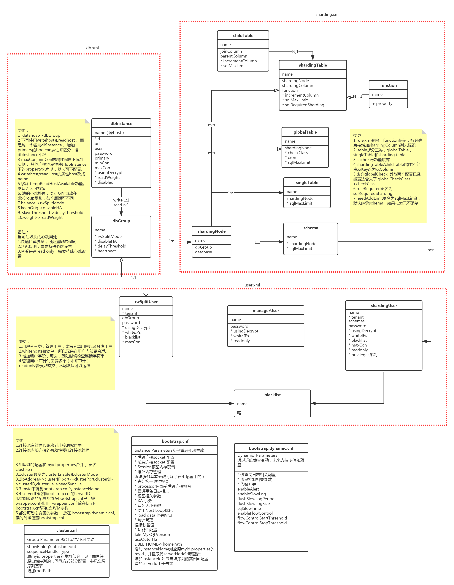

## 1.10 版本变更

+ [3.21.06.0](#config-title-3.21.06.0)
  - [配置文件版本变更](#sequence-insert-3.21.06.0)
  - [集群中存储格式调整](#cluster-update-3.21.06.0)
+ [3.21.02.0](#config-title-3.21.02.0)
  - [集群中sequence结构调整](#sequence-update-3.21.02.0)
  - [配置文件验证方式调整](#xml-valid-update-3.21.02.0)
  - [配置文件版本变更](#config-updat-3.21.02.0)
+ [3.20.07.0](#config-title-3.20.07.0)
    - [配置文件版本变更](#config-update-3.20.07.0)

***
###  <span id="config-title-3.21.06.0">3.21.06.0 变更内容</span>
####  <span id="sequence-insert-3.21.06.0">1 dble的配置文件版本变更</span>
##### 1.1 bootstrap.cnf  
<table >
<tbody>
<tr>
<td  ><p><strong>变更项</strong></p></td>
<td  ><p><strong>变更内容</strong></p></td>
<td  ><p><strong>变更版本</strong></p></td>
<td  ><p><strong>向后兼容性</strong></p></td>
</tr>
<tr>
<td  ><p><strong>新增</strong></p></td>
<td  ><p><strong>inSubQueryTransformToJoin，in子查询转成join进行查询</strong></p></td>
<td  ><p><strong>3.21.06</strong></p></td>
<td  ><p><strong>不兼容</strong></p></td>
</tr>
<tr>
<td  ><p><strong>新增</strong></p></td>
<td  ><p><strong>enableCursor，默认为 false</strong></p></td>
<td  ><p><strong>3.21.06</strong></p></td>
<td  ><p><strong>不兼容</strong></p></td>
</tr>
</tbody>
</table >

###### inSubQueryTransformToJoin
原来：如果sql中存在in子查询并且满足可以转join的条件，在dble中会默认将in子查询转成join处理  
更改后：在默认情况下，不会将in子查询转成join处理，而是正常按照子查询处理。如果需要将in子查询转成join处理，请在bootstrap.cnf增加该参数（-DinSubQueryTransformToJoin=true）  
具体说明请参考：[inSubQueryTransformToJoin](../A.Faq/ErrorCode/Content/inSubQueryTransformToJoin.md)

###### enableCursor：

原来：老版本是只需要 client 显式开启即可使用游标。

现在： 新版本游标功能变成需要client 和 server 同时显式开启才能使用，server 默认不开启。

升级模式：通常不需要这个功能，如果确实需要可以开启。需注意开启会导致所有的prepared statement牺牲一部分性能，用于查询列的数量，详情见 【4.4 prepared statement】.

##### 1.2 sharding.xml
<table >
<tbody>
<tr>
<td  ><p><strong>变更项</strong></p></td>
<td  ><p><strong>变更内容</strong></p></td>
<td  ><p><strong>变更版本</strong></p></td>
<td  ><p><strong>向后兼容性</strong></p></td>
</tr>
<tr>
<td  ><p><strong>修改</strong></p></td>
<td  ><p><strong>jumpStringHash中的hashSlice默认值。</strong></p></td>
<td  ><p><strong>3.21.06</strong></p></td>
<td  ><p><strong>不兼容</strong></p></td>
</tr>
</tbody>
</table >


原来：如果不设置hashSlice, 之前版本默认值是（0:-1）,不是一个很好的默认值，会丢失一个字符的计算。具体见文档【1.5】中关于 stringhash 的介绍

现在： 3.21.06改为了默认值（0:0）

升级模式：需检查jumpStringHash 的 hashSlice是否有配置,如果原本没有配置需要配置为（0:-1）。

####  <span id="cluster-update-3.21.06.0">2 集群中存储格式调整</span>

dble在3.21.06.0版本对集群的存储格式进行了调整

原有： 配置中心（zk）存储value的格式不尽相同，且不具备向后兼容性

更改后： 配置中心（zk）存储value的格式均改成了json 格式。并且在在外层包裹了一个统一的格式。
具体格式如下：
```json
{
  "instanceName": "1", //bootstrap.cnf 里面的instanceName
  "apiVersion": 1, //为了兼容性增加的版本字段
  "createdAt": 1628669627058, //创建这个节点的时间戳（毫秒）
  "data": { …  } //具体数据以 json 格式存储在这里
}
```

升级方式： 由于两者的元数据互不兼容，升级前需停止旧版本 dble，然后删除配置中心中当前集群的所有元数据，即删除目录"`/{rootPath}/{clusterId}`"，再启动新版本。如需缩短不可用的时间，新版本可以使用不同的clusterId，即启动一个和旧版本隔离的全新集群。
> 注意：
>
> rootPath和clusterId 的对应值见 cluster.cnf
>
> 如果不删除，升级会导致dble 无法启动，并报错 "you may use old incompatible metadata."
>
> 降级方式：同升级。


###  <span id="config-title-3.21.02.0">3.21.02.0 变更内容</span>
####  <span id="sequence-update-3.21.02.0">1 集群中sequence结构调整</span>

dble在3.21.02.0版本对序列的存储结构进行了调整

原有： 配置中心（zk）存储sequence的结构为key-value形式。key：文件名；value：文件原始内容

更改后： 配置中心（zk）存储sequence的结构为key-value形式。key：文件名；value：文件内容的json形式

升级方式：升级前需删除配置中心的sequence配置(rootPath/clusterId/conf/sequences)，存储结构详情见：
[ZK整体目录结构](https://github.com/actiontech/dble-docs-cn/blob/2.20.04.1/tag/2.Function/2.08_cluster.md#286-zk%E6%95%B4%E4%BD%93%E7%9B%AE%E5%BD%95%E7%BB%93%E6%9E%84)

####  <span id="xml-valid-update-3.21.02.0">2 dble的配置文件验证方式调整</span>

在3.21.02.0版本对dble的xml配置文件验证方式调整

原有：使用dtd文件验证xml的格式，dble中使用DocumentBuilder的方式解析xml文件

更改后：使用xsd文件验证xml的格式，dble中使用jaxb2.0方式解析xml文件

升级方式：升级前需删除原有xml配置文件中的标签：db.xml中的<!DOCTYPE dble:db SYSTEM "db.dtd">、sharding.xml中的<!DOCTYPE dble:sharding SYSTEM "sharding.dtd">、user.xml中的<!DOCTYPE dble:user SYSTEM "user.dtd">

#### <span id="config-updat-3.21.02.0">3 dble的配置文件版本变更</span>
##### 3.1 bootstrap.cnf  

<table >
<tbody>
<tr>
<td  ><p><strong>变更项</strong></p></td>
<td  ><p><strong>变更内容</strong></p></td>
<td  ><p><strong>变更版本</strong></p></td>
<td  ><p><strong>向后兼容性</strong></p></td>
<td  ><p><strong>升级方式</strong></p></td>
</tr>
<tr>
<td  ><p><strong>变更</strong></p></td>
<td  ><p><strong>homePath必须显示声明</strong></p></td>
<td  ><p><strong>3.21.02</strong></p></td>
<td  ><p><strong>兼容</strong></p></td>
<td  ><p><strong>升级前需要将原来在bootstrap.cnf中未声明的homePath，加上-DhomePath=.（路径为当前目录，已声明的无需更改） </strong></p></td>
</tr>
</tbody>
</table >

### <span id="config-title-3.20.07.0">3.20.07.0 变更内容</span>
#### <span id="config-update-3.20.07.0"> 1 配置文件版本变更</span>

dble 在3.20.07.0 版本做了配置的重构。历史变更请参考[2.20.04.0的变更](https://github.com/actiontech/dble-docs-cn/blob/2.20.04.1/tag/1.config_file/1.10_version_change.md)  

可以通过升级工具[dble_update_config](pic/dble_update_config)将配置从2.20.04.0 升级到3.20.07.0，如果是更早版本，建议先升级到2.20.04.0

升级工具用法：

```
dble_update_config [-i=read_dir] [-o=write_dir] [-p=rootPath]
```
read_dir/write_dir: 如果不指定，缺省值为当前目录，建议指定或者提前备份配置
rootPath:如果集群模式是zk, 那么缺省值为  `/dble`,  如果集群模式是ucore, 缺省值为`universe/dble`

工具将会读取文件:  
myid.properties  
wrapper.conf  
server.xml  
schema.xml  
rule.xml  
log4j2.xml  
cacheservice.properties(option)  
sequence_distributed_conf.properties for type3 (option)  
sequence_time_conf.properties for type2 (option)   

然后写出文件:  
cluster.cnf  
bootstrap.cnf  
user.xml  
db.xml  
sharding.xml  
log4j2.xml   
cacheservice.properties(option)   


重构后的配置概览图：


***


