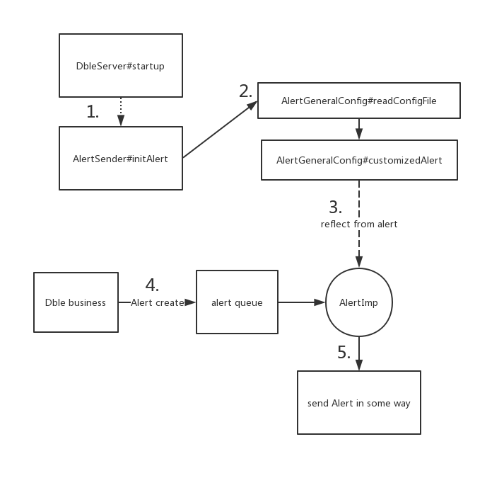
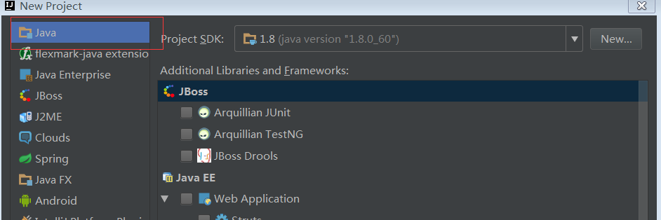
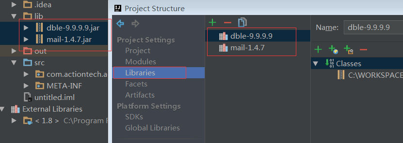
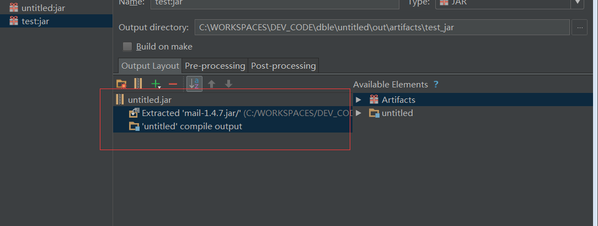
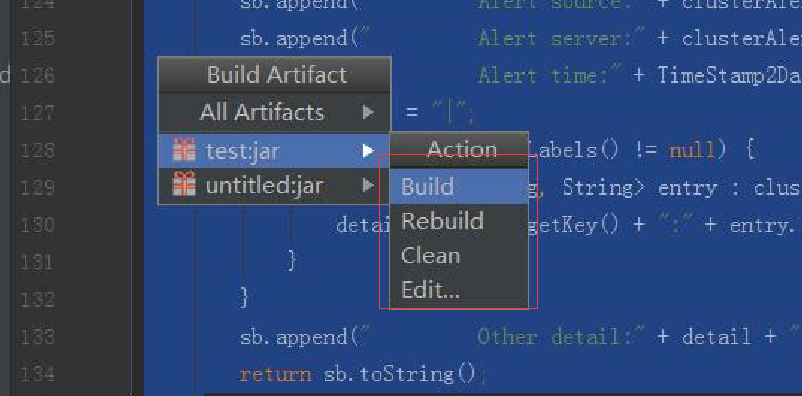

## 1.11 自定义告警模块
+ [告警工作原理]()
 - 告警模块的加载
 - 告警发送和解除
 - 告警Interface Alert详解
 - 告警发送对象详解
+ 自定义告警的开发和部署
 - 自定义告警的开发
 - 自定义告警的使用
 - 自定义告警示例以及示例文件
### 1.11.1 工作原理
#### 1.11.1.1 告警模块的加载
  
**告警模块加载仅在dble启动的时候进行**  
1. dble启动，通过一系列加载之后，开始加载告警模块
2. 由对象AlertGeneralConfig读取告警配置文件dble_alert.properties
3. 根据读取到配置文件中的alert配置项进行对象反射，获取到用户自定义对象的实例
4. 当dble运行过程中发生告警或者告警解除事件，将告警任务放入任务队列中
5. 由一个dble线程循环消费队列中的内容，调用用户自定义对象对于告警任务进行发送
  
#### 1.11.1.2 告警发送和解除

在dble的告警模块中，将系统中的告警分成以下两种类型
+ 可自动解决告警
+ 不可自动解决告警

其中“可自动解决告警”为dble在运行过程中遭遇的偶发错误导致的告警，当错误被修正或者重试成功时告警被解除。例如：后端连接数到达最大值，XA事务提交单次失败等  
而“不可自动解决告警”则为dble不会重试也不能解决的错误，譬如：启动无法读取xa日志记录文件等  

同时在dble中还将告警非常一下两种类型  
+ dble内部发生的错误告警
+ dble和外部交互发生的错误告警

其中“dble内部发生的告警”指的是在dble对于内部任务在执行过程中发生的异常或者其他现象，比如写文件失败，kill后端连接失败等等
而“dble和外部交互发生的错误告警”则指的是dble和外部具体节点交互时候的错误，譬如无法连接某后端节点，或者某后端节点心跳失败等等

**根据以上两种分类，在dble的告警系统中存在着以下的四种告警信息**
+ 可自动解决-dble内部告警
+ 不可自动解决-dble内部告警
+ 可自动解决-dble与外部交互告警
+ 不可自动解决-dble与外部交互告警

**针对以上的四种告警的类别，我们可以发现，在dble的告警周期中，需要有以下四个逻辑上的方法：**
+ dble与外部交互告警发送方法
+ dble内部告警发送方法
+ dble与外部交互告警**解除**发送方法
+ dble内部告警**解除**发送方法  

#### 1.11.1.3 告警Interface Alert详解
```
public interface Alert {
    void alertSelf(ClusterAlertBean bean);
    void alert(ClusterAlertBean bean);
    boolean alertResolve(ClusterAlertBean bean);
    boolean alertSelfResolve(ClusterAlertBean bean);
    void alertConfigCheck() throws Exception;
}
```
以上是整个告警接口的定义，可以看到除了一个比较特殊的方法alertConfigCheck（检查告警配置）其他的几个方法基本可以说是成对出现
 + alert告警发送 --- dble与外部交互告警
 + alertSelf告警发送 --- dble内部告警发送
 + alertResolve告警解决发送 --- dble与外部告警解除发送
 + alertSelfResolve内部告警解除发送 --- dble内部告警解除发送
 
四个信息发送的方法分别对应到上文中对于几个dble告警系统中的方法需求  
并在此解释下alert和alertSelf方法的区别：alertSelf方法的调用输入中为ClusterAlertBean设定了alertComponentType和alertComponentId两个字段，而alertSelf方法则没有，设定适当的DBLEserver标识的动作交给Alert对象来完成
当然在alertResolve和alertSelfResolve之间的区别也是同样的  

#### 1.11.1.4 告警发送对象详解
```
public class ClusterAlertBean {
    String code;                //告警的具体代码
    String level;               //告警发生的具体级别
    String desc;                //告警发送的详细描述
    String sourceComponentType; //告警发生的问题源头组件类型
    String sourceComponentId;   //告警发送的问题源头组件ID
    String alertComponentType;  //具体发送告警的组件类型
    String alertComponentId;    //具体发送告警的组件ID
    String serverId;            //告警发生的服务器ID
    long timestampUnix;         //告警发送的时候戳
    long resolveTimestampUnix;  //告警解除的时间，仅有解除的告警拥有此字段的值
     Map<String, String> labels; //告警的额外附加信息，补充信息
    }
```
以上是在dble中对于告警对象的定义，每个字段的含义都在注释中进行了说明，在自定义告警发送的时候只需要对于告警对象中用户所关心的信息进行发送和处理即可
### 1.11.2 自定义告警的开发和部署

#### 1.11.2.1 自定义告警的开发
从上文中对于整个dble中告警系统的介绍，可以大致的将dble中的告警进行如下的总结：
+ dble会在启动的时候根据配置文件中的信息加载一个Alert的对象
+ dble的告警由dble内部的代码进行固定的触发，并将告警的任务发送到一个指定的告警队列中
+ dble内部会有一个线程循环调用Alert的实现对象对于告警进行发送
+ dble中的告警发送分为四种情况“内部告警”“外部告警”“内部告警解决”“外部告警解决”

按照上文中对于dble内部告警机制和原理的解释，可以整理出对于自定义告警的基本开发过程 ------创建一个Alert接口的实现，并且按照需要的方式将告警的信息发送到指定的地方

为了达成这个目的，可以按照以下的步骤进行逐一的开发，以下提供一个基于IDEA逐步操作的图文步骤，以一个通过邮件发送告警信息为例  
##### 1 创建一个java项目
  
最简单的java项目就能完成这个告警自定义的开发  
##### 2 将需要的依赖包copy到项目中，并且添加到lib
  
在此例中由于仅需额外依赖一个java的邮件发送包mail，所以这里仅导入了两个jar包作为依赖  
##### 3.1 编写Alert实现类初始化方法
```
    public MailAlert() {
        //init the mail data and read config file
        properties = AlertGeneralConfig.getInstance().getProperties();
    }
```
在Alert实现类MailAlert中，可以通过调用AlertGeneralConfig.getInstance().getProperties();获取到dble启动时候加载到的告警配置文件(dble_alert.properties)中的内容
所以，在这个地方如果自定义的告警需要使用到各种参数，都可以直接写在文件dble_alert.properties的配置中，而在Alert实现类里面按照key值进行获取即可  
##### 3.2 编写Alert的配置检查
```
    @Override
    public void alertConfigCheck() throws ConfigException {
        //check if the config is correct
        if (properties.getProperty(MAIL_SENDER) == null
                || properties.getProperty(SENDER_PASSWORD) == null
                || properties.getProperty(MAIL_SERVER) == null
                || properties.getProperty(MAIL_RECEIVE) == null) {
            throw new ConfigException("alert check error, for some config is missing");
        }
    }
```
在此例中由于是基于邮件进行告警发送，所以启动的时候需要在dble_alert.properties文件中配置MAIL_SENDER，SENDER_PASSWORD，MAIL_SERVER，MAIL_RECEIVE四个选项
当配置不能满足自定义的这些选项的时候则抛出异常，dble启动加载的时候会打印对应的异常日志，并且切换为内置默认告警启动  
上文中  
```
properties.getProperty(MAIL_RECEIVE)
```
的这种方式则是从配置中获取自定义配置项的方法  
##### 3.3 编写发送告警主体方法
由于此例中发送告警统一为邮件发送，包括告警和告警解决仅存在邮件内容中的差异，所以在这里仅用一个邮件发送方法send进行实现
```
    private boolean sendMail(boolean isResolve, ClusterAlertBean clusterAlertBean) {
        try {
            Properties props = new Properties();
            props.setProperty("mail.debug", "true");
            props.setProperty("mail.smtp.auth", "true");
            props.setProperty("mail.host", properties.getProperty(MAIL_SERVER));
            props.setProperty("mail.transport.protocol", "smtp");

            MailSSLSocketFactory sf = new MailSSLSocketFactory();
            sf.setTrustAllHosts(true);
            props.put("mail.smtp.ssl.enable", "true");
            props.put("mail.smtp.ssl.socketFactory", sf);

            Session session = Session.getInstance(props);

            Message msg = new MimeMessage(session);
            msg.setSubject("DBLE告警 " + (isResolve ? "RESOLVE\n" : "ALERT\n"));
            StringBuilder builder = new StringBuilder();
            builder.append(groupMailMsg(clusterAlertBean, isResolve));
            msg.setText(builder.toString());
            msg.setFrom(new InternetAddress(properties.getProperty(MAIL_SENDER)));

            Transport transport = session.getTransport();
            transport.connect(properties.getProperty(MAIL_SERVER), properties.getProperty(MAIL_SENDER), properties.getProperty(SENDER_PASSWORD));

            transport.sendMessage(msg, new Address[]{new InternetAddress(properties.getProperty(MAIL_RECEIVE))});
            transport.close();
            //send EMAIL SUCCESS return TRUE
            return true;
        } catch (Exception e) {
            e.printStackTrace();
        }
        //send fail reutrn false
        return false;
    }
    
      private String groupMailMsg(ClusterAlertBean clusterAlertBean, boolean isResolve) {
            StringBuffer sb = new StringBuffer("Alert mail:\n");
            sb.append("         Alert type:" + clusterAlertBean.getCode() + " " + (isResolve ? "RESOLVE\n" : "ALERT\n"));
            sb.append("         Alert message:" + clusterAlertBean.getDesc() + "\n");
            sb.append("         Alert componnent:" + clusterAlertBean.getAlertComponentType() + "\n");
            sb.append("         Alert componnentID:" + clusterAlertBean.getAlertComponentId() + "\n");
            sb.append("         Alert source:" + clusterAlertBean.getAlertComponentId() + "\n");
            sb.append("         Alert server:" + clusterAlertBean.getServerId() + "\n");
            sb.append("         Alert time:" + TimeStamp2Date(clusterAlertBean.getTimestampUnix()) + "\n");
            String detail = "|";
            if (clusterAlertBean.getLabels() != null) {
                for (Map.Entry<String, String> entry : clusterAlertBean.getLabels().entrySet()) {
                    detail += entry.getKey() + ":" + entry.getValue();
                }
            }
            sb.append("         Other detail:" + detail + "|\n");
            return sb.toString();
        }
```
具体如何使用java发送邮件我在此不进行赘述了，大概上面这段代码的原理就是从配置properties获取邮件配置的项，然后发送邮件到指定邮箱即可
而具体的groupMailMsg就是将告警发送过来的对象clusterAlertBean中的数据组织成邮件的文本内容，完全可以感觉实际需要进行组织  
##### 3.4 实现具体的几个告警发送的方法
```
@Override
    public void alertSelf(ClusterAlertBean clusterAlertBean) {
        alert(clusterAlertBean.setAlertComponentType(COMPONNENT_TYPE).setAlertComponentId(properties.getProperty(COMPONNENT_ID)));
    }

    @Override
    public void alert(ClusterAlertBean clusterAlertBean) {
        clusterAlertBean.setSourceComponentType(COMPONNENT_TYPE).
                setSourceComponentId(properties.getProperty(COMPONNENT_ID)).
                setServerId(properties.getProperty(SERVER_ID)).
                setTimestampUnix(System.currentTimeMillis() * 1000000);
        sendMail(false, clusterAlertBean);
    }

    @Override
    public boolean alertResolve(ClusterAlertBean clusterAlertBean) {
        clusterAlertBean.setSourceComponentType(COMPONNENT_TYPE).
                setSourceComponentId(properties.getProperty(COMPONNENT_ID)).
                setServerId(properties.getProperty(SERVER_ID)).
                setTimestampUnix(System.currentTimeMillis() * 1000000);
        return sendMail(true, clusterAlertBean);
    }

    @Override
    public boolean alertSelfResolve(ClusterAlertBean clusterAlertBean) {
        return alertResolve(clusterAlertBean.setAlertComponentType(COMPONNENT_TYPE).setAlertComponentId(properties.getProperty(COMPONNENT_ID)));
    }
```
以上方法实现就特别简单了，一般情况下都可以按照以上的示例进行实现，基本上就是补全部分缺失的信息，调用发送的方法即可  
##### 3.5 打包成jar进行使用

通过idea File->Project Structure..创建打包方式  
  
确认打包的内容，注意的点是不要将dble的jar包也当作依赖打包到项目的jar包中去，当自定义中使用的jar包和dble的依赖jar包发生重复的时候，也请不要把重复的依赖打包进去

通过IDEA的Build->Build Artifacts..对于项目进行打包，能在项目新生成的out文件夹下找到对应的jar包    

#### 1.11.2.2 自定义告警的使用
有了上面打包出来的jar包之后就是该如何进行使用了，大致的步骤只有三个
+ 将打包完成的jar包放入dble安装目录的lib目录下
+ 配置文件dble_alert.properties使得自定义的文件能被加载到,将类名配置到alert配置项中去
+ 重启dble使得加载生效
在这里同样是衔接上文的案例，文件复制到lib下在此进行跳过
之后修改dble_alert.properties配置文件,大致如下图所示
```
alert=com.actiontech.addtionAlert.MailAlert
mail_sender=123456798@qq.com
sender_pass=qwertyuiop
mail_server=smtp.qq.com
mail_receive=yyyyyyyyyyy@actionsky.com
server_id=dble-server-001
componnent_id=DBLE-FOR-XXX-01
```
之后重启dble之后就会加载com.actiontech.addtionAlert.MailAlert这个类进行告警的发送了
#### 1.11.2.3 自定义告警示例以及示例文件
在这里将上文中的实例以文件的形式给出，方便用户进行参考
[示例代码下载](https://github.com/actiontech/dble-docs-cn/raw/master/1.config_file/1.11_customized_alert/MailAlert.java) 
[示例jar包下载](https://github.com/actiontech/dble-docs-cn/raw/master/1.config_file/1.11_customized_alert/mailalert.jar) 
### 1.11.3 附录：dble项目中各个告警CODE的含义

| 告警代码                               | 解释                                   |
| -------------------------------------- | -------------------------------------- |
| DBLE_WRITE_TEMP_RESULT_FAIL            | 写出中间结果集到文件失败               |
| DBLE_XA_RECOVER_FAIL                   | XA事务恢复失败                         |
| XA_READ_XA_STREAM_FAIL                 | 读取XA事务记录文件失败                 |
| DBLE_XA_READ_DECODE_FAIL               | 解析XA事务记录文件失败                 |
| DBLE_XA_READ_IO_FAIL                   | 读取XA事务记录文件失败                 |
| DBLE_XA_WRITE_IO_FAIL                  | 写XA事务记录文件失败                   |
| DBLE_XA_WRITE_CHECK_POINT_FAIL         | XA写出检查点信息失败                   |
| DBLE_XA_BACKGROUND_RETRY_FAIL          | XA后台重试提交失败                     |
| DBLE_REACH_MAX_CON                     | 节点连接数到达配置最大值，获取连接失败 |
| DBLE_TABLE_NOT_CONSISTENT_IN_DATAHOSTS | 表结构在不同数据节点中不一致           |
| DBLE_TABLE_NOT_CONSISTENT_IN_MEMORY    | 表结构在数据节点中和dble内存中不一致   |
| DBLE_GLOBAL_TABLE_COLUMN_LOST          | 全局表检查列不存在                     |
| DBLE_CREATE_CONN_FAIL                  | 创建连接到后端mysql的连接失败          |
| DBLE_DATA_HOST_CAN_NOT_REACH           | 后端连接创建不可达                     |
| DBLE_KILL_BACKEND_CONN_FAIL            | Kill后端连接执行失败                   |
| DBLE_NIOREACTOR_UNKNOWN_EXCEPTION      | NIO意外报错                            |
| DBLE_NIOREACTOR_UNKNOWN_THROWABLE      | NIO意外严重错误                        |
| DBLE_NIOCONNECTOR_UNKNOWN_EXCEPTION    | NIO后端连接创建器意外错误              |
| DBLE_TABLE_LACK                        | 配置中的表格未被创建                   |
| DBLE_GET_TABLE_META_FAIL               | 获取表格的创建语句失败                 |
| DBLE_TEST_CONN_FAIL                    | 测试后端连接可达性失败                 |
| DBLE_HEARTBEAT_FAIL                    | 心跳后端节点失败                       |
| DBLE_DATA_NODE_LACK                    | 缺少可用的dataNode节点                 |

