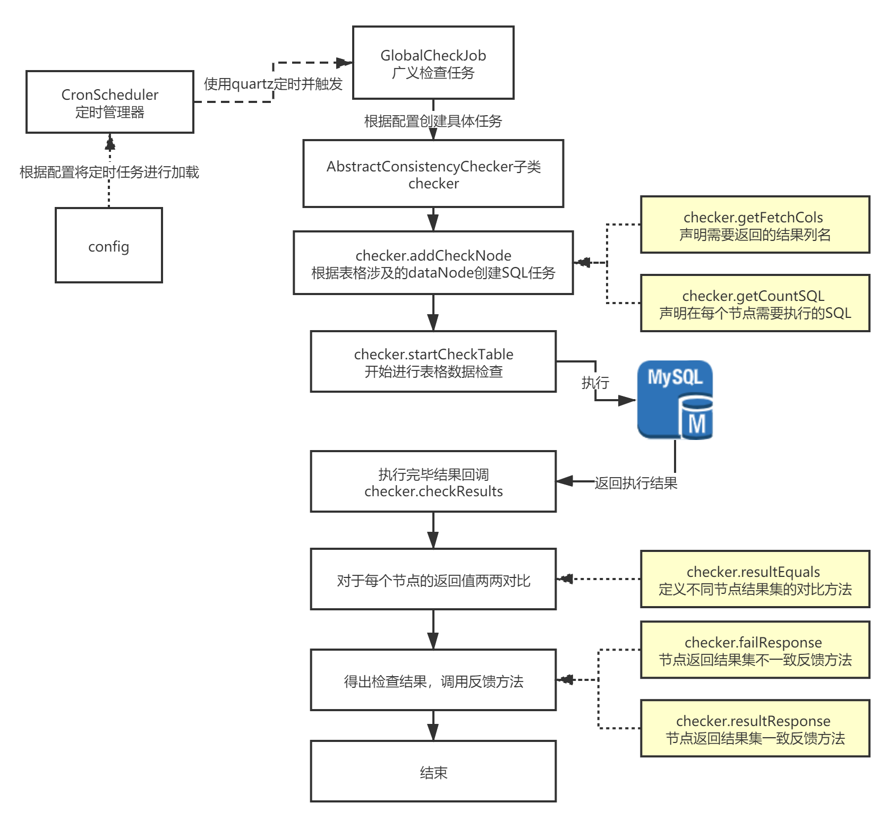
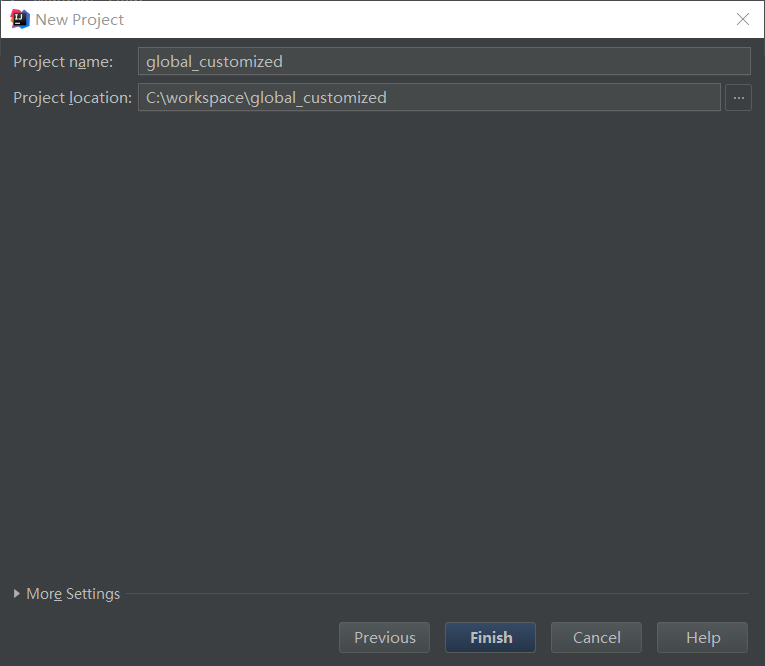
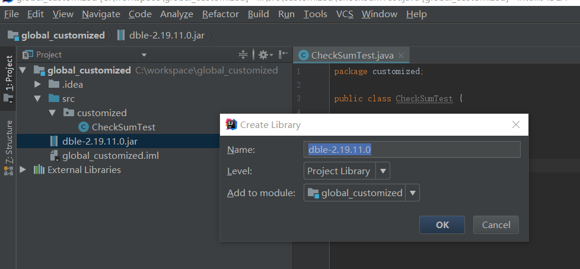
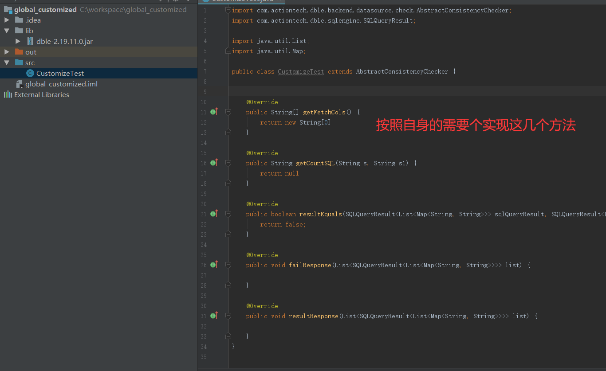
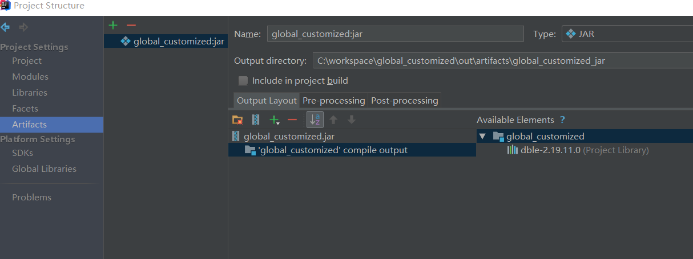

## 自定义全局表检查

### 背景
**全局表**是dble中一种特殊类型的表格，一般来说认为在一个全局表table_a所有分布的节点上，table_a因同时满足以下两个条件：
+ 拥有相同的表格结构
+ 拥有相同的表格数据

但事实上在系统和dble的运行过程中，可能由于一些不可避免分布式事务方面的误差，导致在长时间运行之后，不同节点上面的table_a上面的数据不一致   
**为了**及时的发现问题并不再造成更进一步的错误，dble中采用定时进行表格数据检查的方式对于table_a中的数据一致性进行检查，并及时把检查的结果通知到运维人员
### 工作原理大致逻辑
#### 全局表检查工作逻辑
全局表检查的大致逻辑如下图所示：
  
上图中着色的部分允许接收用户的自定义，在下一小节中会对于每个步骤进行详细的说明  
**整体上来说**全局表检查的工作原理分为以下几个步骤：
+ 加载表格检查配置，在启动或者是reload阶段将配置加载到定时任务管理器CronScheduler中
+ 当根据配置的触发条件正常触发时执行GlobalCheckJob开始任务
+ 在GlobalCheckJob中根据表格配置计算表格配置并创建具体的SQL检查任务
    - 此时会调用checker中的方法返回执行的具体SQL语句以及需要取得的结果级列名
    - 按照dataNode的结构将SQL任务提前构造完毕

+ 触发SQL执行，逐个执行构造完成的SQL任务，下发SQL到MySQL进行执行
+ 等待所有的SQL执行结果都返回(成功或者失败)
+ SQL执行结果返回，回调方法checkResults进行结果集检查
+ 根据checker中的结果集比较方法对于SQL执行的结果进行比较
+ 调用回馈方法进行结果回馈，当SQL执行结果有超过一个版本(存在不一致)时调用失败接口failResponse，当SQL执行结果只有一个版本(所有正常返回的结果一致)时调用resultResponse方法
#### 全局表检查方法详解
##### 执行SQL定义String getCountSQL(String dbName, String tName)
**功能：** 返回全局表检查需要对于表格执行的SQL内容
**输入：** SQL执行的MySQL中database的名称，所检查的表格的名称  
**输出：** 检查具体需要执行的SQL  
**举例：**  
```
public String getCountSQL(String dbName, String tName) {
        //假如需要对于对应的table名字求checksum
        return "checksum table " + tName; 
    }
```
##### 结果集定义 getFetchCols()
**功能：** 返回SQL执行完毕需要使用的结果集中的列名  
**输入：** 无    
**输出：** 需要收集的列名list  
**举例：**    
```
public String[] getFetchCols() {
     //checksum返回结果，我们只关心Checksum字段的返回值
     // mysql> checksum table suntest;
     //+-------------+----------+
     //| Table     | Checksum |
     //+-------------+----------+
     //| db1.suntest |1290812451|
     //+-------------+----------+
	 //所以return的内容只需要一个Checksum的列名即可
        return new String[]{"Checksum"};
    }
```
##### SQL结果比较方法 boolean resultEquals(result1,result2)
**功能：** 用于判断两个不同节点的返回结果是否一致  
**输入：** 不同节点的两个节点result，result1,result2  
```
SQLQueryResult<List<Map<String, String>>> result

result 
     |
	  ------ row(List)
	                |
					 -------------Key-Value(Field-Value)
例如checksum
result 
     |
	  --- row(List<1> checksum table suntest只有一行返回结果)
	                |
					 ---Key-Value(checksum - 1290812451 getFetchCols只取了一列)
```
**输出：** 需要收集的列名list    
**举例：**  
```
public boolean resultEquals(SQLQueryResult<List<Map<String, String>>> or, SQLQueryResult<List<Map<String, String>>> cr) {
        //因为checksum只有一行，并且即使表不存在也会有一行结果集
		//所以直接取结果集的第一行即可
        Map<String, String> oresult = or.getResult().get(0);
        Map<String, String> cresult = cr.getResult().get(0);
        //直接对比Map中checksum的值是不是一致即可
        return (oresult.get("Checksum") == null && cresult.get("Checksum") == null) ||
                (oresult.get("Checksum") != null && cresult.get("Checksum") != null &&
                        oresult.get("Checksum").equals(cresult.get("Checksum")));
    }
```

##### 失败行为接口 failResponse(resultList)
**功能：** 检查失败的通知/响应/其他自定义行为  
**输入：** 检查结果列表  
**输出：** 无   
**举例：**    
```
public void failResponse(List<SQLQueryResult<List<Map<String, String>>>> res) {
        //简单的情况下直接在日志中打印出对应信息
		//如果有需要可以自行实现发邮件/发短信/发接口给告警系统等等
        String errorMsg = "Global Consistency Check fail for table :" + schema + "-" + tableName;
        System.out.println(errorMsg);
        for (SQLQueryResult<List<Map<String, String>>> r : res) {
            System.out.println("Checksum is : " + r.getResult().get(0).get("Checksum"));
        }
    }
```
#####  其他结果通知 void resultResponse(errorList);
**功能：** 检查结果的通知/响应/其他自定义行为  
**输入：** 检查(报错)结果列表  
**输出：** 无   
**举例：**  
```
public void resultResponse(List<SQLQueryResult<List<Map<String, String>>>> elist) {
        //输入参数是检查过程中SQL执行报错的list，因为SQL自定义
		//不同的检查SQL对于SQL报错的处理不同，具体报错应该别忽视
		//或者应该视作不一致，由用户自己进行定义
        String tableId = schema + "." + tableName;

        if (elist.size() == 0) {
            System.out.println("Global Consistency Check success for table :" + schema + "-" + tableName);
        } else {
            System.out.println("Global Consistency Check fail for table :" + schema + "-" + tableName);
            StringBuilder sb = new StringBuilder("Error when check Global Consistency, Table ");
            sb.append(tableName).append(" dataNode ");
            for (SQLQueryResult<List<Map<String, String>>> r : elist) {
                System.out.println("error node is : " + r.getTableName() + "-" + r.getDataNode());
                sb.append(r.getDataNode()).append(",");
            }
            sb.setLength(sb.length() - 1);
        }
    }
```
### 自定义全局表检查的开发及使用
#### 检查的自定义步骤
##### 1 创建一个java项目
  
##### 2 将需要的依赖包copy到项目中，并且添加到lib
  
##### 3 按照上一节的介绍逐个实现5个自定义方法
  
##### 4 打包成jar进行使用
  
##### 5 示例文件及jar包
[示例代码下载](https://github.com/actiontech/dble-docs-cn/raw/master/1.config_file/1.12_customized_global_table_check/CustomizeTest.java)   
[示例jar包下载](https://github.com/actiontech/dble-docs-cn/raw/master/1.config_file/1.12_customized_global_table_check/global_customized.jar) 
#### 自定义检查的配置
**当前**的全局表检查定义为schema.table级别，需要对于每个需要进行全局表一致性检查的表格进行配置，配置的下放带来一些繁琐的工作，但是却提供了一个重要的特性，用户可以根据不同全局表格的需要，或者是业务上面的特性，给与不同的全局表格不同的校验方式  
***注意:检查方式的修改仅在reload或者重启之后生效***
**举例：***
```
<!--dble内置CHECKSUM检查方式-->
<table name="tb_global1" dataNode="dn1,dn2" type="global" globalCheck="true" cron = "0 * * * * ?" globalCheckClass="CHECKSUM"/>

<!--dble内置COUNT检查方式-->
<table name="tb_global2" dataNode="dn1,dn2" type="global" globalCheck="true" cron = "0 * * * * ?" globalCheckClass="COUNT"/>

<!--上文中我们自定义的CustomizeTest类的检查方式-->
<table name="tb_global3" dataNode="dn1,dn2" type="global" globalCheck="true" cron = "0 * * * * ?" globalCheckClass="CustomizeTest"/>
```
**自定义**的jar包和其他dble内的自定义功能一样，将jar包放置于algorithm或者lib目录下就会在启动的时候被dble加载到，但是由于java中的类加载方式，如果由更新jar包内容和新增jar包的情况下，请先重启dble进程
***注意：当修改自定义jar包的时候请重启dble，此时reload可能无法得到预期的结果***