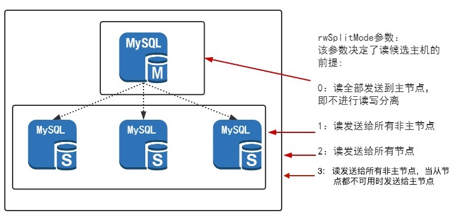

## 2.3 读写分离
3.20.10.0版本dble支持单纯的读写分离，可以和分库分表功能分开单独使用。3.20.10.0之前的版本，分库分表也支持读写分离，兼容该功能。

### 2.3.1 读写分离配置

#### 2.3.1.1 单纯使用读写分离功能的配置
若想启用dble的读写分离，仅需在 user.xml 文件中配置 rwSplitUser并指定对应的dbGroup即可。dbGroup的配置参考db.xml的章节。这里需要注意的是三种用户配置的顺序是固定的。user.xml的配置请参考user.xml章节。
```xml
<dble:user xmlns:dble="http://dble.cloud/" version="4.0">
    <managerUser name="man1" password="654321" maxCon="100"/>
    <shardingUser name="root" password="123456" schemas="testdb" readOnly="false" maxCon="20"/>
    <rwSplitUser name="rwsu1" password="123456" dbGroup="rwGroup" maxCon="20"/>
</dble:user>
```


配置注意事项：
1. 当在user.xml中仅配置rwSplitUser时，dble不会加载sharding.xml配置文件，即dble不具备分库分表的功能。  
2. 当同时开启dble读写分离和分库分表的功能，分库分表引用的dbGroup和读写分离引用的dbGroup必须相互独立。rwSplitUser引用的dbGroup，仅需在db.xml中定义即可。shardingUser引用的dbGroup，需要被配置的schemas对应的sharding.xml中的shardingNode所引用。
3. 多个rwSplitUser可以引用同一个dbGroup。
4. 被读写分离或者分库分表使用的dbGroup内的instance才会有心跳和连接池；未被有效使用的dbGroup内的instance只有心跳，不会初始化连接池。

#### 2.3.1.2 分库分表中读写分离的配置
分库分表中的读写分离，配置好db.xml和sharding.xml即可，具体参考db.xml和sharding.xml的章节


### 2.3.2 负载均衡

dble通过配置多个dbInstance为读操作提供负载均衡，注意的是rwSplitMode配置不为0，详细请参见db.xml章节。负载均衡规则如下：

1. 确定参与读写分离的dbInstance集合
2. 负载均衡算法

#### 2.3.2.1  确定参与读写分离的dbInstance集合

该算法在每次连接获取时提供可用的dbInstances实例集。可用的dbInstance是指心跳正常的dbInstance，这里需要注意的是show slave status和其他心跳语句是有区别的，以该语句作为心跳语句，心跳正常只是基本前提。dble会根据最近一次的心跳返回结果判断读库和主库的延迟，如果延迟超过delayThreshold配置，则不会将此节点加入到dbInstances实例集中，如果delayThreshold=-1那么不会进行延迟检测。

+ 写节点(primary="true")可用
  - rwSplitMod配置为2，则写节点有资格参到读写分离，将写节点加入到dbInstances实例集
  - 读节点(primary没配置或者 primary="false")
     + 节点可用且需要进行延迟检测，检查延迟是否在阈值内再决定是否加入到dbInstances实例集
     + 节点可用且不需要进行延迟检测，直接加入到dbInstances实例集
+ 写节点异常
  - 检查读节点是否可用，与上面读节点的检测机制一致
  
#### 2.3.2.2  负载均衡算法

该算法在dbInstance集合中选择一个dbInstance实例来获取连接。

+ dbInstance集合为空，前端报错。
+ dbInstance集合非空
  - 每个dbInstance有权重设置(readWeight参数), 但不都是等值权重, 依权重随机选择。
  - 每个dbInstance无权重设置或所有权重等值, 则等权随机选择。此种情况只是上面情况的特例。

#### 2.3.2.3 写节点是否参与均衡与dbGroup的rwSplitMode属性有关，具体见下图



### 2.3.3 读写分离支持语句类型
在事务中所有语句都会发主，在非事务中则根据语句类型进行负载均衡。
#### 2.3.3.1 纯读写分离支持的语句类型
1. ddl
2. dml
3. prepared statement协议
4. 函数，存储过程 

#### 2.3.3.2 分库分表支持的语句类型
1. 可进行负载均衡的SQL语句为 select 或者 show。  


### 2.3.4 读写分离功能限制
1. druid 解析器限制 - 不支持set语句中存在特殊字符；
2. druid 解析器限制 - set session transaction read write, isolation level repeatable read中，逗号后的语句不生效；
2. 只读事务的支持；
3. 不支持set transaction read write；
4. select 语句现在的逻辑是都进行负载，还没有进行细节的区分，比如有些语句需要强制发主，如系统函数，系统表，系统变量；
5. select ... into 或者 load data中存在用户变量，通过dble再次查询该变量，变量值不对；
6. 临时表，预编译语句和当前连接存在关联，使用会有问题；
7. client连接dble时，若指定不存在的schema默认库，dble不会报错；
8. 在会话中，删除正在使用的库，mysql会将当前库置为null，dble依然保留；
9. prepared statament协议未测试，谨慎使用；