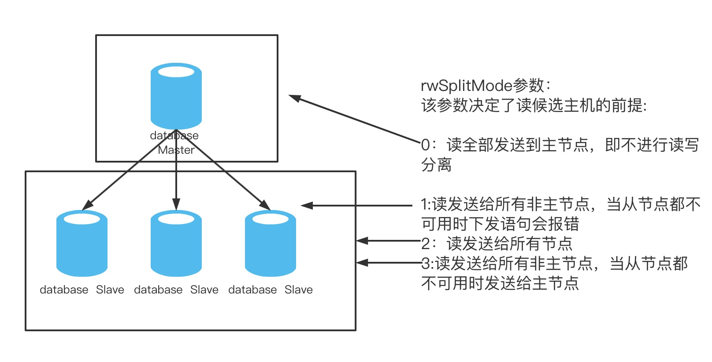

## 2.3 读写分离
### 2.3.1 读写分离条件

要实现读写分离必须满足如下条件：

1. 必须在db.xml中配置多个dbInstance(参见db.xml章节) 而且rwSplitMode配置不为0。 
2. SQL语句为select 或者show。  
3. 在非事务中。  
   当然，也可以通过注释/*#dble:db_type=slave, ... */ 或者/*!dble:db_type=slave, ... */ 强制发从(参见2.4 Hint).

 
### 2.3.2 负载均衡

dble通过配置多个dbInstance为读操作提供负载均衡。负载均衡通过如下的连接获取来实现。连接获取有如下两个步骤：

1.参与读写分离的资格检查，确定符合参与读写分离的候选主机集合
2.参与者承担读任务的负载均衡算法

#### 2.3.2.1  参与读写分离的资格检查

该算法在每次连接获取时提供可用的mysql实例集.

+ 写节点(primary="true")正常(heartbeat状态正常)
  - 写节点参与均衡,则有资格参与读写分离中的读,加入候选主机集合
  - 读节点(primary没配置或者 primary="false" )
     + 节点正常且需要同步状态检测,检查同步状态确定资格，决定是否加入候选主机集合
     + 节点正常且不需要同步状态检测,直接符合资格,加入候选主机集合
+ 写节点异常
  - 检查读节点是否可用,决定加入候选主机集合
  
#### 2.3.2.2  负载均衡算法

该算法在候选主机集中选择一个mysql实例以便获取连接.

+ 候选主机集为空,选择当前写主机.
+ 候选主机集为非空
  - 有权重设置(readWeight参数), 但不是所有权重等值, 依权重随机选择.
  - 无权重设置或所有权重等值, 等权随机选择。此种情况指示上面情况的特例。

#### 2.3.2.3 写节点是否参与均衡与dbGroup的rwSplitMode属性有关，具体见下见下图

