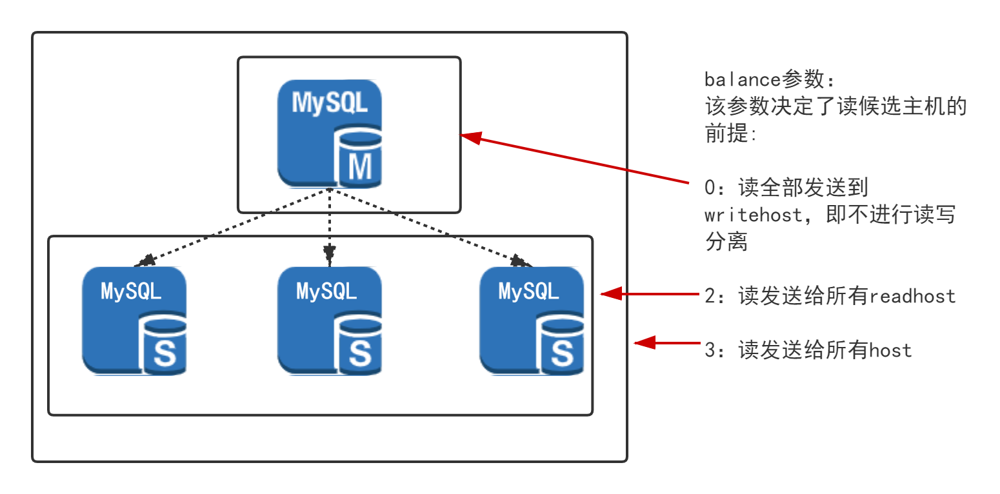

## 2.3 读写分离
### 2.3.1 读写分离条件

要实现读写分离必须满足如下条件：

1. 必须在schema.xml中配置readHost(参见1.2 schemal.xml) 而且balance配置不为0。 
2. SQL语句为select 或者show。  
3. 在非事务中。  
   当然，也可以通过注释/*#dble:db_type=slave, ... */ 或者/*!dble:db_type=slave, ... */ 强制发从(参见2.4 Hint).

 
### 2.3.2 负载均衡

dble通过在writeHost下配置多个readHost为读操作提供负载均衡(参见1.2 schemal.xml)。负载均衡通过如下的链接获取来实现。链接获取有如下两个步骤：

1.选择候选主机集合(候选主机选择算法)
2.在候选主机集中随机选择(随机选择算法)

#### 2.3.2.1  候选主机选择算法

该算法在每次连接获取时提供可用的mysql实例集.

+ 写节点正常(heartbeat状态正常)
  - 写节点参与均衡
     + 写节点为当前写节点且当前写节点参与均衡, 加入候选集合.
     + 非当前写节点且需要同步状态检测,是否加入候选集合依同步状态而定. 需要同步状态的条件为: 配置了slavethreshold和心跳语句为show slave status.
     + 非当前写节点且不需要同步状态检测,加入候选集合.
  - 读节点
     + 节点正常且需要同步状态检测,是否加入候选集合依同步状态而定.
     + 节点正常且不需要同步状态检测,加入候选集合.
+ 写节点异常
  - 如果配置读节点临时可用(参数tempreadhostavailable),是否加入候选集合同上读 节点 情况相同.
  
#### 2.3.2.2  随机选择算法：

该算法在候选主机集中选择一个mysql实例以便获取连接.

+ 候选主机集为空,选择当前写主机.
+ 候选主机集为非空
  - 有权重设置(weight参数), 但不是所有权重等值, 依权重随机选择.
  - 无权重设置或所有权重等值, 等权随机选择。此种情况指示上面情况的特例。

#### 2.3.2.3 写节点是否参与均衡与datahost的balance属性有关，具体见下见下图

