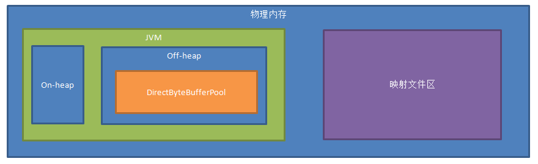
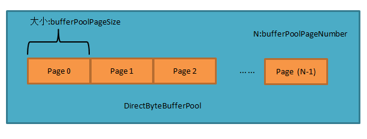
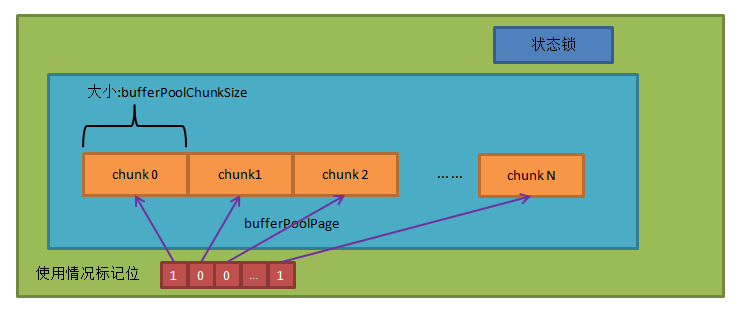

## 2.7 内存管理

### 2.7.1 内存结构概览：

* On-Heap 大小由JVM 参数Xms ,Xmx 决定，就是正常服务需要的内存，由jvm自动分配和回收。 

* Off-Heap大小由JVM 参数 XX:MaxDirectMemorySize 大小确定。 

* DirectByteBufferPool 大小 = bufferPoolPageNumber*bufferPoolPageSize

    bufferPoolPageNumber和bufferPoolPageSize可在Server.xml 配置 ，bufferPoolPageSize默认为2M, bufferPoolPageNumber默认为Java虚拟机的可用的处理器数量*20

* 映射文件区不在JVM之内

    大小计算方法求得值tmpMin= Min(物理内存的一半， free内存) 

    可在映射区保存的文件的个数=(向下取整(tmpMin/mappedFileSize))

    真实使用值= 可在映射区保存的文件的个数*mappedFileSize (mappedFileSize默认64M)

    其中mappedFileSize可由Server.xml 指定

    注：这里是通过单例模式，一次性确定映射文件区的大小，如果运行过程中，内存被其他进程占用，这里可能存在风险 

 

### 2.7.2 DirectByteBufferPool  
BufferPool结构概览：

单个bufferPoolPage的内部结构:  

#### 1.用途:
##### 1.1 网络读写时使用 
##### 1.2 中间结果集暂存时用于写数据前的缓存buffer
#### 2.初始化：
按照参数，初始化为bufferPoolPageNumber个页，每个页大小为bufferPoolPageSize

#### 3.内存分配 
##### 3.1 分配大小 
如果不指定分配大小，则默认分配一个最小单元(最小单元由bufferPoolChunkSize决定，默认大小为 4k,请最好设为bufferPoolPageSize 的约数，否则最后一个会造成浪费)。 

如果指定分配大小，则分配放得下分配大小的最小单元的整数倍(向上取整)  。 

总之，大小为 M*bufferPoolChunkSize 

##### 3.2 分配方式
遍历 缓冲池从N+1页到bufferPoolPageNumber-1页(上次分配过的记为第N页)

	  对单页加锁在每个页中从头寻找未被使用的连续M个最小单元 

如果没找到，再从第0页找到第N页  

以上成功后更新上次分配页，标记分配的单元 

如果找不到可存放的单页(比如大于bufferPoolPageSize )，直接分配On-Heap内存 
 

 

#### 4.内存回收 
##### 4.1 如果是On-Heap内存
直接clear，等GC回收

##### 4.2 如果是Off-Heap内存
遍历所有页，找到对应页

对单页加锁，到对应页的对应块的位置，标记为未使用 

### 2.7.3 处理中间结果集过大时内存使用  
 
目前dble 对每个session的内存管理如下：  
 
* Join内存管理，最大上限为4M，目前写死，用于管理join操作暂存的数据  
* Order内存管理，最大上限为4M，目前写死，用于管理排序操作暂存的数据  
* Other内存管理，最大上限为4M，目前写死，用于管理distinct group ，nestloop操作暂存的数据  

每一个复杂查询中，当子查询单元需要在中间件当中暂存数据的时候,数据会存在Heap内存当中，但如果当前存储使用的内存大于4M，则需要写内存映射文件。  
如果内存映射文件个数达到上限（参见概览中的可在映射区保存的文件的个数），则会去写硬盘。  
写文件的时候，当单个文件大于mappedFileSize时，会将文件拆分。  

注1:内存映射文件总大小在第一次使用时就确定，有风险  
注2:写硬盘时候的缓冲区是从DirectByteBufferPool申请的chunk大小的  

