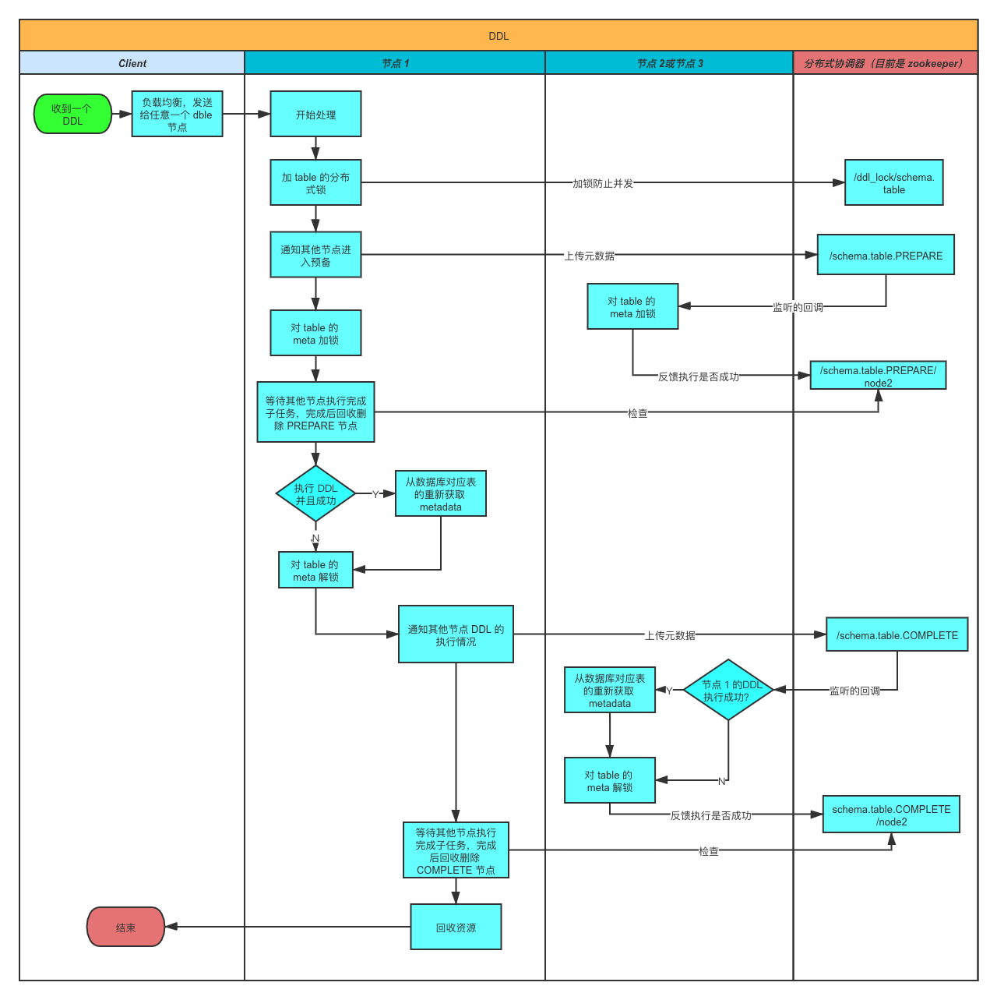
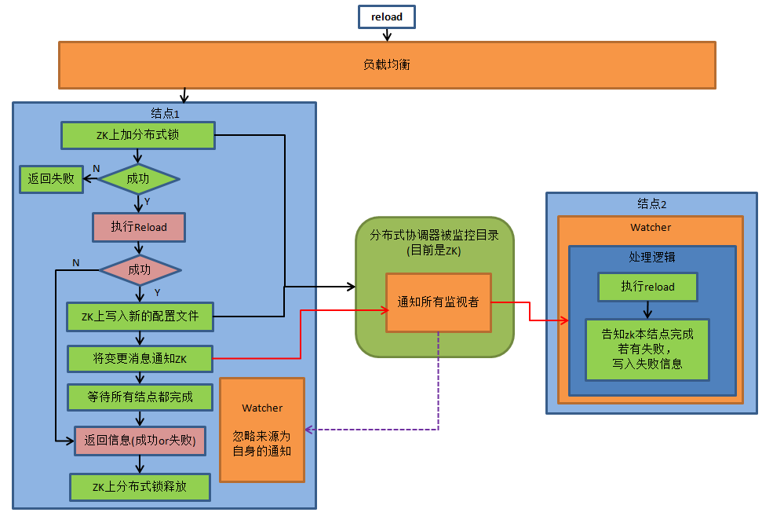
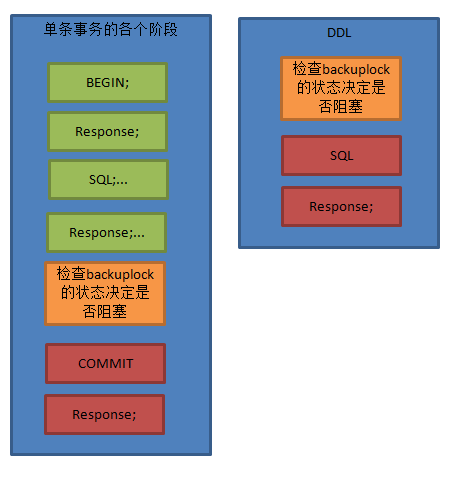
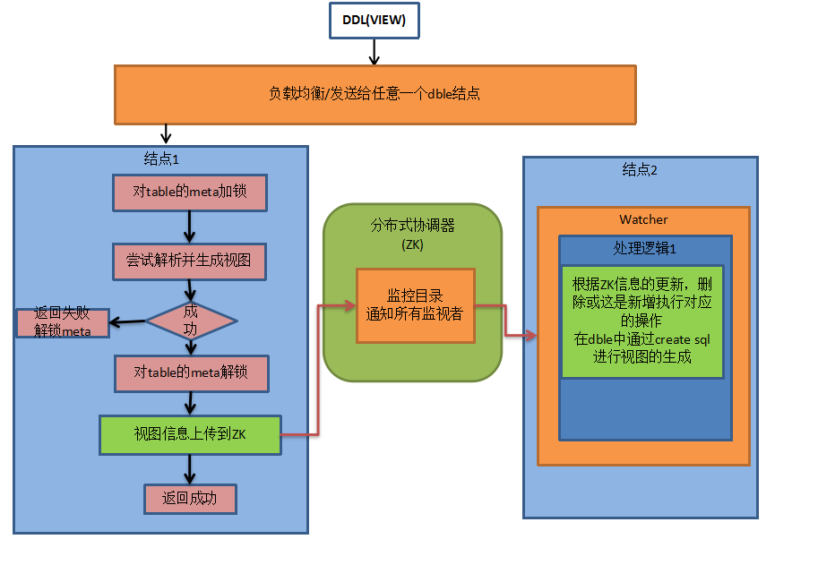
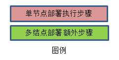

## 2.8 集群同步协调&状态管理

### 2.8.1 概述
大多数时候，dble结点是无状态的，所以可以用常用的高可用/负载均衡软件来接入各个结点。  
这里不讨论各个负载均衡软件的使用。  
主要讨论一下某些情况下需要同步状态的操作和细节。  
注：本部分内容需要额外部署zookeeper用于管理集群的状态和同步。  

### 2.8.2 配置
配置文件 myid.properties:
    
    #不使用/单节点部署请设置为false
    loadZk=true
    #zk的clinet端入口
    zkURL=127.0.0.1:2181
    #zk上的命名空间,同一集群使用同一个
    clusterId=server-cluster-1
    #每个结点必须不同
    myid=server_fz_01

### 2.8.3 初始化状态
 
#### 方式1.
通过执行脚本init_zk_data.sh方式将某个结点的配置文件等数据写入ZK,所有结点启动时都从ZK拉取配置数据。
 

#### 方式2.
在第一个结点第一次启动时自动将自己的配置文件写入ZK,其他结点启动时从ZK拉取。  
第一个结点的判定：用分布式锁抢占的方式，未抢占到结点会阻塞等待直到获取到分布式锁，如果此时初始化标记已经被设置，则从ZK拉取配置，否则将自己本地配置写入。  

### 2.8.4 状态同步
#### A.DDL
做DDL时候会在执行的某个节点成功后，将消息推给ZK，ZK负责通知其他结点做变更。流程如下图：  

注：

1. 新结点启动时，加载元数据前会检测是否有其他结点在做DDL变更，如果有，则等待。  
否则加分布式锁防止加载元数据期间其他结点做DDL变更, 直到元数据加载完释放分布式锁 。   

2. 回收指的是：每个节点ddl完成后会告知分布式协调器自己已经完成，并检查如果所有结点均完成，则删除schema.table 结点。此操作为原子操作。

3. 发起结点故障：如果执行DDL的结点故障下线，其他结点会侦听到此消息，保证解开对应结点的tablemeta锁，并记录故障告警（如果配置了告警通道），需要运维人工介入修改ZK对应ddl结点的状态，检查各个结点meta数据状态，可能需要reload metadata。

4. 逻辑上不应该有某个监听节点上加载meta失败的情况，如果发生了，告警处理

	  (人工介入对应结点的meta是不正确的,需要reload meta)

5. 注:view目前是异步模式,可能存在某个间隙view修改成功，查询仍旧拿到旧版的view结构。

#### B.reload @@config/ reload @@config_all/ rollback @@config
执行流程如下图：  

 
注：如果在部分结点失败，则会返回错误及错误原因以及结点名。

#### C.拉取一致性的binlog线

##### 目的:
获得后端数据库实例的一致性binlog位置。由于两阶段提交的第二阶段执行在各结点无法保证时序性和同步性，所以直接下发show master status获取binlog可能会造成不一致。  

##### 实现方式：
如下图，当前端收到show @@binlog.status 语句时，遍历当前所有活动session查看状态 。  
若session处于绿色区域，则在进入红色区域前等待知道show @@binlog.status结果返回  
若存在session处于红色区域，则需要等待所有红色区域的session返回结果走出红色区域后下发show master status。  

##### 超时处理：
此处有可能有死锁发生。  
场景:session1 正在更新tableA，处于绿色区域，session2下发有关于tableA 的DDL，等待  metaLock解锁，处于红色区域.session3 下发show @@binlog.status.  
此时session1 等待session3, session2等待session1,session3等待session2.  
因此引入超时机制。如果session3 等待超过showBinlogStatusTimeout(默认60s，可配置)，自动放弃等待，环状锁解除。  

##### 集群协调：
1.收到请求后同步通知ZK，先等待本身结点准备工作结束，之后zk通知其他结点处理。  
2.所有结点遍历各自的活动的session，进入红色区域的等待处理完成，绿色区域的暂停进入红色区域。  
3.结点将准备好/超时将状态上报给ZK  
4.主节点等待所有结点状态上报完成之后，判断是否可以执行任务，若是,则执行show   @@binlog.status并返回结果，否则报告本次执行失败。  
5.主节点通过ZK通知各结点继续之前的任务  

##### 集群超时处理：
若有结点超时未准备好，主节点会报超时错误，并通过ZK通知各结点继续之前的任务。

##### 故障处理：
主节点执行过程中故障下线，其他结点会感知，保证自己结点一定时间后自动解锁继续原有任务。  
ZK状态需要人工干预。人工等待所有结点超时之后，手动删除/修改zk上的状态信息以便下次执行时不出问题。

#### D.View管理
在使用集群模式是，使用zk进行view视图信息的管理，使得整个dble集群能够进行视图信息的同步
由于视图只用于数据查询且不会造成数据异常的属性，在视图同步时采用异步同步的方法

注 在zk上的view数据信息如下形式
    key schema.table
    value {"serverId":"create_Server_id",
           "createSql":"view_create_sql"}  
		   
#### E.其他(暂未实现)
cache配置变化（暂未实现专门入口）:  
reload 时会将变化写入zk并通知其他结点同步   

新增自增序列表（暂未实现专门入口）：  
reload未比对并添加新表的配置，  
包括sequence_conf.properties  和sequence_db_conf.properties 方式  

### 2.8.5 XA日志管理
在使用集群模式时，未完成的XA日志会存放在zookeeper上，更加安全，防止某台机器硬盘物理损坏导致日志丢失（此处可能会有并发高吞吐引发的性能及其他问题，待测试）。  

### 2.8.6 ZK整体目录结构
 

	dble
		server-cluster-1
			conf
				inited
				status
				schema
					schema
					dataNode
					dataHost
				server
					default
					user
					firewall
				rules
					tableRule
					function
			cache
				ehcache.xml
				cacheservice.properties
			sequences
				leader
				instance
				incr_sequence//批量步长方式
					table_name
				common
					sequence_conf.properties
					sequence_db_conf.properties
					sequence_distributed_conf.properties(INSTANCEID配置为非zk的,不同步)
			bindata
				dnindex.properties
			binlog_pause
				instance
				status
			lock
				dnindex.lock
				syncMeta.lock(tmp,启动时)
				confInit.lock
				confChange.lock
				binlogStatus.lock
			online
				myid(tmp)
			ddl
				`schema`.`table`（ddl运行时）
					instance
						myid(tmp)
				`schema`.`table2`
			xalog
				node1
				node2
			view
			     schema.table
 

### 2.8.7 全局序列
类twitter snowflake 方式，ZK完成的工作是生成每个节点的instanceID。  
类offset-step 方式，ZK完成的工作是存储当前的Step值。  

### 2.8.8 附录

