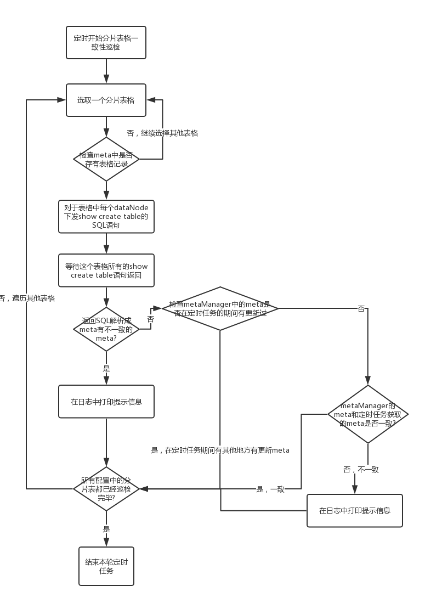

### 2.10.3 一致性检测
由于Dble对于分片的应用和处理可以看到，对于某张具体的分片表，dble默认在具体数据库节点上的所有表格的实体拥有同样的结构，由于可能在Dble运行的过程中的种种问题导致了数据库节点的表格结构不一致的情况，在Dble中有对于各个分片表的表格结构进行定期检查确认的机制。

分片表结构一致性检查的定时任务为tableStructureCheckTask，其周期为checkTableConsistencyPeriod默认值30×60×1000（30分钟），任务开关为checkTableConsistency默认为0（关闭），以上配置均配置在server.xml中

大致的表格一致性检查任务逻辑如下：

+ 循环配置信息中的schema以及table
+ 检查对应数据库和表格的meta信息是否存在
+ 对于每个有效的节点下发SQL “show create table”
+ 根据收到的建表语句创建新的meta，并通过Set进行去重
+ 判断有几个不同的meta，若meta数量超过一个则进行在日志中打印告警信息
+ 将新老的meta进行对比，如果发现新老meta之间的meta也不一致则在日志中打印告警信息  

整体的流程图如下：  

	   
##### 全局表的一致性检查
全局表在Dble的使用中被认为每个节点都存在全量的数据，所以在全局表的检查中不光检查了全局表的表格结构，还在需要另外检查表格的数据一致性,功能开启由server.xml参数useGlobleTableCheck控制。  

