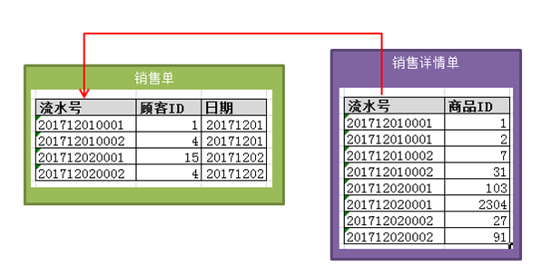
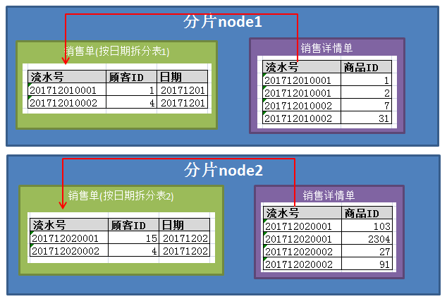

## 2.14 ER 拆分

### 2.14.1 普通ER拆分
当我们需要两个表要进行join的时候,由于数据被分配到不同的节点上，普通的nest loop 方式可能效率会很低。  
如果我们能把需要join的表按照统一规则划分到相同的区上，就能大概率的解决这一问题。  
举个简单的例子如下：  


这样两张表具有外键关系，我们可以仿照聚簇的方式按照对应列来进行拆分，这样就可以不跨库实现join了。  
如下图:  


要实现这样的ER功能，需要如下配置。  
```
<shardingTable name="sales" shardingNode="dn1,dn2" function="sharding" shardingColumn="id">
<childTable name="sales_detail" joinColumn="sales_detail_pos_num" parentColumn="sales_pos_num"/>
</table>
``` 


### 2.14.2 智能的ER关系
当我们有多个不同的表时，上面的配置方式有点难以使用了。  
这种情况下，如果2张或者多张表在dble上的分片规则相同并且具体分片也相同，即使没有配置ER关系，也会当作ER关系来处理。  
举例如下配置（片段）：
```
<!--schema片段-->
<shardingTable name="tableA" shardingNode="dn1,dn2" function="hash_function" shardingColumn="id_a" />
<shardingTable name="tableB" shardingNode="dn1,dn2" function="hash_function" shardingColumn="id_b" />
<shardingTable name="tableC" shardingNode="dn2,dn1" function="hash_function" shardingColumn="id_c" />
<shardingTable name="tableD" shardingNode="dn3,dn4" function="hash_function" shardingColumn="id_a" />
<shardingTable name="tableE" shardingNode="dn1,dn2" function="hash_function" shardingColumn="id_a" />
<shardingTable name="tableF" shardingNode="dn1,dn2" function="enum_par" shardingColumn="id_a" />
 
<!--rfunction片段-->
<function name="enum_par"
   class="com.actiontech.dble.route.function.PartitionByFileMap">
   <property name="mapFile">partition-hash-int.txt</property>
</function>
<function name="hash_function" class="com.actiontech.dble.route.function.PartitionByLong">
   <property name="partitionCount">2</property>
   <property name="partitionLength">512</property>
</function>  
``` 

最终会得出这样一个映射关系，识别分组会根据数据分布结点 和function的唯一性将表分为几组，同一组的才会有ER关系。

<table >
<tbody>
<tr >
<th >
table名
</th>
<th >
拆分列
</th>
<th    >
数据分布结点
</th>
<th colspan="1"    >
function
</th>
<th colspan="1"    >
识别分组
</th>
</tr>
<tr>
<td >
tableA
</td>
<td >
id_a
</td>
<td >
dn1,dn2
</td>
<td colspan="1" >
hash_function
</td>
<td colspan="1" >1</td>
</tr>
<tr>
<td >
tableB
</td>
<td >
id_b
</td>
<td >
dn1,dn2
</td>
<td colspan="1" >
hash_function
</td>
<td colspan="1" >1</td>
</tr>
<tr>
<td >
tableC
</td>
<td >
id_c
</td>
<td >
dn2,dn1
</td>
<td colspan="1" >
hash_function
</td>
<td colspan="1" >2</td>
</tr>
<tr>
<td >
tableD
</td>
<td >
id_a
</td>
<td >
dn3,dn4
</td>
<td colspan="1" >
hash_function
</td>
<td colspan="1" >3</td>
</tr>
<tr>
<td >
tableE
</td>
<td >
id_a
</td>
<td >
dn1,dn2
</td>
<td colspan="1" >
hash_function
</td>
<td colspan="1" >1</td>
</tr>
<tr>
<td colspan="1" >
tableF
</td>
<td colspan="1" >
id_a
</td>
<td colspan="1" >
dn1,dn2
</td>
<td colspan="1" >
enum_par
</td>
<td colspan="1" >4</td>
</tr>
</tbody>
</table>

即，ER关系集合为：

<tableA.id_a , tableB.id_b, tableE.id_a > 

<tableC.id_c>

<tableD.id_a>

<tableF.id_a>

PS：此处略去了schema，实际实现需要标识schema防止重复，ER关系是到列的，如果关联关系不是上述表对应的列，也不会视为ER.

