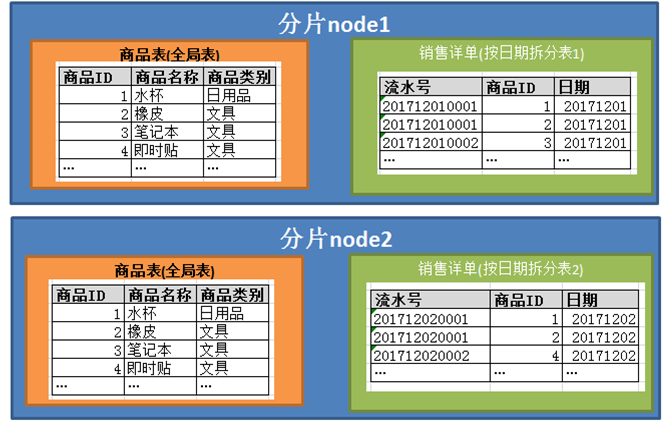

## 2.15 global 表
在一些业务系统中，存在着类似字典表的表格，它们与业务表之间可能有关系，这种关系，可以理解为“标签”，而不应理解为通常的“主从关系”。  
这些表具有以下几个特性:  

+ 变动不频繁
+ 数据量总体变化不大
+ 数据规模不大，很少有超过数十万条记录。 

鉴于此，dble 定义了一种特殊的表，称之为“全局表”，全局表具有以下特性：
  
+ 全局表的插入、更新操作会实时在所有节点上执行，保持各个分片的数据一致性
+ 全局表的查询操作，只从一个节点获取
+ 全局表可以跟任何一个表进行JOIN 操作  
 
将字典表或者符合字典表特性的一些表定义为全局表，某种程度上部分解决了数据JOIN的难题。  
举例如下:  
  

对于数据量不大的字典表（例:超市商品）,在多个分片上都有一份同样的副本

相关JOIN语句可以直接下发给各个结点，直接合并结果集就行.

JOIN 例子(伪SQL):
```
SELECT 日期,商品名,COUNT(*)  AS 订单量  
FROM 商品表 
JOIN 销售详单 USING(商品ID) 
WHERE 日期范围(跨结点)  
GROUP  BY 日期,商品名。
```

