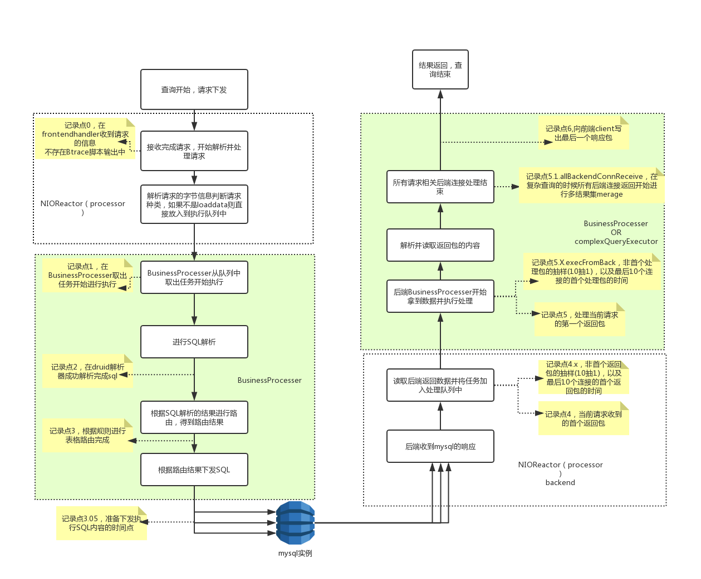
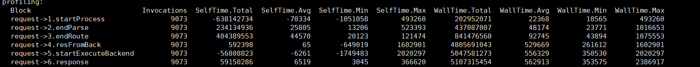
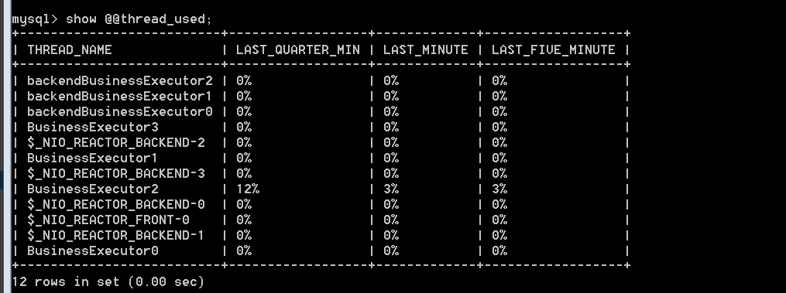

## 2.18 性能观测以及调试概览
+ Btrace脚本性能观察(观察查询过程中每个不同阶段的耗时)
+ manager命令show @@thread_used观察(观察不同线程的负载情况)

### 2.18.1 Btrace脚本观察
#### 2.18.1.1 观察 
Dble源码中自带观测脚本,[BTraceCostTime.java](https://github.com/actiontech/dble/tree/master/src/main/java/com/actiontech/dble/btrace/script/BTraceCostTime.java)文件是专用的Btrace观测脚本,当前脚本适用Btrace v.1.3  
Btrace 相关资料[https://github.com/btraceio/btrace](https://github.com/btraceio/btrace)  
开启性能观察的统计需要配置bootstrap.cnf中的两个参数useCostTimeStat和costSamplePercent，分别是启用耗时监控的标志位以及耗时监控的采样百分比，useCostTimeStat = 1的状态下耗时监控被开启，并且以costSamplePercent的概率进行统计，默认的采样率是1%，采样率过低有可能导致btrace脚本输出没有统计结果的情况，采样率过高则会影响性能本身。
脚本中包含几个统计点如下图所示：  

通过执行[btrace](https://github.com/btraceio/btrace)监控正在运行的dble，可以获得类似以下的结果图： 
 

以上输出值有效信息为Block,Invocations,WallTime.* , 而SelfTime.*由于btrace的原因 不准确，可以忽略。  
其中通过记录一个查询在每个记录点的时间点来观察是否存在某个中间步骤耗时过长，并进行针对性的优化和调整

#### 2.18.1.2 节点描述
+ **0** : 逻辑时间0，来自客户端的请求首次被dble接收到的时间点
+ **1.startProcess** : 开始处理前端请求的时间节点
+ **2.endParse** : SQL被解析完成的时间节点
+ **3.endRoute** : SQL被路由完成的时间节点
+ **3.05 readyToDeliver** : SQL准备开始下发的时间点
+ **4.resFromBack** : 前端请求首次由任意个后端连接返回信息
+ **4.X.resFromBack** : 前端请求后端连接的首个返回包的采样时间点,例：4.3.resFromBack指的是第三个后端连接首次返回包给dble的时间点，具体的后端连接的编号为首次返回的顺序，即首个有网络包返回的后端连接编号为1
+ **5.startExecuteBackend** : 前端请求后端连接首个包进入处理阶段的时间点
+ **5.X.startExecuteBackend** : 前端请求后端连接的首个包被处理的采样时间点，例：5.3.startExecuteBackend指的是第三个后端连接首次进入到后端数据处理的阶段，具体的编号为首次进入处理阶段的顺序
+ **5.1.allBackendConnReceive** ：在复杂查询的情况下开始merage的时间点
+ **6.response** : 给前端开始最终返回包的时间点

**注意:Btrace关于性能跟踪的脚本设计专为单一SQL模式下使用，在多个SQL混合查询的情况下，由于每个SQL涉及的采样点可能不同，会出现数据上的异常，甚至是节点顺序和时间点倒挂的现象**  
####  2.18.1.3 调整策略
+ 1-0的耗时增长：需增大bootstrap.cnf中processorExecutor的值
（其中0比表示dble开始读到某条语句时的时间，即初始值：0，所以1-0的时间就是request->1.startProcess的输出值，不需要进行计算）
+ 4-3的耗时增长：需增大bootstrap.cnf中backendProcessors的值
+ 5-4的耗时增长：需增大bootstrap.cnf中backendBusinessExecutor的值  

### 2.18.2 Manager命令观察

#### 2.18.2.1 观察 
Dble 在18.02.0版本中新添加了manager端口的性能观测命令，可以通过命令查看各个线程的负载情况，需要配合在配置文件bootstrap.cnf中的新增参数useThreadUsageStat进行使用  
使用命令show @@thread_used会返回各个dble中关键线程最近时间的负载情况，如下示例  

+ BussinessExecutor**X**  
  面向前端的业务处理线程，主要处理前端请求的解析，sql解析路由，下发查询到mysql实例等  
+ backendBusinessExecutor**X**  
  面向后端的业务处理线程，主要处理后端mysql查询结果的返回解析，结果聚合，并发回结果到client  
+ $\_NIO\_REACTOR\_FRONT\_**X**  
  前端请求接受线程,负责请求的接收和读取,之后把数据处理交给BussinessExecutor进行    
+ $\_NIO\_REACTOR\_BACKEND\_**X**  
  后端请求接收线程，负责mysql返回信息的接收和读取，之后把数据交给backendBusinessExecutor处理

####  2.18.2.2 调整策略
当输出的统计结果中，有一个或者多个类型的线程使用率过高（经验值为超过80%），可以适当调整对应的处理线程的数量 
 
+ processors 参数控制前端\_NIO\_REACTOR\_FRONT\_**X**的数量  
+ backendProcessors 参数控制后端\_NIO\_REACTOR\_BACKEND\_**X**的数量  
+ backendProcessorExecutor 参数控制backendBusinessExecutor**X**数量  
+ processorExecutor 参数控制BussinessExecutor**X**数量  

