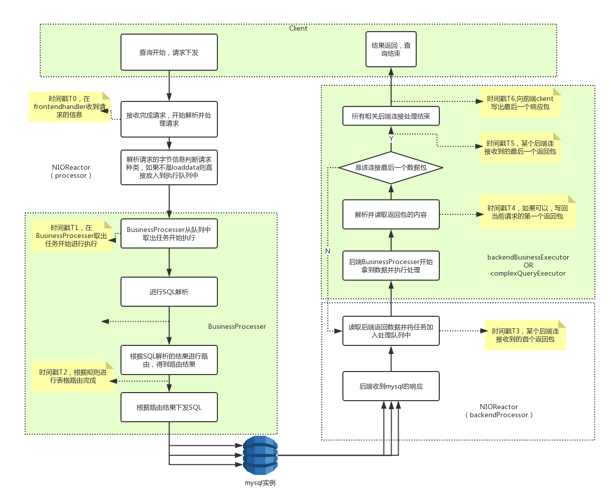

## 2.20 慢查询日志

类似于MySQL的慢查询日志，可以全局开启并设置，记录dble server运行过程当中的慢查询日志，日志格式兼容MySQL慢查询分析工具(已测试过MySQL官方工具mysqldumpslow和Percona的pt-query-digest)  

### 2.20.1 在server.xml里增加了6个参数，用于启动时候控制慢查询日志的行为  
```
 <!-- 是否开启慢查询日志 -->
<property name="enableSlowLog">0</property>
<!-- 慢查询日志保存文件目录 -->
<!--<property name="slowLogBaseDir">./slowlogs</property>-->
<!-- 慢查询日志保存文件前缀名称 -->
<!--<property name="slowLogBaseName">slow-query</property>-->
<!-- 日志两次刷盘之间的最大周期，单位是秒 -->
<property name="flushSlowLogPeriod">1</property>
<!-- 日志两次刷盘之间内存中的最大条数阈值 -->
<property name="flushSlowLogSize">1000</property>
<!-- 慢查询统计阈值，大于此值会被认为是慢查询 , 单位是毫秒 -->
<property name="sqlSlowTime">100</property>
```
### 2.20.2 管理端口增加命令，用于运行过程中动态修改慢查询日志统计行为  
```
enable @@slow_query_log; -- 开启慢查询日志  
show @@slow_query_log; -- 查询慢查询日志的开启状态  
disable @@slow_query_log; -- 关闭慢查询日志  
show @@slow_query_log;

show @@slow_query.time;  -- 查看慢查询日志统计阈值  
reload @@slow_query.time=200;  -- 修改慢查询日志统计阈值  

show @@slow_query.flushperiod; -- 查看慢查询日志刷盘周期  
reload @@slow_query.flushperiod=2;  -- 修改慢查询日志刷盘周期  

show @@slow_query.flushsize;-- 查看慢查询日志刷盘条数阈值  
reload @@slow_query.flushsize=1100;  -- 修改慢查询日志刷盘条数阈值  
```
### 2.20.3 支持慢查询日志分析工具：MySQL的 mysqldumpslow 工具和Percona 的 pt-query-digest 工具  
慢查询日志大概是这样的 :  

```
/FAKE_PATH/mysqld, Version: FAKE_VERSION. started with:
Tcp port: 3320  Unix socket: FAKE_SOCK
Time                 Id Command    Argument
# Time: 2018-08-23T17:40:10.149000Z
# User@Host: root[root] @  [0:0:0:0:0:0:0:1]  Id:   2
# Query_time: 0.132709  Lock_time: 0.000000 Rows_sent: 0  Rows_examined: 0  Read_SQL: 0.000350  Prepare_Push: 0.116678  dn1_First_Result_Fetch: 0.013686  dn1_Last_Result_Fetch: 0.001422  Write_Client: 0.001995
SET timestamp=1535017210149;
select * from sharding_two_node where id =1;
# Time: 2018-08-23T17:40:10.200000Z
# User@Host: root[root] @  [0:0:0:0:0:0:0:1]  Id:   2
# Query_time: 0.035600  Lock_time: 0.000000 Rows_sent: 0  Rows_examined: 0  Read_SQL: 0.000062  Prepare_Push: 0.006733  dn2_First_Result_Fetch: 0.012524  dn1_First_Result_Fetch: 0.010971  dn2_Last_Result_Fetch: 0.015368  dn1_Last_Result_Fetch: 0.005119  Write_Client: 0.017834
SET timestamp=1535017210200;
select * from sharding_two_node;
# Time: 2018-08-23T17:40:10.282000Z
# User@Host: root[root] @  [0:0:0:0:0:0:0:1]  Id:   2
# Query_time: 0.045337  Lock_time: 0.000000 Rows_sent: 0  Rows_examined: 0  Read_SQL: 0.000166  Prepare_Push: 0.003941  dn1_First_Result_Fetch: 0.039652  dn1_Last_Result_Fetch: 0.000300  Write_Client: 0.001578
SET timestamp=1535017210282;
delete from sharding_two_node where id =15;
# Time: 2018-08-23T17:40:10.315000Z
# User@Host: root[root] @  [0:0:0:0:0:0:0:1]  Id:   2
# Query_time: 0.031232  Lock_time: 0.000000 Rows_sent: 0  Rows_examined: 0  Read_SQL: 0.005467  Prepare_Push: 0.001989  dn2_First_Result_Fetch: 0.020240  dn2_Last_Result_Fetch: 0.001900  Write_Client: 0.003536
SET timestamp=1535017210315;
delete from sharding_two_node where id =519;
# Time: 2018-08-23T17:40:10.432000Z
# User@Host: root[root] @  [0:0:0:0:0:0:0:1]  Id:   2
# Query_time: 0.116672  Lock_time: 0.000000 Rows_sent: 0  Rows_examined: 0  Read_SQL: 0.013625  Prepare_Push: 0.024767  dn2_First_Result_Fetch: 0.056395  dn1_First_Result_Fetch: 0.026420  dn2_Last_Result_Fetch: 0.000743  dn1_Last_Result_Fetch: 0.001700  Write_Client: 0.051861
SET timestamp=1535017210432;
insert into sharding_two_node values(15,'15',15),(519,'519',519);
# Time: 2018-08-23T17:40:10.772000Z
# User@Host: root[root] @  [0:0:0:0:0:0:0:1]  Id:   2
# Query_time: 0.338569  Lock_time: 0.000000 Rows_sent: 0  Rows_examined: 0  Read_SQL: 0.000082  Prepare_Push: 0.258365  dn1_0_First_Result_Fetch: 0.047494  dn1_0_Last_Result_Fetch: 0.029018  dn2_0_First_Result_Fetch: 0.042964  dn2_0_Last_Result_Fetch: 0.033525  Write_Client: 0.009385
SET timestamp=1535017210772;
select count(*) from sharding_two_node;
# Time: 2018-08-23T17:40:10.821000Z
# User@Host: root[root] @  [0:0:0:0:0:0:0:1]  Id:   2
# Query_time: 0.046745  Lock_time: 0.000000 Rows_sent: 0  Rows_examined: 0  Read_SQL: 0.000059  Prepare_Push: 0.025401  dn1_0_First_Result_Fetch: 0.011755  dn1_0_Last_Result_Fetch: 0.001180  Generate_New_Query: 0.001706  dn1_1_First_Result_Fetch: 0.004224  dn1_1_Last_Result_Fetch: 0.001213  Write_Client: 0.001384
SET timestamp=1535017210821;
select count(*) from sharding_two_node where id =(select id from sharding_two_node where id=1);
# Time: 2018-08-23T17:40:12.061000Z
# User@Host: root[root] @  [0:0:0:0:0:0:0:1]  Id:   2
# Query_time: 0.036952  Lock_time: 0.000000 Rows_sent: 0  Rows_examined: 0  Read_SQL: 0.001111  Prepare_Push: 0.001132  dn1_First_Result_Fetch: 0.034266  dn1_Last_Result_Fetch: 0.000084  Write_Client: 0.000443
SET timestamp=1535017212061;
delete from sharding_two_node where id =15;
# Time: 2018-08-23T17:40:12.091000Z
# User@Host: root[root] @  [0:0:0:0:0:0:0:1]  Id:   2
# Query_time: 0.028213  Lock_time: 0.000000 Rows_sent: 0  Rows_examined: 0  Read_SQL: 0.000666  Prepare_Push: 0.001206  dn2_First_Result_Fetch: 0.025991  dn2_Last_Result_Fetch: 0.000101  Write_Client: 0.000349
SET timestamp=1535017212091;
delete from sharding_two_node where id =519;
# Time: 2018-08-23T17:40:12.132000Z
# User@Host: root[root] @  [0:0:0:0:0:0:0:1]  Id:   2
# Query_time: 0.040365  Lock_time: 0.000000 Rows_sent: 0  Rows_examined: 0  Read_SQL: 0.000223  Prepare_Push: 0.001172  dn2_First_Result_Fetch: 0.019852  dn1_First_Result_Fetch: 0.019810  dn2_Last_Result_Fetch: 0.000901  dn1_Last_Result_Fetch: 0.000780  Write_Client: 0.019160
SET timestamp=1535017212132;
insert into sharding_two_node values(15,'15',15),(519,'519',519);
# Time: 2018-08-23T17:40:12.145000Z
# User@Host: root[root] @  [0:0:0:0:0:0:0:1]  Id:   2
# Query_time: 0.012196  Lock_time: 0.000000 Rows_sent: 0  Rows_examined: 0  Read_SQL: 0.000115  Prepare_Push: 0.001403  dn1_0_First_Result_Fetch: 0.006714  dn1_0_Last_Result_Fetch: 0.002561  dn2_0_First_Result_Fetch: 0.006787  dn2_0_Last_Result_Fetch: 0.001806  Write_Client: 0.002280
SET timestamp=1535017212145;
select count(*) from sharding_two_node;
# Time: 2018-08-23T17:40:12.164000Z
# User@Host: root[root] @  [0:0:0:0:0:0:0:1]  Id:   2
# Query_time: 0.016979  Lock_time: 0.000000 Rows_sent: 0  Rows_examined: 0  Read_SQL: 0.000224  Prepare_Push: 0.002236  dn1_0_First_Result_Fetch: 0.006678  dn1_0_Last_Result_Fetch: 0.000703  Generate_New_Query: 0.000866  dn1_1_First_Result_Fetch: 0.004532  dn1_1_Last_Result_Fetch: 0.000879  Write_Client: 0.001002
SET timestamp=1535017212164;
select count(*) from sharding_two_node where id =(select id from sharding_two_node where id=1);
# Time: 2018-08-23T17:40:13.134000Z
# User@Host: root[root] @  [0:0:0:0:0:0:0:1]  Id:   2
# Query_time: 0.010213  Lock_time: 0.000000 Rows_sent: 0  Rows_examined: 0  Read_SQL: 0.000145  Prepare_Push: 0.001520  dn1_First_Result_Fetch: 0.007996  dn1_Last_Result_Fetch: 0.000201  Write_Client: 0.000551
SET timestamp=1535017213134;
select * from sharding_two_node where id =1;
# Time: 2018-08-23T17:40:13.153000Z
# User@Host: root[root] @  [0:0:0:0:0:0:0:1]  Id:   2
# Query_time: 0.014257  Lock_time: 0.000000 Rows_sent: 0  Rows_examined: 0  Read_SQL: 0.000080  Prepare_Push: 0.002394  dn2_First_Result_Fetch: 0.008839  dn1_First_Result_Fetch: 0.008837  dn2_Last_Result_Fetch: 0.001424  dn1_Last_Result_Fetch: 0.002407  Write_Client: 0.002945
SET timestamp=1535017213153;
select * from sharding_two_node;
# Time: 2018-08-23T17:40:13.212000Z
# User@Host: root[root] @  [0:0:0:0:0:0:0:1]  Id:   2
# Query_time: 0.029822  Lock_time: 0.000000 Rows_sent: 0  Rows_examined: 0  Read_SQL: 0.000063  Prepare_Push: 0.001128  dn1_First_Result_Fetch: 0.028277  dn1_Last_Result_Fetch: 0.000109  Write_Client: 0.000355
SET timestamp=1535017213212;
delete from sharding_two_node where id =15;
# Time: 2018-08-23T17:40:13.240000Z
# User@Host: root[root] @  [0:0:0:0:0:0:0:1]  Id:   2
# Query_time: 0.027695  Lock_time: 0.000000 Rows_sent: 0  Rows_examined: 0  Read_SQL: 0.000067  Prepare_Push: 0.000682  dn2_First_Result_Fetch: 0.026582  dn2_Last_Result_Fetch: 0.000078  Write_Client: 0.000364
SET timestamp=1535017213240;
delete from sharding_two_node where id =519;
# Time: 2018-08-23T17:40:13.321000Z
# User@Host: root[root] @  [0:0:0:0:0:0:0:1]  Id:   2
# Query_time: 0.076093  Lock_time: 0.000000 Rows_sent: 0  Rows_examined: 0  Read_SQL: 0.000231  Prepare_Push: 0.001334  dn2_First_Result_Fetch: 0.035072  dn1_First_Result_Fetch: 0.035074  dn2_Last_Result_Fetch: 0.018756  dn1_Last_Result_Fetch: 0.001263  Write_Client: 0.039457
SET timestamp=1535017213321;
insert into sharding_two_node values(15,'15',15),(519,'519',519);
# Time: 2018-08-23T17:40:13.348000Z
# User@Host: root[root] @  [0:0:0:0:0:0:0:1]  Id:   2
# Query_time: 0.026278  Lock_time: 0.000000 Rows_sent: 0  Rows_examined: 0  Read_SQL: 0.000335  Prepare_Push: 0.001249  dn1_0_First_Result_Fetch: 0.011028  dn1_0_Last_Result_Fetch: 0.009279  dn2_0_First_Result_Fetch: 0.019200  dn2_0_Last_Result_Fetch: 0.003441  Write_Client: 0.004600
SET timestamp=1535017213348;
select count(*) from sharding_two_node;
# Time: 2018-08-23T17:40:13.381000Z
# User@Host: root[root] @  [0:0:0:0:0:0:0:1]  Id:   2
# Query_time: 0.029152  Lock_time: 0.000000 Rows_sent: 0  Rows_examined: 0  Read_SQL: 0.000662  Prepare_Push: 0.003189  dn1_0_First_Result_Fetch: 0.014453  dn1_0_Last_Result_Fetch: 0.001013  Generate_New_Query: 0.000911  dn1_1_First_Result_Fetch: 0.005703  dn1_1_Last_Result_Fetch: 0.001483  Write_Client: 0.002114
SET timestamp=1535017213381;
select count(*) from sharding_two_node where id =(select id from sharding_two_node where id=1);
# Time: 2018-08-23T17:40:14.163000Z
# User@Host: root[root] @  [0:0:0:0:0:0:0:1]  Id:   2
# Query_time: 0.012540  Lock_time: 0.000000 Rows_sent: 0  Rows_examined: 0  Read_SQL: 0.000197  Prepare_Push: 0.001303  dn2_First_Result_Fetch: 0.006452  dn1_First_Result_Fetch: 0.007858  dn2_Last_Result_Fetch: 0.004065  dn1_Last_Result_Fetch: 0.002960  Write_Client: 0.004588
SET timestamp=1535017214163;
select * from sharding_two_node;
# Time: 2018-08-23T17:40:14.220000Z
# User@Host: root[root] @  [0:0:0:0:0:0:0:1]  Id:   2
# Query_time: 0.027587  Lock_time: 0.000000 Rows_sent: 0  Rows_examined: 0  Read_SQL: 0.000051  Prepare_Push: 0.000744  dn1_First_Result_Fetch: 0.026441  dn1_Last_Result_Fetch: 0.000104  Write_Client: 0.000350
SET timestamp=1535017214220;
delete from sharding_two_node where id =15;
# Time: 2018-08-23T17:40:14.253000Z
# User@Host: root[root] @  [0:0:0:0:0:0:0:1]  Id:   2
# Query_time: 0.031984  Lock_time: 0.000000 Rows_sent: 0  Rows_examined: 0  Read_SQL: 0.000070  Prepare_Push: 0.001144  dn2_First_Result_Fetch: 0.030202  dn2_Last_Result_Fetch: 0.000182  Write_Client: 0.000568
SET timestamp=1535017214253;
delete from sharding_two_node where id =519;
# Time: 2018-08-23T17:40:14.292000Z
# User@Host: root[root] @  [0:0:0:0:0:0:0:1]  Id:   2
# Query_time: 0.037327  Lock_time: 0.000000 Rows_sent: 0  Rows_examined: 0  Read_SQL: 0.000272  Prepare_Push: 0.001316  dn2_First_Result_Fetch: 0.014299  dn1_First_Result_Fetch: 0.014331  dn2_Last_Result_Fetch: 0.001148  dn1_Last_Result_Fetch: 0.000753  Write_Client: 0.021440
SET timestamp=1535017214292;
insert into sharding_two_node values(15,'15',15),(519,'519',519);
# Time: 2018-08-23T17:40:14.303000Z
# User@Host: root[root] @  [0:0:0:0:0:0:0:1]  Id:   2
# Query_time: 0.010244  Lock_time: 0.000000 Rows_sent: 0  Rows_examined: 0  Read_SQL: 0.000050  Prepare_Push: 0.001101  dn1_0_First_Result_Fetch: 0.004540  dn1_0_Last_Result_Fetch: 0.002781  dn2_0_First_Result_Fetch: 0.004708  dn2_0_Last_Result_Fetch: 0.002592  Write_Client: 0.002092
SET timestamp=1535017214303;
select count(*) from sharding_two_node;
# Time: 2018-08-23T17:40:14.327000Z
# User@Host: root[root] @  [0:0:0:0:0:0:0:1]  Id:   2
# Query_time: 0.021078  Lock_time: 0.000000 Rows_sent: 0  Rows_examined: 0  Read_SQL: 0.000109  Prepare_Push: 0.002098  dn1_0_First_Result_Fetch: 0.006720  dn1_0_Last_Result_Fetch: 0.000748  Generate_New_Query: 0.001158  dn1_1_First_Result_Fetch: 0.008043  dn1_1_Last_Result_Fetch: 0.001147  Write_Client: 0.001269
SET timestamp=1535017214327;
select count(*) from sharding_two_node where id =(select id from sharding_two_node where id=1);
# Time: 2018-08-23T17:40:15.254000Z
# User@Host: root[root] @  [0:0:0:0:0:0:0:1]  Id:   2
# Query_time: 0.010569  Lock_time: 0.000000 Rows_sent: 0  Rows_examined: 0  Read_SQL: 0.000076  Prepare_Push: 0.001050  dn1_First_Result_Fetch: 0.008330  dn1_Last_Result_Fetch: 0.000146  Write_Client: 0.001113
SET timestamp=1535017215254;
select * from sharding_two_node where id =1;
# Time: 2018-08-23T17:40:15.321000Z
# User@Host: root[root] @  [0:0:0:0:0:0:0:1]  Id:   2
# Query_time: 0.024216  Lock_time: 0.000000 Rows_sent: 0  Rows_examined: 0  Read_SQL: 0.000081  Prepare_Push: 0.001295  dn1_First_Result_Fetch: 0.021938  dn1_Last_Result_Fetch: 0.000422  Write_Client: 0.000902
SET timestamp=1535017215321;
delete from sharding_two_node where id =15;
# Time: 2018-08-23T17:40:15.351000Z
# User@Host: root[root] @  [0:0:0:0:0:0:0:1]  Id:   2
# Query_time: 0.027796  Lock_time: 0.000000 Rows_sent: 0  Rows_examined: 0  Read_SQL: 0.000666  Prepare_Push: 0.000760  dn2_First_Result_Fetch: 0.025984  dn2_Last_Result_Fetch: 0.000094  Write_Client: 0.000386
SET timestamp=1535017215351;
delete from sharding_two_node where id =519;
# Time: 2018-08-23T17:40:15.392000Z
# User@Host: root[root] @  [0:0:0:0:0:0:0:1]  Id:   2
# Query_time: 0.039805  Lock_time: 0.000000 Rows_sent: 0  Rows_examined: 0  Read_SQL: 0.000217  Prepare_Push: 0.000804  dn2_First_Result_Fetch: 0.017410  dn1_First_Result_Fetch: 0.017468  dn2_Last_Result_Fetch: 0.001490  dn1_Last_Result_Fetch: 0.001223  Write_Client: 0.021374
SET timestamp=1535017215392;
insert into sharding_two_node values(15,'15',15),(519,'519',519);
# Time: 2018-08-23T17:40:15.410000Z
# User@Host: root[root] @  [0:0:0:0:0:0:0:1]  Id:   2
# Query_time: 0.017384  Lock_time: 0.000000 Rows_sent: 0  Rows_examined: 0  Read_SQL: 0.000152  Prepare_Push: 0.001183  dn1_0_First_Result_Fetch: 0.005037  dn1_0_Last_Result_Fetch: 0.007164  dn2_0_First_Result_Fetch: 0.008156  dn2_0_Last_Result_Fetch: 0.004962  Write_Client: 0.004043
SET timestamp=1535017215410;
select count(*) from sharding_two_node;
# Time: 2018-08-23T17:40:15.434000Z
# User@Host: root[root] @  [0:0:0:0:0:0:0:1]  Id:   2
# Query_time: 0.021341  Lock_time: 0.000000 Rows_sent: 0  Rows_examined: 0  Read_SQL: 0.000318  Prepare_Push: 0.002764  dn1_0_First_Result_Fetch: 0.010897  dn1_0_Last_Result_Fetch: 0.000544  Generate_New_Query: 0.000798  dn1_1_First_Result_Fetch: 0.004506  dn1_1_Last_Result_Fetch: 0.000790  Write_Client: 0.000845
SET timestamp=1535017215434;
select count(*) from sharding_two_node where id =(select id from sharding_two_node where id=1);
# Time: 2018-08-23T17:40:16.322000Z
# User@Host: root[root] @  [0:0:0:0:0:0:0:1]  Id:   2
# Query_time: 0.030106  Lock_time: 0.000000 Rows_sent: 0  Rows_examined: 0  Read_SQL: 0.000217  Prepare_Push: 0.001253  dn1_First_Result_Fetch: 0.028330  dn1_Last_Result_Fetch: 0.000086  Write_Client: 0.000306
SET timestamp=1535017216322;
delete from sharding_two_node where id =15;
# Time: 2018-08-23T17:40:16.353000Z
# User@Host: root[root] @  [0:0:0:0:0:0:0:1]  Id:   2
# Query_time: 0.030005  Lock_time: 0.000000 Rows_sent: 0  Rows_examined: 0  Read_SQL: 0.001306  Prepare_Push: 0.001004  dn2_First_Result_Fetch: 0.027242  dn2_Last_Result_Fetch: 0.000140  Write_Client: 0.000453
SET timestamp=1535017216353;
delete from sharding_two_node where id =519;
# Time: 2018-08-23T17:40:16.403000Z
# User@Host: root[root] @  [0:0:0:0:0:0:0:1]  Id:   2
# Query_time: 0.049615  Lock_time: 0.000000 Rows_sent: 0  Rows_examined: 0  Read_SQL: 0.001459  Prepare_Push: 0.000830  dn2_First_Result_Fetch: 0.024286  dn1_First_Result_Fetch: 0.025469  dn2_Last_Result_Fetch: 0.001726  dn1_Last_Result_Fetch: 0.000853  Write_Client: 0.023039
SET timestamp=1535017216403;
insert into sharding_two_node values(15,'15',15),(519,'519',519);
# Time: 2018-08-23T17:40:16.526000Z
# User@Host: root[root] @  [0:0:0:0:0:0:0:1]  Id:   2
# Query_time: 0.121702  Lock_time: 0.000000 Rows_sent: 0  Rows_examined: 0  Read_SQL: 0.000337  Prepare_Push: 0.000889  dn1_0_First_Result_Fetch: 0.009370  dn1_0_Last_Result_Fetch: 0.002010  dn2_0_First_Result_Fetch: 0.009160  dn2_0_Last_Result_Fetch: 0.001779  Write_Client: 0.109753
SET timestamp=1535017216526;
select count(*) from sharding_two_node;
# Time: 2018-08-23T17:40:16.560000Z
# User@Host: root[root] @  [0:0:0:0:0:0:0:1]  Id:   2
# Query_time: 0.030306  Lock_time: 0.000000 Rows_sent: 0  Rows_examined: 0  Read_SQL: 0.001534  Prepare_Push: 0.001759  dn1_0_First_Result_Fetch: 0.011846  dn1_0_Last_Result_Fetch: 0.001663  Generate_New_Query: 0.003223  dn1_1_First_Result_Fetch: 0.006428  dn1_1_Last_Result_Fetch: 0.002601  Write_Client: 0.002291
SET timestamp=1535017216560;
select count(*) from sharding_two_node where id =(select id from sharding_two_node where id=1);
# Time: 2018-08-23T17:40:17.325000Z
# User@Host: root[root] @  [0:0:0:0:0:0:0:1]  Id:   2
# Query_time: 0.017545  Lock_time: 0.000000 Rows_sent: 0  Rows_examined: 0  Read_SQL: 0.006231  Prepare_Push: 0.002335  dn1_First_Result_Fetch: 0.008121  dn1_Last_Result_Fetch: 0.000277  Write_Client: 0.000857
SET timestamp=1535017217325;
select * from sharding_two_node where id =1;
# Time: 2018-08-23T17:40:17.390000Z
# User@Host: root[root] @  [0:0:0:0:0:0:0:1]  Id:   2
# Query_time: 0.026216  Lock_time: 0.000000 Rows_sent: 0  Rows_examined: 0  Read_SQL: 0.000854  Prepare_Push: 0.000904  dn1_First_Result_Fetch: 0.024157  dn1_Last_Result_Fetch: 0.000081  Write_Client: 0.000301
SET timestamp=1535017217390;
delete from sharding_two_node where id =15;
# Time: 2018-08-23T17:40:17.411000Z
# User@Host: root[root] @  [0:0:0:0:0:0:0:1]  Id:   2
# Query_time: 0.020095  Lock_time: 0.000000 Rows_sent: 0  Rows_examined: 0  Read_SQL: 0.000699  Prepare_Push: 0.000711  dn2_First_Result_Fetch: 0.017634  dn2_Last_Result_Fetch: 0.000132  Write_Client: 0.001051
SET timestamp=1535017217411;
delete from sharding_two_node where id =519;
# Time: 2018-08-23T17:40:17.491000Z
# User@Host: root[root] @  [0:0:0:0:0:0:0:1]  Id:   2
# Query_time: 0.078505  Lock_time: 0.000000 Rows_sent: 0  Rows_examined: 0  Read_SQL: 0.001702  Prepare_Push: 0.000763  dn2_First_Result_Fetch: 0.018547  dn1_First_Result_Fetch: 0.018482  dn2_Last_Result_Fetch: 0.036637  dn1_Last_Result_Fetch: 0.000566  Write_Client: 0.057558
SET timestamp=1535017217491;
insert into sharding_two_node values(15,'15',15),(519,'519',519);
# Time: 2018-08-23T17:40:17.518000Z
# User@Host: root[root] @  [0:0:0:0:0:0:0:1]  Id:   2
# Query_time: 0.026112  Lock_time: 0.000000 Rows_sent: 0  Rows_examined: 0  Read_SQL: 0.000686  Prepare_Push: 0.000872  dn1_0_First_Result_Fetch: 0.007054  dn1_0_Last_Result_Fetch: 0.001072  dn2_0_First_Result_Fetch: 0.005839  dn2_0_Last_Result_Fetch: 0.017248  Write_Client: 0.016586
SET timestamp=1535017217518;
select count(*) from sharding_two_node;
# Time: 2018-08-23T17:40:17.558000Z
# User@Host: root[root] @  [0:0:0:0:0:0:0:1]  Id:   2
# Query_time: 0.038199  Lock_time: 0.000000 Rows_sent: 0  Rows_examined: 0  Read_SQL: 0.000966  Prepare_Push: 0.005189  dn1_0_First_Result_Fetch: 0.013137  dn1_0_Last_Result_Fetch: 0.001134  Generate_New_Query: 0.003973  dn1_1_First_Result_Fetch: 0.010228  dn1_1_Last_Result_Fetch: 0.003564  Write_Client: 0.002115
SET timestamp=1535017217558;
select count(*) from sharding_two_node where id =(select id from sharding_two_node where id=1);
# Time: 2018-08-23T17:40:18.353000Z
# User@Host: root[root] @  [0:0:0:0:0:0:0:1]  Id:   2
# Query_time: 0.019048  Lock_time: 0.000000 Rows_sent: 0  Rows_examined: 0  Read_SQL: 0.003008  Prepare_Push: 0.000844  dn2_First_Result_Fetch: 0.006415  dn1_First_Result_Fetch: 0.009082  dn2_Last_Result_Fetch: 0.000323  dn1_Last_Result_Fetch: 0.005902  Write_Client: 0.008781
SET timestamp=1535017218353;
select * from sharding_two_node;
# Time: 2018-08-23T17:40:18.410000Z
# User@Host: root[root] @  [0:0:0:0:0:0:0:1]  Id:   2
# Query_time: 0.025498  Lock_time: 0.000000 Rows_sent: 0  Rows_examined: 0  Read_SQL: 0.000060  Prepare_Push: 0.000696  dn1_First_Result_Fetch: 0.024394  dn1_Last_Result_Fetch: 0.000084  Write_Client: 0.000348
SET timestamp=1535017218410;
delete from sharding_two_node where id =15;
# Time: 2018-08-23T17:40:18.430000Z
# User@Host: root[root] @  [0:0:0:0:0:0:0:1]  Id:   2
# Query_time: 0.018794  Lock_time: 0.000000 Rows_sent: 0  Rows_examined: 0  Read_SQL: 0.000047  Prepare_Push: 0.001301  dn2_First_Result_Fetch: 0.017073  dn2_Last_Result_Fetch: 0.000099  Write_Client: 0.000373
SET timestamp=1535017218430;
delete from sharding_two_node where id =519;
# Time: 2018-08-23T17:40:18.471000Z
# User@Host: root[root] @  [0:0:0:0:0:0:0:1]  Id:   2
# Query_time: 0.039810  Lock_time: 0.000000 Rows_sent: 0  Rows_examined: 0  Read_SQL: 0.000052  Prepare_Push: 0.000661  dn2_First_Result_Fetch: 0.019799  dn1_First_Result_Fetch: 0.019923  dn2_Last_Result_Fetch: 0.000698  dn1_Last_Result_Fetch: 0.000814  Write_Client: 0.019298
SET timestamp=1535017218471;
insert into sharding_two_node values(15,'15',15),(519,'519',519);
# Time: 2018-08-23T17:40:18.484000Z
# User@Host: root[root] @  [0:0:0:0:0:0:0:1]  Id:   2
# Query_time: 0.012214  Lock_time: 0.000000 Rows_sent: 0  Rows_examined: 0  Read_SQL: 0.000047  Prepare_Push: 0.001782  dn1_0_First_Result_Fetch: 0.007109  dn1_0_Last_Result_Fetch: 0.001544  dn2_0_First_Result_Fetch: 0.005518  dn2_0_Last_Result_Fetch: 0.001470  Write_Client: 0.003568
SET timestamp=1535017218484;
select count(*) from sharding_two_node;
# Time: 2018-08-23T17:40:18.507000Z
# User@Host: root[root] @  [0:0:0:0:0:0:0:1]  Id:   2
# Query_time: 0.019695  Lock_time: 0.000000 Rows_sent: 0  Rows_examined: 0  Read_SQL: 0.000046  Prepare_Push: 0.001448  dn1_0_First_Result_Fetch: 0.006244  dn1_0_Last_Result_Fetch: 0.000988  Generate_New_Query: 0.001564  dn1_1_First_Result_Fetch: 0.007080  dn1_1_Last_Result_Fetch: 0.001306  Write_Client: 0.001137
SET timestamp=1535017218507;
select count(*) from sharding_two_node where id =(select id from sharding_two_node where id=1);
# Time: 2018-08-23T17:40:19.351000Z
# User@Host: root[root] @  [0:0:0:0:0:0:0:1]  Id:   2
# Query_time: 0.020937  Lock_time: 0.000000 Rows_sent: 0  Rows_examined: 0  Read_SQL: 0.000059  Prepare_Push: 0.000800  dn1_First_Result_Fetch: 0.019607  dn1_Last_Result_Fetch: 0.000169  Write_Client: 0.000472
SET timestamp=1535017219351;
delete from sharding_two_node where id =15;
# Time: 2018-08-23T17:40:19.370000Z
# User@Host: root[root] @  [0:0:0:0:0:0:0:1]  Id:   2
# Query_time: 0.018011  Lock_time: 0.000000 Rows_sent: 0  Rows_examined: 0  Read_SQL: 0.001184  Prepare_Push: 0.000583  dn2_First_Result_Fetch: 0.015894  dn2_Last_Result_Fetch: 0.000129  Write_Client: 0.000351
SET timestamp=1535017219370;
delete from sharding_two_node where id =519;
# Time: 2018-08-23T17:40:19.412000Z
# User@Host: root[root] @  [0:0:0:0:0:0:0:1]  Id:   2
# Query_time: 0.041319  Lock_time: 0.000000 Rows_sent: 0  Rows_examined: 0  Read_SQL: 0.000689  Prepare_Push: 0.000573  dn2_First_Result_Fetch: 0.017735  dn1_First_Result_Fetch: 0.017876  dn2_Last_Result_Fetch: 0.000601  dn1_Last_Result_Fetch: 0.000806  Write_Client: 0.022322
SET timestamp=1535017219412;
insert into sharding_two_node values(15,'15',15),(519,'519',519);
# Time: 2018-08-23T17:40:19.423000Z
# User@Host: root[root] @  [0:0:0:0:0:0:0:1]  Id:   2
# Query_time: 0.010063  Lock_time: 0.000000 Rows_sent: 0  Rows_examined: 0  Read_SQL: 0.000200  Prepare_Push: 0.001136  dn1_0_First_Result_Fetch: 0.006820  dn1_0_Last_Result_Fetch: 0.000694  dn2_0_First_Result_Fetch: 0.003519  dn2_0_Last_Result_Fetch: 0.003944  Write_Client: 0.001443
SET timestamp=1535017219423;
select count(*) from sharding_two_node;
# Time: 2018-08-23T17:40:19.454000Z
# User@Host: root[root] @  [0:0:0:0:0:0:0:1]  Id:   2
# Query_time: 0.027592  Lock_time: 0.000000 Rows_sent: 0  Rows_examined: 0  Read_SQL: 0.000182  Prepare_Push: 0.012798  dn1_0_First_Result_Fetch: 0.005960  dn1_0_Last_Result_Fetch: 0.000530  Generate_New_Query: 0.000811  dn1_1_First_Result_Fetch: 0.005659  dn1_1_Last_Result_Fetch: 0.000926  Write_Client: 0.001101
SET timestamp=1535017219454;
select count(*) from sharding_two_node where id =(select id from sharding_two_node where id=1);
# Time: 2018-08-23T17:40:20.312000Z
# User@Host: root[root] @  [0:0:0:0:0:0:0:1]  Id:   2
# Query_time: 0.025903  Lock_time: 0.000000 Rows_sent: 0  Rows_examined: 0  Read_SQL: 0.001470  Prepare_Push: 0.000887  dn1_First_Result_Fetch: 0.022114  dn1_Last_Result_Fetch: 0.000197  Write_Client: 0.001433
SET timestamp=1535017220312;
delete from sharding_two_node where id =15;
# Time: 2018-08-23T17:40:20.342000Z
# User@Host: root[root] @  [0:0:0:0:0:0:0:1]  Id:   2
# Query_time: 0.028503  Lock_time: 0.000000 Rows_sent: 0  Rows_examined: 0  Read_SQL: 0.005643  Prepare_Push: 0.001172  dn2_First_Result_Fetch: 0.021342  dn2_Last_Result_Fetch: 0.000074  Write_Client: 0.000346
SET timestamp=1535017220342;
delete from sharding_two_node where id =519;
# Time: 2018-08-23T17:40:20.381000Z
# User@Host: root[root] @  [0:0:0:0:0:0:0:1]  Id:   2
# Query_time: 0.037424  Lock_time: 0.000000 Rows_sent: 0  Rows_examined: 0  Read_SQL: 0.000641  Prepare_Push: 0.000959  dn2_First_Result_Fetch: 0.015139  dn1_First_Result_Fetch: 0.015238  dn2_Last_Result_Fetch: 0.000795  dn1_Last_Result_Fetch: 0.000956  Write_Client: 0.020685
SET timestamp=1535017220381;
insert into sharding_two_node values(15,'15',15),(519,'519',519);
# Time: 2018-08-23T17:40:20.408000Z
# User@Host: root[root] @  [0:0:0:0:0:0:0:1]  Id:   2
# Query_time: 0.016143  Lock_time: 0.000000 Rows_sent: 0  Rows_examined: 0  Read_SQL: 0.000122  Prepare_Push: 0.001979  dn1_0_First_Result_Fetch: 0.004408  dn1_0_Last_Result_Fetch: 0.000484  Generate_New_Query: 0.000965  dn1_1_First_Result_Fetch: 0.006059  dn1_1_Last_Result_Fetch: 0.001553  Write_Client: 0.000755
SET timestamp=1535017220408;
select count(*) from sharding_two_node where id =(select id from sharding_two_node where id=1);
# Time: 2018-08-23T17:40:21.214000Z
# User@Host: root[root] @  [0:0:0:0:0:0:0:1]  Id:   2
# Query_time: 0.023376  Lock_time: 0.000000 Rows_sent: 0  Rows_examined: 0  Read_SQL: 0.000073  Prepare_Push: 0.001306  dn1_First_Result_Fetch: 0.021694  dn1_Last_Result_Fetch: 0.000081  Write_Client: 0.000302
SET timestamp=1535017221214;
delete from sharding_two_node where id =15;
# Time: 2018-08-23T17:40:21.241000Z
# User@Host: root[root] @  [0:0:0:0:0:0:0:1]  Id:   2
# Query_time: 0.025408  Lock_time: 0.000000 Rows_sent: 0  Rows_examined: 0  Read_SQL: 0.000083  Prepare_Push: 0.001029  dn2_First_Result_Fetch: 0.023856  dn2_Last_Result_Fetch: 0.000122  Write_Client: 0.000440
SET timestamp=1535017221241;
delete from sharding_two_node where id =519;
# Time: 2018-08-23T17:40:21.281000Z
# User@Host: root[root] @  [0:0:0:0:0:0:0:1]  Id:   2
# Query_time: 0.038482  Lock_time: 0.000000 Rows_sent: 0  Rows_examined: 0  Read_SQL: 0.000087  Prepare_Push: 0.000871  dn2_First_Result_Fetch: 0.016690  dn1_First_Result_Fetch: 0.016708  dn2_Last_Result_Fetch: 0.000579  dn1_Last_Result_Fetch: 0.000891  Write_Client: 0.020835
SET timestamp=1535017221281;
insert into sharding_two_node values(15,'15',15),(519,'519',519);
# Time: 2018-08-23T17:40:21.293000Z
# User@Host: root[root] @  [0:0:0:0:0:0:0:1]  Id:   2
# Query_time: 0.011657  Lock_time: 0.000000 Rows_sent: 0  Rows_examined: 0  Read_SQL: 0.000615  Prepare_Push: 0.001320  dn1_0_First_Result_Fetch: 0.006906  dn1_0_Last_Result_Fetch: 0.001589  dn2_0_First_Result_Fetch: 0.005105  dn2_0_Last_Result_Fetch: 0.001548  Write_Client: 0.003341
SET timestamp=1535017221293;
select count(*) from sharding_two_node;
# Time: 2018-08-23T17:40:21.312000Z
# User@Host: root[root] @  [0:0:0:0:0:0:0:1]  Id:   2
# Query_time: 0.017169  Lock_time: 0.000000 Rows_sent: 0  Rows_examined: 0  Read_SQL: 0.000635  Prepare_Push: 0.001609  dn1_0_First_Result_Fetch: 0.006997  dn1_0_Last_Result_Fetch: 0.000728  Generate_New_Query: 0.001037  dn1_1_First_Result_Fetch: 0.004816  dn1_1_Last_Result_Fetch: 0.000709  Write_Client: 0.000703
SET timestamp=1535017221312;
select count(*) from sharding_two_node where id =(select id from sharding_two_node where id=1);
# Time: 2018-08-23T17:40:22.150000Z
# User@Host: root[root] @  [0:0:0:0:0:0:0:1]  Id:   2
# Query_time: 0.026153  Lock_time: 0.000000 Rows_sent: 0  Rows_examined: 0  Read_SQL: 0.000180  Prepare_Push: 0.000771  dn1_First_Result_Fetch: 0.024940  dn1_Last_Result_Fetch: 0.000061  Write_Client: 0.000261
SET timestamp=1535017222150;
delete from sharding_two_node where id =15;
# Time: 2018-08-23T17:40:22.170000Z
# User@Host: root[root] @  [0:0:0:0:0:0:0:1]  Id:   2
# Query_time: 0.019181  Lock_time: 0.000000 Rows_sent: 0  Rows_examined: 0  Read_SQL: 0.000180  Prepare_Push: 0.000642  dn2_First_Result_Fetch: 0.018060  dn2_Last_Result_Fetch: 0.000088  Write_Client: 0.000299
SET timestamp=1535017222170;
delete from sharding_two_node where id =519;
# Time: 2018-08-23T17:40:22.220000Z
# User@Host: root[root] @  [0:0:0:0:0:0:0:1]  Id:   2
# Query_time: 0.049834  Lock_time: 0.000000 Rows_sent: 0  Rows_examined: 0  Read_SQL: 0.000261  Prepare_Push: 0.000735  dn2_First_Result_Fetch: 0.019862  dn1_First_Result_Fetch: 0.019807  dn2_Last_Result_Fetch: 0.000418  dn1_Last_Result_Fetch: 0.000655  Write_Client: 0.029031
SET timestamp=1535017222220;
insert into sharding_two_node values(15,'15',15),(519,'519',519);
# Time: 2018-08-23T17:40:22.240000Z
# User@Host: root[root] @  [0:0:0:0:0:0:0:1]  Id:   2
# Query_time: 0.019128  Lock_time: 0.000000 Rows_sent: 0  Rows_examined: 0  Read_SQL: 0.000934  Prepare_Push: 0.002731  dn1_0_First_Result_Fetch: 0.013430  dn1_0_Last_Result_Fetch: 0.000521  dn2_0_First_Result_Fetch: 0.003296  dn2_0_Last_Result_Fetch: 0.001243  Write_Client: 0.011072
SET timestamp=1535017222240;
select count(*) from sharding_two_node;
# Time: 2018-08-23T17:40:22.270000Z
# User@Host: root[root] @  [0:0:0:0:0:0:0:1]  Id:   2
# Query_time: 0.028479  Lock_time: 0.000000 Rows_sent: 0  Rows_examined: 0  Read_SQL: 0.003233  Prepare_Push: 0.004986  dn1_0_First_Result_Fetch: 0.009870  dn1_0_Last_Result_Fetch: 0.001172  Generate_New_Query: 0.001590  dn1_1_First_Result_Fetch: 0.006060  dn1_1_Last_Result_Fetch: 0.000771  Write_Client: 0.000700
SET timestamp=1535017222270;
select count(*) from sharding_two_node where id =(select id from sharding_two_node where id=1);
# Time: 2018-08-23T17:40:23.097000Z
# User@Host: root[root] @  [0:0:0:0:0:0:0:1]  Id:   2
# Query_time: 0.053956  Lock_time: 0.000000 Rows_sent: 0  Rows_examined: 0  Read_SQL: 0.000056  Prepare_Push: 0.001034  dn1_First_Result_Fetch: 0.052343  dn1_Last_Result_Fetch: 0.000174  Write_Client: 0.000523
SET timestamp=1535017223097;
select * from sharding_two_node where id =1;
# Time: 2018-08-23T17:40:23.110000Z
# User@Host: root[root] @  [0:0:0:0:0:0:0:1]  Id:   2
# Query_time: 0.010839  Lock_time: 0.000000 Rows_sent: 0  Rows_examined: 0  Read_SQL: 0.000499  Prepare_Push: 0.000680  dn2_First_Result_Fetch: 0.006349  dn1_First_Result_Fetch: 0.009082  dn2_Last_Result_Fetch: 0.000270  dn1_Last_Result_Fetch: 0.000333  Write_Client: 0.003311
SET timestamp=1535017223110;
select * from sharding_two_node;
# Time: 2018-08-23T17:40:23.181000Z
# User@Host: root[root] @  [0:0:0:0:0:0:0:1]  Id:   2
# Query_time: 0.027573  Lock_time: 0.000000 Rows_sent: 0  Rows_examined: 0  Read_SQL: 0.000109  Prepare_Push: 0.000980  dn2_First_Result_Fetch: 0.026156  dn2_Last_Result_Fetch: 0.000086  Write_Client: 0.000328
SET timestamp=1535017223181;
delete from sharding_two_node where id =519;
# Time: 2018-08-23T17:40:23.231000Z
# User@Host: root[root] @  [0:0:0:0:0:0:0:1]  Id:   2
# Query_time: 0.049380  Lock_time: 0.000000 Rows_sent: 0  Rows_examined: 0  Read_SQL: 0.002435  Prepare_Push: 0.000670  dn2_First_Result_Fetch: 0.025278  dn1_First_Result_Fetch: 0.025242  dn2_Last_Result_Fetch: 0.000392  dn1_Last_Result_Fetch: 0.000629  Write_Client: 0.021032
SET timestamp=1535017223231;
insert into sharding_two_node values(15,'15',15),(519,'519',519);
# Time: 2018-08-23T17:40:23.268000Z
# User@Host: root[root] @  [0:0:0:0:0:0:0:1]  Id:   2
# Query_time: 0.025207  Lock_time: 0.000000 Rows_sent: 0  Rows_examined: 0  Read_SQL: 0.000060  Prepare_Push: 0.001492  dn1_0_First_Result_Fetch: 0.007693  dn1_0_Last_Result_Fetch: 0.000752  Generate_New_Query: 0.001946  dn1_1_First_Result_Fetch: 0.008776  dn1_1_Last_Result_Fetch: 0.005040  Write_Client: 0.001884
SET timestamp=1535017223268;
select count(*) from sharding_two_node where id =(select id from sharding_two_node where id=1);
# Time: 2018-08-23T17:40:24.121000Z
# User@Host: root[root] @  [0:0:0:0:0:0:0:1]  Id:   2
# Query_time: 0.027104  Lock_time: 0.000000 Rows_sent: 0  Rows_examined: 0  Read_SQL: 0.001558  Prepare_Push: 0.001107  dn1_First_Result_Fetch: 0.024084  dn1_Last_Result_Fetch: 0.000085  Write_Client: 0.000356
SET timestamp=1535017224121;
delete from sharding_two_node where id =15;
# Time: 2018-08-23T17:40:24.141000Z
# User@Host: root[root] @  [0:0:0:0:0:0:0:1]  Id:   2
# Query_time: 0.019191  Lock_time: 0.000000 Rows_sent: 0  Rows_examined: 0  Read_SQL: 0.000072  Prepare_Push: 0.000673  dn2_First_Result_Fetch: 0.017923  dn2_Last_Result_Fetch: 0.000092  Write_Client: 0.000522
SET timestamp=1535017224141;
delete from sharding_two_node where id =519;
# Time: 2018-08-23T17:40:24.182000Z
# User@Host: root[root] @  [0:0:0:0:0:0:0:1]  Id:   2
# Query_time: 0.039883  Lock_time: 0.000000 Rows_sent: 0  Rows_examined: 0  Read_SQL: 0.000483  Prepare_Push: 0.000584  dn2_First_Result_Fetch: 0.017241  dn1_First_Result_Fetch: 0.017320  dn2_Last_Result_Fetch: 0.000603  dn1_Last_Result_Fetch: 0.000767  Write_Client: 0.021575
SET timestamp=1535017224182;
insert into sharding_two_node values(15,'15',15),(519,'519',519);
# Time: 2018-08-23T17:40:24.196000Z
# User@Host: root[root] @  [0:0:0:0:0:0:0:1]  Id:   2
# Query_time: 0.012406  Lock_time: 0.000000 Rows_sent: 0  Rows_examined: 0  Read_SQL: 0.000073  Prepare_Push: 0.000958  dn1_0_First_Result_Fetch: 0.008102  dn1_0_Last_Result_Fetch: 0.001255  dn2_0_First_Result_Fetch: 0.007566  dn2_0_Last_Result_Fetch: 0.001772  Write_Client: 0.002300
SET timestamp=1535017224196;
select count(*) from sharding_two_node;
# Time: 2018-08-23T17:40:24.218000Z
# User@Host: root[root] @  [0:0:0:0:0:0:0:1]  Id:   2
# Query_time: 0.021238  Lock_time: 0.000000 Rows_sent: 0  Rows_examined: 0  Read_SQL: 0.000864  Prepare_Push: 0.001143  dn1_0_First_Result_Fetch: 0.010305  dn1_0_Last_Result_Fetch: 0.000532  Generate_New_Query: 0.001852  dn1_1_First_Result_Fetch: 0.005359  dn1_1_Last_Result_Fetch: 0.000618  Write_Client: 0.000661
SET timestamp=1535017224218;
select count(*) from sharding_two_node where id =(select id from sharding_two_node where id=1);
# Time: 2018-08-23T17:40:25.093000Z
# User@Host: root[root] @  [0:0:0:0:0:0:0:1]  Id:   2
# Query_time: 0.029579  Lock_time: 0.000000 Rows_sent: 0  Rows_examined: 0  Read_SQL: 0.000106  Prepare_Push: 0.000882  dn1_First_Result_Fetch: 0.028241  dn1_Last_Result_Fetch: 0.000069  Write_Client: 0.000351
SET timestamp=1535017225093;
delete from sharding_two_node where id =15;
# Time: 2018-08-23T17:40:25.121000Z
# User@Host: root[root] @  [0:0:0:0:0:0:0:1]  Id:   2
# Query_time: 0.027422  Lock_time: 0.000000 Rows_sent: 0  Rows_examined: 0  Read_SQL: 0.001867  Prepare_Push: 0.001330  dn2_First_Result_Fetch: 0.023887  dn2_Last_Result_Fetch: 0.000102  Write_Client: 0.000338
SET timestamp=1535017225121;
delete from sharding_two_node where id =519;
# Time: 2018-08-23T17:40:25.161000Z
# User@Host: root[root] @  [0:0:0:0:0:0:0:1]  Id:   2
# Query_time: 0.038859  Lock_time: 0.000000 Rows_sent: 0  Rows_examined: 0  Read_SQL: 0.000050  Prepare_Push: 0.000753  dn2_First_Result_Fetch: 0.019091  dn1_First_Result_Fetch: 0.019189  dn2_Last_Result_Fetch: 0.000582  dn1_Last_Result_Fetch: 0.000560  Write_Client: 0.018965
SET timestamp=1535017225161;
insert into sharding_two_node values(15,'15',15),(519,'519',519);
# Time: 2018-08-23T17:40:25.191000Z
# User@Host: root[root] @  [0:0:0:0:0:0:0:1]  Id:   2
# Query_time: 0.016379  Lock_time: 0.000000 Rows_sent: 0  Rows_examined: 0  Read_SQL: 0.000043  Prepare_Push: 0.001276  dn1_0_First_Result_Fetch: 0.007469  dn1_0_Last_Result_Fetch: 0.000678  Generate_New_Query: 0.001327  dn1_1_First_Result_Fetch: 0.003927  dn1_1_Last_Result_Fetch: 0.000787  Write_Client: 0.000893
SET timestamp=1535017225191;
select count(*) from sharding_two_node where id =(select id from sharding_two_node where id=1);
# Time: 2018-08-23T17:40:26.026000Z
# User@Host: root[root] @  [0:0:0:0:0:0:0:1]  Id:   2
# Query_time: 0.029878  Lock_time: 0.000000 Rows_sent: 0  Rows_examined: 0  Read_SQL: 0.000162  Prepare_Push: 0.000916  dn1_First_Result_Fetch: 0.028497  dn1_Last_Result_Fetch: 0.000084  Write_Client: 0.000303
SET timestamp=1535017226026;
delete from sharding_two_node where id =15;
# Time: 2018-08-23T17:40:26.051000Z
# User@Host: root[root] @  [0:0:0:0:0:0:0:1]  Id:   2
# Query_time: 0.024231  Lock_time: 0.000000 Rows_sent: 0  Rows_examined: 0  Read_SQL: 0.001105  Prepare_Push: 0.000469  dn2_First_Result_Fetch: 0.022188  dn2_Last_Result_Fetch: 0.000100  Write_Client: 0.000470
SET timestamp=1535017226051;
delete from sharding_two_node where id =519;
# Time: 2018-08-23T17:40:26.091000Z
# User@Host: root[root] @  [0:0:0:0:0:0:0:1]  Id:   2
# Query_time: 0.039762  Lock_time: 0.000000 Rows_sent: 0  Rows_examined: 0  Read_SQL: 0.001669  Prepare_Push: 0.001915  dn2_First_Result_Fetch: 0.018107  dn1_First_Result_Fetch: 0.018187  dn2_Last_Result_Fetch: 0.000633  dn1_Last_Result_Fetch: 0.000832  Write_Client: 0.018071
SET timestamp=1535017226091;
insert into sharding_two_node values(15,'15',15),(519,'519',519);
# Time: 2018-08-23T17:40:26.105000Z
# User@Host: root[root] @  [0:0:0:0:0:0:0:1]  Id:   2
# Query_time: 0.012664  Lock_time: 0.000000 Rows_sent: 0  Rows_examined: 0  Read_SQL: 0.000261  Prepare_Push: 0.000935  dn1_0_First_Result_Fetch: 0.007328  dn1_0_Last_Result_Fetch: 0.000733  dn2_0_First_Result_Fetch: 0.006229  dn2_0_Last_Result_Fetch: 0.002592  Write_Client: 0.003554
SET timestamp=1535017226105;
select count(*) from sharding_two_node;
# Time: 2018-08-23T17:40:26.134000Z
# User@Host: root[root] @  [0:0:0:0:0:0:0:1]  Id:   2
# Query_time: 0.028335  Lock_time: 0.000000 Rows_sent: 0  Rows_examined: 0  Read_SQL: 0.000046  Prepare_Push: 0.003442  dn1_0_First_Result_Fetch: 0.009563  dn1_0_Last_Result_Fetch: 0.001069  Generate_New_Query: 0.001856  dn1_1_First_Result_Fetch: 0.010875  dn1_1_Last_Result_Fetch: 0.000798  Write_Client: 0.000712
SET timestamp=1535017226134;
select count(*) from sharding_two_node where id =(select id from sharding_two_node where id=1);
# Time: 2018-08-23T17:40:26.859000Z
# User@Host: root[root] @  [0:0:0:0:0:0:0:1]  Id:   2
# Query_time: 0.014882  Lock_time: 0.000000 Rows_sent: 0  Rows_examined: 0  Read_SQL: 0.000067  Prepare_Push: 0.001351  dn1_First_Result_Fetch: 0.013084  dn1_Last_Result_Fetch: 0.000137  Write_Client: 0.000381
SET timestamp=1535017226859;
select * from sharding_two_node where id =1;
# Time: 2018-08-23T17:40:26.874000Z
# User@Host: root[root] @  [0:0:0:0:0:0:0:1]  Id:   2
# Query_time: 0.010509  Lock_time: 0.000000 Rows_sent: 0  Rows_examined: 0  Read_SQL: 0.000066  Prepare_Push: 0.001761  dn2_First_Result_Fetch: 0.006921  dn1_First_Result_Fetch: 0.008256  dn2_Last_Result_Fetch: 0.000279  dn1_Last_Result_Fetch: 0.000211  Write_Client: 0.001761
SET timestamp=1535017226874;
select * from sharding_two_node;
# Time: 2018-08-23T17:40:26.931000Z
# User@Host: root[root] @  [0:0:0:0:0:0:0:1]  Id:   2
# Query_time: 0.028690  Lock_time: 0.000000 Rows_sent: 0  Rows_examined: 0  Read_SQL: 0.000237  Prepare_Push: 0.001126  dn1_First_Result_Fetch: 0.026194  dn1_Last_Result_Fetch: 0.000640  Write_Client: 0.001133
SET timestamp=1535017226931;
delete from sharding_two_node where id =15;
# Time: 2018-08-23T17:40:26.951000Z
# User@Host: root[root] @  [0:0:0:0:0:0:0:1]  Id:   2
# Query_time: 0.018818  Lock_time: 0.000000 Rows_sent: 0  Rows_examined: 0  Read_SQL: 0.000342  Prepare_Push: 0.001671  dn2_First_Result_Fetch: 0.016482  dn2_Last_Result_Fetch: 0.000063  Write_Client: 0.000323
SET timestamp=1535017226951;
delete from sharding_two_node where id =519;
# Time: 2018-08-23T17:40:26.991000Z
# User@Host: root[root] @  [0:0:0:0:0:0:0:1]  Id:   2
# Query_time: 0.039399  Lock_time: 0.000000 Rows_sent: 0  Rows_examined: 0  Read_SQL: 0.000082  Prepare_Push: 0.000706  dn2_First_Result_Fetch: 0.019233  dn1_First_Result_Fetch: 0.019167  dn2_Last_Result_Fetch: 0.000426  dn1_Last_Result_Fetch: 0.000739  Write_Client: 0.019444
SET timestamp=1535017226991;
insert into sharding_two_node values(15,'15',15),(519,'519',519);
# Time: 2018-08-23T17:40:27.032000Z
# User@Host: root[root] @  [0:0:0:0:0:0:0:1]  Id:   2
# Query_time: 0.029495  Lock_time: 0.000000 Rows_sent: 0  Rows_examined: 0  Read_SQL: 0.000064  Prepare_Push: 0.001349  dn1_0_First_Result_Fetch: 0.005745  dn1_0_Last_Result_Fetch: 0.000632  Generate_New_Query: 0.001056  dn1_1_First_Result_Fetch: 0.018101  dn1_1_Last_Result_Fetch: 0.002282  Write_Client: 0.000863
SET timestamp=1535017227032;
select count(*) from sharding_two_node where id =(select id from sharding_two_node where id=1);
```

#### 2.20.3.1 mysqldumpslow 结果:
```
Reading mysql slow query log from /tmp/slow3.log
Count: 17  Time=0.05s (0s)  Lock=0.00s (0s)  Rows=0.0 (0), root[root]@[0:0:0:0:0:0:0:1]
  insert into sharding_two_node values(N,'S',N),(N,'S',N)

Count: 13  Time=0.05s (0s)  Lock=0.00s (0s)  Rows=0.0 (0), root[root]@[0:0:0:0:0:0:0:1]
  select count(*) from sharding_two_node

Count: 6  Time=0.04s (0s)  Lock=0.00s (0s)  Rows=0.0 (0), root[root]@[0:0:0:0:0:0:0:1]
  select * from sharding_two_node where id =N

Count: 33  Time=0.03s (0s)  Lock=0.00s (0s)  Rows=0.0 (0), root[root]@[0:0:0:0:0:0:0:1]
  delete from sharding_two_node where id =N

Count: 17  Time=0.03s (0s)  Lock=0.00s (0s)  Rows=0.0 (0), root[root]@[0:0:0:0:0:0:0:1]
  select count(*) from sharding_two_node where id =(select id from sharding_two_node where id=N)

Count: 6  Time=0.02s (0s)  Lock=0.00s (0s)  Rows=0.0 (0), root[root]@[0:0:0:0:0:0:0:1]
  select * from sharding_two_node
```
#### 2.20.3.2 pt-query-digest 结果:
```

# 710ms user time, 70ms system time, 23.35M rss, 68.36M vsz
# Current date: Thu Aug 23 17:48:25 2018
# Hostname: 10-186-24-63
# Files: /tmp/slow_query4.log
# Overall: 92 total, 6 unique, 5.41 QPS, 0.18x concurrency _______________
# Time range: 2018-08-23T17:40:10 to 2018-08-23T17:40:27
# Attribute          total     min     max     avg     95%  stddev  median
# ============     ======= ======= ======= ======= ======= ======= =======
# Exec time             3s    10ms   339ms    34ms    75ms    37ms    27ms
# Lock time              0       0       0       0       0       0       0
# Rows sent              0       0       0       0       0       0       0
# Rows examine           0       0       0       0       0       0       0
# Query size         4.91k      31      94   54.64   92.72   20.87   42.48
# Generate New        0.03    0.00    0.00    0.00    0.00    0.00    0.00
# Prepare Push        0.56    0.00    0.26    0.01    0.01    0.03    0.00
# Read SQL            0.07    0.00    0.01    0.00    0.00    0.00    0.00
# Write Client        0.70    0.00    0.11    0.01    0.02    0.01    0.00
# dn1 0 First         0.29    0.00    0.05    0.01    0.01    0.01    0.01
# dn1 0 Last R        0.07    0.00    0.03    0.00    0.01    0.01    0.00
# dn1 1 First         0.12    0.00    0.02    0.01    0.01    0.00    0.01
# dn1 1 Last R        0.03    0.00    0.01    0.00    0.00    0.00    0.00
# dn1 First Re        0.93    0.01    0.05    0.02    0.03    0.01    0.02
# dn1 Last Res        0.04    0.00    0.01    0.00    0.00    0.00    0.00
# dn2 0 First         0.13    0.00    0.04    0.01    0.02    0.01    0.01
# dn2 0 Last R        0.08    0.00    0.03    0.01    0.02    0.01    0.00
# dn2 First Re        0.80    0.01    0.06    0.02    0.03    0.01    0.02
# dn2 Last Res        0.09    0.00    0.04    0.00    0.01    0.01    0.00

# Profile
# Rank Query ID                         Response time Calls R/Call V/M   I
# ==== ================================ ============= ===== ====== ===== =
#    1 0x13233F8ADA41C6E2D889AEE0C2B...  0.8815 28.1%    33 0.0267  0.00 DELETE sharding_two_node
#    2 0xF68D16B46E487184E8FD3BB3912...  0.8525 27.1%    17 0.0501  0.01 INSERT sharding_two_node
#    3 0xB46D813C53609C853F7CBA6D2DB...  0.6306 20.1%    13 0.0485  0.15 SELECT sharding_two_node
#    4 0x3FB41587E746A475282C1ED2606...  0.4335 13.8%    17 0.0255  0.00 SELECT sharding_two_node
#    5 0x04CDF91DDFC4E1DD7A22E312C72...  0.2399  7.6%     6 0.0400  0.05 SELECT sharding_two_node
# MISC 0xMISC                            0.1028  3.3%     6 0.0171   0.0 <1 ITEMS>

# Query 1: 2.06 QPS, 0.06x concurrency, ID 0x13233F8ADA41C6E2D889AEE0C2BC6CB5 at byte 943
# Scores: V/M = 0.00
# Time range: 2018-08-23T17:40:10 to 2018-08-23T17:40:26
# Attribute    pct   total     min     max     avg     95%  stddev  median
# ============ === ======= ======= ======= ======= ======= ======= =======
# Count         35      33
# Exec time     28   882ms    18ms    45ms    27ms    31ms     5ms    27ms
# Lock time      0       0       0       0       0       0       0       0
# Rows sent      0       0       0       0       0       0       0       0
# Rows examine   0       0       0       0       0       0       0       0
# Query size    27   1.37k      42      43   42.52   42.48    0.50   42.48
# Prepare Push   6    0.04    0.00    0.00    0.00    0.00    0.00    0.00
# Read SQL      35    0.03    0.00    0.01    0.00    0.00    0.00    0.00
# Write Client   2    0.02    0.00    0.00    0.00    0.00    0.00    0.00
# dn1 First Re  45    0.42    0.02    0.04    0.03    0.03    0.01    0.03
# dn1 Last Res   7    0.00    0.00    0.00    0.00    0.00    0.00    0.00
# dn2 First Re  47    0.38    0.02    0.03    0.02    0.03    0.00    0.02
# dn2 Last Res   3    0.00    0.00    0.00    0.00    0.00    0.00    0.00
# String:
# Hosts        0:0:0:0:0:0:0:1
# Users        root
# Query_time distribution
#   1us
#  10us
# 100us
#   1ms
#  10ms  ################################################################
# 100ms
#    1s
#  10s+
# Tables
#    SHOW TABLE STATUS LIKE 'sharding_two_node'\G
#    SHOW CREATE TABLE `sharding_two_node`\G
delete from sharding_two_node where id =15\G
# Converted for EXPLAIN
# EXPLAIN /*!50100 PARTITIONS*/
select * from  sharding_two_node where id =15\G

# Query 2: 1.06 QPS, 0.05x concurrency, ID 0xF68D16B46E487184E8FD3BB3912A3658 at byte 1690
# Scores: V/M = 0.01
# Time range: 2018-08-23T17:40:10 to 2018-08-23T17:40:26
# Attribute    pct   total     min     max     avg     95%  stddev  median
# ============ === ======= ======= ======= ======= ======= ======= =======
# Count         18      17
# Exec time     27   853ms    37ms   117ms    50ms    78ms    21ms    40ms
# Lock time      0       0       0       0       0       0       0       0
# Rows sent      0       0       0       0       0       0       0       0
# Rows examine   0       0       0       0       0       0       0       0
# Query size    21   1.06k      64      64      64      64       0      64
# Prepare Push   7    0.04    0.00    0.02    0.00    0.00    0.01    0.00
# Read SQL      32    0.02    0.00    0.01    0.00    0.00    0.00    0.00
# Write Client  63    0.45    0.02    0.06    0.03    0.05    0.01    0.02
# dn1 First Re  37    0.35    0.01    0.04    0.02    0.03    0.00    0.02
# dn1 Last Res  40    0.01    0.00    0.00    0.00    0.00    0.00    0.00
# dn2 First Re  46    0.37    0.01    0.06    0.02    0.03    0.01    0.02
# dn2 Last Res  72    0.07    0.00    0.04    0.00    0.02    0.01    0.00
# String:
# Hosts        0:0:0:0:0:0:0:1
# Users        root
# Query_time distribution
#   1us
#  10us
# 100us
#   1ms
#  10ms  ################################################################
# 100ms  ####
#    1s
#  10s+
# Tables
#    SHOW TABLE STATUS LIKE 'sharding_two_node'\G
#    SHOW CREATE TABLE `sharding_two_node`\G
insert into sharding_two_node values(15,'15',15) /*... omitted ...*/\G

# Query 3: 0.81 QPS, 0.04x concurrency, ID 0xB46D813C53609C853F7CBA6D2DB4047C at byte 2152
# Scores: V/M = 0.15
# Time range: 2018-08-23T17:40:10 to 2018-08-23T17:40:26
# Attribute    pct   total     min     max     avg     95%  stddev  median
# ============ === ======= ======= ======= ======= ======= ======= =======
# Count         14      13
# Exec time     20   631ms    10ms   339ms    49ms   116ms    84ms    12ms
# Lock time      0       0       0       0       0       0       0       0
# Rows sent      0       0       0       0       0       0       0       0
# Rows examine   0       0       0       0       0       0       0       0
# Query size     9     494      38      38      38      38       0      38
# Prepare Push  48    0.27    0.00    0.26    0.02    0.00    0.07    0.00
# Read SQL       5    0.00    0.00    0.00    0.00    0.00    0.00    0.00
# Write Client  24    0.17    0.00    0.11    0.01    0.02    0.03    0.00
# dn1 0 First   48    0.14    0.00    0.05    0.01    0.01    0.01    0.01
# dn1 0 Last R  80    0.06    0.00    0.03    0.00    0.01    0.01    0.00
# dn2 0 First  100    0.13    0.00    0.04    0.01    0.02    0.01    0.01
# dn2 0 Last R 100    0.08    0.00    0.03    0.01    0.02    0.01    0.00
# String:
# Hosts        0:0:0:0:0:0:0:1
# Users        root
# Query_time distribution
#   1us
#  10us
# 100us
#   1ms
#  10ms  ################################################################
# 100ms  ###########
#    1s
#  10s+
# Tables
#    SHOW TABLE STATUS LIKE 'sharding_two_node'\G
#    SHOW CREATE TABLE `sharding_two_node`\G
# EXPLAIN /*!50100 PARTITIONS*/
select count(*) from sharding_two_node\G

# Query 4: 1 QPS, 0.03x concurrency, ID 0x3FB41587E746A475282C1ED2606795FB at byte 2596
# Scores: V/M = 0.00
# Time range: 2018-08-23T17:40:10 to 2018-08-23T17:40:27
# Attribute    pct   total     min     max     avg     95%  stddev  median
# ============ === ======= ======= ======= ======= ======= ======= =======
# Count         18      17
# Exec time     13   434ms    16ms    47ms    26ms    38ms     8ms    26ms
# Lock time      0       0       0       0       0       0       0       0
# Rows sent      0       0       0       0       0       0       0       0
# Rows examine   0       0       0       0       0       0       0       0
# Query size    31   1.56k      94      94      94      94       0      94
# Generate New 100    0.03    0.00    0.00    0.00    0.00    0.00    0.00
# Prepare Push  13    0.07    0.00    0.03    0.00    0.01    0.01    0.00
# Read SQL      12    0.01    0.00    0.00    0.00    0.00    0.00    0.00
# Write Client   2    0.02    0.00    0.00    0.00    0.00    0.00    0.00
# dn1 0 First   51    0.15    0.00    0.01    0.01    0.01    0.00    0.01
# dn1 0 Last R  19    0.01    0.00    0.00    0.00    0.00    0.00    0.00
# dn1 1 First  100    0.12    0.00    0.02    0.01    0.01    0.00    0.01
# dn1 1 Last R 100    0.03    0.00    0.01    0.00    0.00    0.00    0.00
# String:
# Hosts        0:0:0:0:0:0:0:1
# Users        root
# Query_time distribution
#   1us
#  10us
# 100us
#   1ms
#  10ms  ################################################################
# 100ms
#    1s
#  10s+
# Tables
#    SHOW TABLE STATUS LIKE 'sharding_two_node'\G
#    SHOW CREATE TABLE `sharding_two_node`\G
# EXPLAIN /*!50100 PARTITIONS*/
select count(*) from sharding_two_node where id =(select id from sharding_two_node where id=1)\G

# Query 5: 0.38 QPS, 0.01x concurrency, ID 0x04CDF91DDFC4E1DD7A22E312C72C268D at byte 0
# Scores: V/M = 0.05
# Time range: 2018-08-23T17:40:10 to 2018-08-23T17:40:26
# Attribute    pct   total     min     max     avg     95%  stddev  median
# ============ === ======= ======= ======= ======= ======= ======= =======
# Count          6       6
# Exec time      7   240ms    10ms   133ms    40ms   128ms    43ms    35ms
# Lock time      0       0       0       0       0       0       0       0
# Rows sent      0       0       0       0       0       0       0       0
# Rows examine   0       0       0       0       0       0       0       0
# Query size     5     258      43      43      43      43       0      43
# Prepare Push  22    0.12    0.00    0.12    0.02    0.12    0.04    0.00
# Read SQL       9    0.01    0.00    0.01    0.00    0.01    0.00    0.00
# Write Client   0    0.01    0.00    0.00    0.00    0.00    0.00    0.00
# dn1 First Re  11    0.10    0.01    0.05    0.02    0.05    0.02    0.01
# dn1 Last Res   6    0.00    0.00    0.00    0.00    0.00    0.00    0.00
# String:
# Hosts        0:0:0:0:0:0:0:1
# Users        root
# Query_time distribution
#   1us
#  10us
# 100us
#   1ms
#  10ms  ################################################################
# 100ms  ############
#    1s
#  10s+
# Tables
#    SHOW TABLE STATUS LIKE 'sharding_two_node'\G
#    SHOW CREATE TABLE `sharding_two_node`\G
# EXPLAIN /*!50100 PARTITIONS*/
select * from sharding_two_node where id =1\G

```

### 2.20.4 附：慢查询日志格式解析  
#### 2.20.4.1 MySQL 慢查询日志格式   

先放一段正常记录的MySQL慢日志  


```  

/usr/local/mysql5.7.11/bin/mysqld-debug, Version: 5.7.11-debug-log (MySQL Community Server - Debug (GPL)). started with:

Tcp port: 3320  Unix socket: /tmp/mysql_3320.sock

Time                 Id Command    Argument

# Time: 2018-05-15T10:53:23.798040Z

# User@Host: action[action] @  [192.168.2.206]  Id:   436

# Query_time: 296.145816  Lock_time: 0.000000 Rows_sent: 0  Rows_examined: 0

use test;

SET timestamp=1526381603;

drop table sharding_two_node;

# Time: 2018-05-15T11:32:25.549290Z

# User@Host: action[action] @  [192.168.2.206]  Id:   451

# Query_time: 129.555883  Lock_time: 0.000000 Rows_sent: 0  Rows_examined: 0

use nosharding;

SET timestamp=1526383945;

drop table test4;

# Time: 2018-05-15T11:32:25.550190Z

# User@Host: action[action] @  [192.168.2.206]  Id:   454

# Query_time: 84.316518  Lock_time: 0.000000 Rows_sent: 0  Rows_examined: 0

SET timestamp=1526383945;

insert into test4 values(1,'1');

# Time: 2018-05-15T11:37:01.079214Z

# User@Host: action[action] @  [192.168.2.206]  Id:   483

# Query_time: 49.571983  Lock_time: 0.000000 Rows_sent: 0  Rows_examined: 0

SET timestamp=1526384221;

drop table test3;

# Time: 2018-07-11T05:28:34.161405Z

# User@Host: action[action] @  [192.168.2.206]  Id: 16421

# Query_time: 10.035706  Lock_time: 0.000000 Rows_sent: 1  Rows_examined: 0

use test;

SET timestamp=1531286914;

insert into test4 values(1,'1');

```


我们从MySQL源代码上来分析慢日志的格式：

##### 1.1 文件头：（包含版本信息等）  

/usr/local/mysql5.7.11/bin/mysqld-debug, Version: 5.7.11-debug-log (MySQL Community Server - Debug (GPL)). started with:

Tcp port: 3320  Unix socket: /tmp/mysql_3320.sock

Time                 Id Command    Argument


如果MySQL实例没有专门设置参数log-short-format，则会有time行和session信息行

##### 1.2  time行

例如：

`# Time: 2018-05-15T10:53:23.798040Z`

##### 1.3  session信息行  

例如：

`# User@Host: action[action] @  [192.168.2.206]  Id:   436`


##### 1.4 执行时间行 

注意用两个空格分隔不同键值对，用单个空格区分key和value

`# Query_time: 296.145816  Lock_time: 0.000000 Rows_sent: 0  Rows_examined: 0`


##### 1.5 如果有Database changed，则有转换schema行：  

`use nosharding;`


##### 1.6 set行(注：mysqldumpslow官方工具只处理了SET timestamp=)  

举例

`SET timestamp=1526383945;`

###### 1.6.1 last_insert_id

如果设置了

`stmt_depends_on_first_successful_insert_id_in_prev_stmt` （含义待调查）

会有last_insert_id=某个值


###### 1.6.2 insert_id

如果没有设置log-short-format，并且

`auto_inc_intervals_in_cur_stmt_for_binlog.nb_elements()` （含义待调查）

会有last_id=某个值


###### 1.6.3 timestamp=

设置时间戳


##### 1.7 命令行

例如：

`# administrator command`

如果是is_command（含义待调查），则有此行


##### 1.8 SQL语句行

例如

`insert into test4 values(1,'1');`
 
 
#### 2.20.4.2 dble 慢日志格式

为了兼容mysqldumpslow和pt-query-digest 工具，dble的慢日志格式如下：


##### 2.1 文件头


```

/FAKE_PATH/mysqld, Version: FAKE_VERSION. started with:

Tcp port: 3320  Unix socket: FAKE_SOCK

Time                 Id Command    Argument

```


##### 2.2 time行


因为java8目前只能获取到毫秒级别的绝对时间戳，所以时间戳后三位为0，与mysql不同， 例如：


`# Time: 2018-08-23T17:40:10.149000Z`


##### 2.3  session信息行  


例如：


`# User@Host: root[root] @  [0:0:0:0:0:0:0:1]  Id:   2`


##### 2.4 执行时间行 


注意用两个空格分隔不同键值对，用单个空格区分key和value. 

如图，这是dble的内部流程，根据此图：





我们在兼容MySQL的情况下增加了如下字段：

Read_SQL: 接受到SQL字节数据开始到将字节数据转为可供解析的SQL字符串 的耗时，即T1-T0  

Prepare_Push：解析/路由/尝试优化及其他准备工作耗时，与Read_SQL是线性顺序的,即T2-T1  

{$datanodeName}_First_Result_Fetch： 某个datanode收到的第一个数据包，相对于Prepare_Push结束时的耗时 ,即T3-T2  。另外：不同的datanode之间是并行的

{$datanodeName}_Last_Result_Fetch： 某个datanode收到的最后一个数据包，相对于自己的{$datanodeName}__First_Result_Fetch的耗时,即T5-T3    

Write_Client：可以开始返回客户端（收到一个后端返回数据包）到最后一个数据包准备写出的时间，如果是复杂查询，可能包含合并等操作的结果,即T6-T4  


另外，MySQL原有的Query_time为dble开始读取SQL到准备写回最后一个数据包的时间间隔,即T6-T0  
Lock_time，Rows_sent，Rows_examined用0填充


例如：


`# Query_time: 0.116672  Lock_time: 0.000000 Rows_sent: 0  Rows_examined: 0  Read_SQL: 0.013625  Prepare_Push: 0.024767  dn2_First_Result_Fetch: 0.056395  dn1_First_Result_Fetch: 0.026420  dn2_Last_Result_Fetch: 0.000743  dn1_Last_Result_Fetch: 0.001700  Write_Client: 0.051861`


##### 2.5 set行(只处理了SET timestamp=)  

例如：

`SET timestamp=1535017210432;`


##### 2.6 SQL语句行


例如


`insert into sharding_two_node values(15,'15',15),(519,'519',519);`


