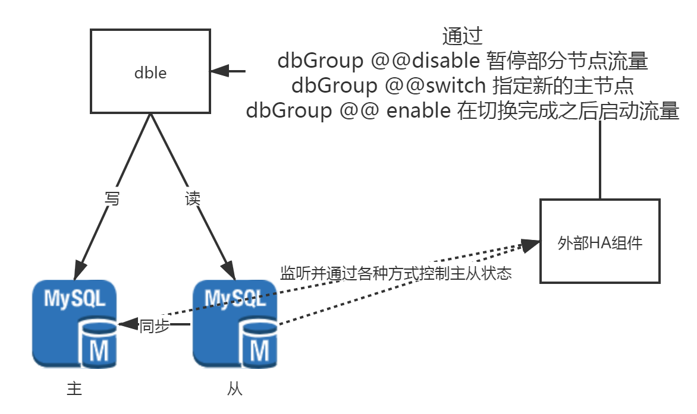

# 2.23.1 外部后端MYSQL-HA连接

dble在版本2.19.09.0开始提供对应的外部接口，基于以下几个基础要点进行设计：
+ 外部HA组件能够通过一定的方式和dble进行信息的主动沟通（包括脚本，网络通信，命令等方式）
+ 外部HA组件能够做出对与MYSQL可用性的明确判断（包括哪些节点停流量，哪些节点主从切换，哪些节点启动流量）

在基于以上的两个条件的情况下，基于提供外部接口通用性以及易用性的考虑，决定通过管理端用户命令的方式添加对应的交互接口，具体的提供以下的三个交互接口：
+ 停止流量命令(dataHost @@disable)
+ 启动流量命令(dataHost @@enable)
+ 主从切换命令(dataHost @@swtich)

其次为了方便进行管理和观测，提供了一个当前切换状态的查询命令:
+ 切换状态查询命令(dataHost @@events)

外部HA组件可以通过 mysql命令、脚本调用mysql命令、或者程序的DB连接执行mysql命令的方式进行交互。  
同时此功能设计考虑到zk集群用户的需求，当用户使用zk集群状态下的dble进行高可用切换时，会有集群的联动机制，外部HA组件只需要通知其中一个节点即可。

以下提供一个外部HA和dble交互设计图：

更加详细的情况请查询以下文档:  
[命令的使用说明](2.23.2_command_usage.md)  
[命令的实现细节](2.23.3_Logical_detail.md)  
[简单的HA交互使用案例](2.23.4_mha_sample.md)  

