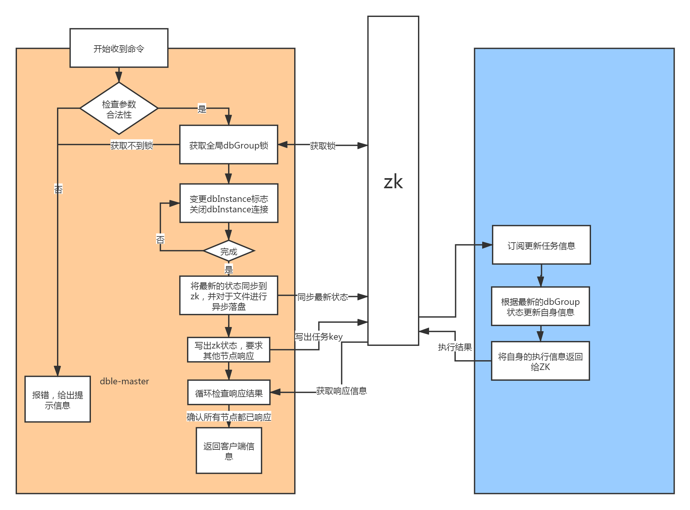
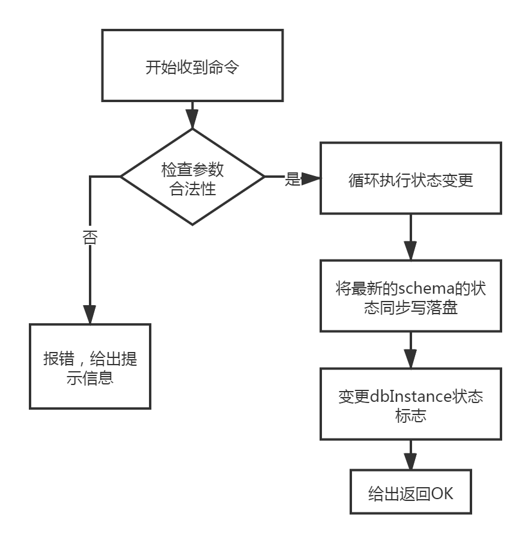

# 2.23.3 高可用联动命令的逻辑细节

## 简述
   在dble高可用协同的几个接口中基本逻辑都是相似的，只是去更新dataHost的属性，只不过在细节上每个命令都有一些自身的特殊行为
   + disable命令在执行过程中会断开当前所有连接，并且在zk集群状态下会要求其他节点同步响应
   + enable命令没有任何附加行为
   + switch命令会在切换过程中断开旧writeHost的所有连接

## dataHost @@disable
dble在单机情况下其大致逻辑如下：

+ 检查各个数据参数是否符合条件
+ 更新dataSource的状态
+ 关闭所有已经存在的连接
+ 同步更新配置文件，将dataHost的最新状态落盘
+ 返回OK信息

在集群状态下的逻辑有所不同：

+ 检查各个数据参数是否符合条件
+ 更新dataSource的状态
+ 关闭所有已经存在的连接
+ 异步更新配置文件，将dataHost的最新状态落盘
+ 将最新的dataHost的状态信息同步到zk上
+ 写出一个zk上面的key任务，等待其他节点响应
+ 其他节点响应任务，更新自身写出响应结果
+ 发起dble检查所有响应结果，等待所有节点响应完成
+ 返回最终的执行结果

## dataHost @@enable

dble在单机情况下的其逻辑大致如下：
+ 检查各个数据参数是否符合条件
+ 更新dataSource的状态
+ 同步更新配置文件，将dataHost的最新状态落盘
+ 返回OK信息

在ZK集群的状况下起逻辑大致如下：

+ 检查各个数据参数是否符合条件
+ 更新dataSource的状态
+ 关闭所有已经存在的连接
+ 异步更新配置文件，将dataHost的最新状态落盘
+ 将最新的dataHost的状态信息同步到zk上
+ 写出一个zk上面的key任务，等待其他节点响应
+ 其他节点响应任务，更新自身写出响应结果
+ 发起dble检查所有响应结果，等待所有节点响应完成
+ 返回最终的执行结果

## dataHost @@switch

dble在单机情况下的其逻辑大致如下：
+ 检查各个数据参数是否符合条件
+ 更新dataSource的状态
+ 关闭旧writeHost的所有连接
+ 同步更新配置文件，将dataHost的最新状态落盘
+ 返回OK信息

在ZK集群的状况下起逻辑大致如下：

+ 检查各个数据参数是否符合条件
+ 更新dataSource的状态
+ 关闭所有已经存在的连接
+ 异步更新配置文件，将dataHost的最新状态落盘
+ 将最新的dataHost的状态信息同步到zk上
+ 写出一个zk上面的key任务，等待其他节点响应 
+ 其他节点响应任务，更新自身写出响应结果
+ 发起dble检查所有响应结果，等待所有节点响应完成
+ 返回最终的执行结果

