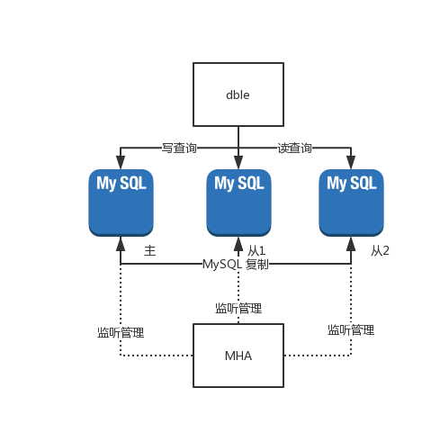
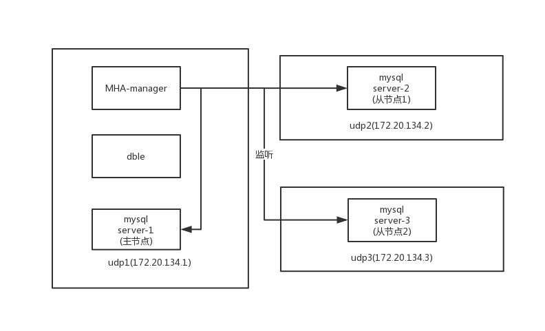

# 2.23.4 mha-dble高可用联动实例

## 基础介绍

### 服务结构图
整体的服务结构如下图所示，dble将一个一组两从的MySQL视作一个读写分离的dataHost，然后通过MHA对于此MySQL进行复制的管理：  
  
下图是对于各个服务在每个docker容器上面的分布图：  
  
### 实验过程
+ 搭建一个MySQL主从(一主两从)的基础环境
+ 搭建MHA监管MySQL复制组的环境
+ 搭建dble环境使用这MySQL组进行启动
+ 手动kill MySQL主实例让MHA托管的高可用组发生切换
+ 验证dble和MySQL的高可用切换过程
### 实验目的
本实验原则上存在两个目的：
+ 验证dble在2.19.09.0版本提供的高可用接口功能
+ 搭建简单的MHA和dble高可用的环境范例

## 前期环境准备
前期准备环境：  
三个docker容器，安装并部署mysql实例，并让三个mysql之间形成一主两从的复制关系(操作略)
## 操作过程

### mha环境搭建
+ 在每个docker容器中开启ssh服务
```
/usr/sbin/sshd -D
```
+ 给每个容器之间创建免密登录,去到所有容器中执行，包括需要给自身容器创建
```
ssh-keygen -t rsa
ssh-copy-id -i ~/.ssh/id_rsa.pub root@other1
ssh-copy-id -i ~/.ssh/id_rsa.pub root@other2
ssh-copy-id -i ~/.ssh/id_rsa.pub root@self
```
+ 确保/usr/bin/mysqlbinlog和/usr/bin/mysql文件存在，若不存在，请使用yum安装mysql即可
+ 创建所有节点上的MHA工作目录
```
mkdir /etc/masterha/app1 -p
mkdir /var/log/masterha/app2 -p
mkdir /var/log/masterha/app1 -p
```
+ 给所有mysql节点统一复制权限
```
grant all on *.* to root@'%' identified by '123456' with grant option;
grant replication slave on *.* to repl@'%' identified by 'repl';
```
+ 下载并安装MHA的rpm包
```
从项目的文档页面能够直接找到对应的下载地址
https://github.com/yoshinorim/mha4mysql-manager/wiki/Downloads
下载一个MHA Manager 0.56 rpm RHEL6
以及一个MHA Node 0.56 rpm RHEL6
并将下载完成的rpm包上传到对应的容器中
注意使用yum localinstall 命令对于rpm包进行安装，这样在安装过程中可以由yum来进行依赖的处理
Node的包需要先于Manager的包安装，不然会有依赖方面的报错
在所有容器上安装完成这两个rpm
当yum无法正确安装rpm依赖，请更新yum源到阿里云的yum
```

### 切换脚本准备
mha这个项目是使用perl写的，同时mha这个项目给用户提供了大量的自定义插入接口，可以允许用户在一些关键步骤进行自定义的操作响应以及通知，在自动高可用切换过程中，mha提供了一个切换脚本的入口master_ip_failover_script脚本配置  
详细的参数介绍可以参考官网的解释https://github.com/yoshinorim/mha4mysql-manager/wiki/Parameters#master_ip_failover_script    
大体上来说这个脚本的三种命令会在以下几个时间节点得到调用
+ 启动检查HA的状态，调用脚本master_ip_failover的status命令
+ 发现MySQL master节点失效，调用master_ip_failover的stop命令，并输入失效master的信息
+ 在新选择的master节点补偿数据完成，并进行写恢复设置read_only=0，调用master_ip_failover脚本的start命令


在本次实验中，通过自定义的脚本行为来进行mha和dble之间的事件交互，所以我们对于原有的样例脚本进行以下的修改
+ 原有MySQL master节点失效时，将dataHost上面对应写节点的状态修改成disable，这要求在stop命令中对于dble发送dataHost @@disable命令
+ 当新的MySQL master被选出来并且上线时，在脚本start阶段通过调用dataHost @@switch命令将新的master节点切换成为dataHost中的主节点

按照以上的逻辑对于修改完成的master_ip_failover脚本如下(注意给创建的脚步提供执行权限)
```
#!/usr/bin/env perl

#  Copyright (C) 2011 DeNA Co.,Ltd.
#
#  This program is free software; you can redistribute it and/or modify
#  it under the terms of the GNU General Public License as published by
#  the Free Software Foundation; either version 2 of the License, or
#  (at your option) any later version.
#
#  This program is distributed in the hope that it will be useful,
#  but WITHOUT ANY WARRANTY; without even the implied warranty of
#  MERCHANTABILITY or FITNESS FOR A PARTICULAR PURPOSE.  See the
#  GNU General Public License for more details.
#
#  You should have received a copy of the GNU General Public License
#   along with this program; if not, write to the Free Software
#  Foundation, Inc.,
#  51 Franklin Street, Fifth Floor, Boston, MA  02110-1301  USA

## Note: This is a sample script and is not complete. Modify the script based on your environment.

use strict;
use warnings FATAL => 'all';

use Getopt::Long;
use MHA::DBHelper;

my (
  $command,        $ssh_user,         $orig_master_host,
  $orig_master_ip, $orig_master_port, $new_master_host,
  $new_master_ip,  $new_master_port,  $new_master_user,
  $new_master_password
);
GetOptions(
  'command=s'             => \$command,
  'ssh_user=s'            => \$ssh_user,
  'orig_master_host=s'    => \$orig_master_host,
  'orig_master_ip=s'      => \$orig_master_ip,
  'orig_master_port=i'    => \$orig_master_port,
  'new_master_host=s'     => \$new_master_host,
  'new_master_ip=s'       => \$new_master_ip,
  'new_master_port=i'     => \$new_master_port,
  'new_master_user=s'     => \$new_master_user,
  'new_master_password=s' => \$new_master_password,
);

exit &main();

sub main {
  if ( $command eq "stop" || $command eq "stopssh" ) {

    # $orig_master_host, $orig_master_ip, $orig_master_port are passed.
    # If you manage master ip address at global catalog database,
    # invalidate orig_master_ip here.
    my $exit_code = 1;
    eval {

      # dataHost @@disable name = "dataHost1" node='$orig_master_host'
	  # 调用对应的disable命令，使得部分节点不可写
      $orig_master_host =~tr/./_/;
      system "mysql -P9066 -u man1 -p654321 -h 172.20.134.1 -e \"dataHost \@\@disable name = 'dataHost1' node='".$orig_master_host."'\"";
      $exit_code = 0;
    };
    if ($@) {
      warn "Got Error: $@\n";
      exit $exit_code;
    }
    exit $exit_code;
  }
  elsif ( $command eq "start" ) {

    # all arguments are passed.
    # If you manage master ip address at global catalog database,
    # activate new_master_ip here.
    # You can also grant write access (create user, set read_only=0, etc) here.
    my $exit_code = 10;
    eval {
      my $new_master_handler = new MHA::DBHelper();

      # args: hostname, port, user, password, raise_error_or_not
      $new_master_handler->connect( $new_master_ip, $new_master_port,
        $new_master_user, $new_master_password, 1 );

      ## Set read_only=0 on the new master
      $new_master_handler->disable_log_bin_local();
      print "Set read_only=0 on the new master.\n";
      $new_master_handler->disable_read_only();

      ## Creating an app user on the new master
      print "Creating app user on the new master..\n";
      $new_master_handler->enable_log_bin_local();
      $new_master_handler->disconnect();

      ## try to switch the dataHost master into new master
	  ## 调用dataHost switch的命令，将新的new_master_host节点提升
      $new_master_host =~tr/./_/;
      system "mysql -P9066 -u man1 -p654321 -h 172.20.134.1 -e \"dataHost \@\@switch name = 'dataHost1' master='".$new_master_host."'\"";

      $exit_code = 0;
    };
    if ($@) {
      warn $@;

      # If you want to continue failover, exit 10.
      exit $exit_code;
    }
    exit $exit_code;
  }
  elsif ( $command eq "status" ) {
    # test for start command
    exit 0;
  }
  else {
    &usage();
    exit 1;
  }
}

sub usage {
  print
"Usage: master_ip_failover --command=start|stop|stopssh|status --orig_master_host=host --orig_master_ip=ip --orig_master_port=port --new_master_host=host --new_master_ip=ip --new_master_port=port\n";
}

```
将脚本存放到指定目录/etc/masterha/app1目录下  
并且创建MHA最终使用的 app1.conf配置文件在/etc/masterha/app1目录，具体创建的配置文件内容如下所示：  
```
#mha manager工作目录
manager_workdir = /var/log/masterha/app1  
manager_log = /var/log/masterha/app1/app1.log
remote_workdir = /var/log/masterha/app2  
master_ip_failover_script=/etc/masterha/app1/master_ip_failover
# master_ip_online_change_script=/etc/masterha/app1/master_ip_online_change
# MySQL管理帐号和密码
user=root
password=123456
# 系统ssh用户
ssh_user=root

# 复制帐号和密码
repl_user=repl 
repl_password= repl

# 监控间隔(秒)
ping_interval=1
manager_log=/var/log/masterha/app1/manager.log

[server1]
hostname=172.20.134.1
master_binlog_dir = /opt/3306/
port=3306


[server2]
# 每个机器上面的mysql实例的信息
hostname=172.20.134.2
master_binlog_dir = /opt/3306/
candidate_master=1
check_repl_delay=0
port=3306

[server3]
# 每个机器上面的mysql实例的信息
hostname=172.20.134.3
master_binlog_dir = /opt/3306/
candidate_master=1
check_repl_delay=0
port=3306
```

最终通过以下命令对于MHA的监听线程进行启动
```
nohup masterha_manager --conf=/etc/masterha/app1/app1.conf >> /var/log/masterha/app1/manager.log 2>&1 &
```
### dble配置
配置dble在这里是比较简单的内容，我们仅使用默认的配置即可，从项目的release页面下载最新的2.19.09.0安装包，解压并将conf文件下的rule_temp.xml，server_temp.xml，schema_temp.xml三个配置文件分别重命名成为rule.xml，server.xml，schema.xml  
并按照当前的配置需求对于其中的server.xml以及schema.xml进行如下的配置调整  
server.xml  
```
  <property name="useOuterHa">true</property>
```
schema.xml
```
    <dataNode name="dn1" dataHost="dataHost1" database="db_1"/>
    <dataNode name="dn2" dataHost="dataHost1" database="db_2"/>
    <dataNode name="dn3" dataHost="dataHost1" database="db_3"/>
    <dataNode name="dn4" dataHost="dataHost1" database="db_4"/>
    <dataNode name="dn5" dataHost="dataHost1" database="db_5"/>
    <dataNode name="dn6" dataHost="dataHost1" database="db_6"/>
    <dataHost balance="0" maxCon="1000" minCon="10" name="dataHost1" switchType="-1" slaveThreshold="100">
        <heartbeat>show slave status</heartbeat>
        <writeHost host="172_20_134_1" url="172.20.134.1:3306" password="123456" user="root" disabled="false" id="udp-1" weight="0">
            <readHost host="172_20_134_3" url="172.20.134.3:3306" password="123456" user="root" disabled="false" id="udp-3" weight="0"/>
            <readHost host="172_20_134_2" url="172.20.134.2:3306" password="123456" user="root" disabled="false" id="udp-2" weight="0"/>
        </writeHost>
    </dataHost>

```
启动dble，并通过管理用户man1查看基础状态下的dble后端节点状态
```
MySQL [(none)]> show @@datasource;
+-----------+--------------+--------------+------+------+--------+------+------+---------+-----------+------------+----------+
| DATAHOST  | NAME         | HOST         | PORT | W/R  | ACTIVE | IDLE | SIZE | EXECUTE | READ_LOAD | WRITE_LOAD | DISABLED |
+-----------+--------------+--------------+------+------+--------+------+------+---------+-----------+------------+----------+
| dataHost1 | 172_20_134_1 | 172.20.134.1 | 3306 | W    |      1 |    0 | 1000 |       1 |         0 |          0 | false    |
| dataHost1 | 172_20_134_3 | 172.20.134.3 | 3306 | R    |      1 |    0 | 1000 |       0 |         0 |          0 | false    |
| dataHost1 | 172_20_134_2 | 172.20.134.2 | 3306 | R    |      1 |    0 | 1000 |       0 |         0 |          0 | false    |
+-----------+--------------+--------------+------+------+--------+------+------+---------+-----------+------------+----------+

```
可见在初始状态下，节点的使用属性和配置文件一致，172.20.134.1节点作为写节点，并且所有节点的使用状态都是“可用”
### 最终效果
+ 通过ps命令在172.20.134.1容器中找到对应的mysqld进程  
+ 通过kill -9 命令对于172.20.134.1容器中的mysqld进程进行关闭
+ 重新通过命令检查dble中此时的后端节点状态，发现如下的执行结果
```
MySQL [(none)]> show @@datasource;
+-----------+--------------+--------------+------+------+--------+------+------+---------+-----------+------------+----------+
| DATAHOST  | NAME         | HOST         | PORT | W/R  | ACTIVE | IDLE | SIZE | EXECUTE | READ_LOAD | WRITE_LOAD | DISABLED |
+-----------+--------------+--------------+------+------+--------+------+------+---------+-----------+------------+----------+
| dataHost1 | 172_20_134_2 | 172.20.134.2 | 3306 | W    |      1 |    0 | 1000 |       0 |         0 |          0 | false    |
| dataHost1 | 172_20_134_3 | 172.20.134.3 | 3306 | R    |      1 |    0 | 1000 |       0 |         0 |          0 | false    |
| dataHost1 | 172_20_134_1 | 172.20.134.1 | 3306 | R    |      0 |    0 | 1000 |       0 |         0 |          0 | true     |
+-----------+--------------+--------------+------+------+--------+------+------+---------+-----------+------------+----------+

```
+ 检查当前dble的配置文件，发现配置文件中的后端节点位置发生扭转,172_20_134_2变成新的写节点
```
<dataHost balance="0" maxCon="1000" minCon="10" name="dataHost1" switchType="-1" slaveThreshold="100">
        <heartbeat>show slave status</heartbeat>
        <writeHost host="172_20_134_2" url="172.20.134.2:3306" password="123456" user="root" disabled="false" id="udp-2" weight="0">
            <readHost host="172_20_134_3" url="172.20.134.3:3306" password="123456" user="root" disabled="false" id="udp-3" weight="0"/>
            <readHost host="172_20_134_1" url="172.20.134.1:3306" password="123456" user="root" disabled="true" id="udp-1" weight="0"/>
        </writeHost>
    </dataHost>
```
+ 检查存在于172.20.134.3上mysql从的状态，发现其复制指向已经发生切换，切换为新主172.20.134.2，与dble中最新的配置文件相符
```
MySQL [(none)]> show slave status\G
*************************** 1. row ***************************
               Slave_IO_State: Waiting for master to send event
                  Master_Host: 172.20.134.2
                  Master_User: repl
                  Master_Port: 3306
                Connect_Retry: 60
              Master_Log_File: mysql-bin.000001
          Read_Master_Log_Pos: 2113
               Relay_Log_File: udp3-relay-bin.000002
                Relay_Log_Pos: 320
        Relay_Master_Log_File: mysql-bin.000001
             Slave_IO_Running: Yes
            Slave_SQL_Running: Yes
..........................
```