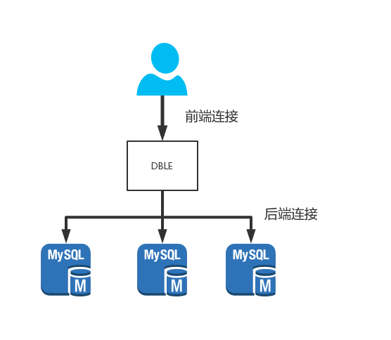

# 2.24 超时（连接/执行）控制

## 概述
在dble中连接分为两种，前后端连接，分别对应客户端连接dble的网络连接和dble中连接mysql的网络连接  
大致的情况如下图所示：  
  
由于网络TCP连接的特性，dble中需要对于这两种连接都有超时控制，具体在dble中将连接的超时控制分为**空闲超时**和**执行超时**两种情况。当超时发生的时候，dble会通过切断超时连接的方法进行控制。

## 超时的检查和实现
在配置文件server.xml中存在三个配置项
+ sqlExecuteTimeout(后端连接执行超时)
+ idleTimeout（前端连接空闲超时）
+ processorCheckPeriod（超时检查周期）

以下描述具体超时检查的实现逻辑
+ dble按照配置的processorCheckPeriod作为周期去周期性检查所有的连接
+ 检查所有后端连接，若满足以下条件就关闭后端连接
    -  此后端连接已经被某个前端连接借走（正在执行或持有）
    -  此后端连接距离上一次收发包超过sqlExecuteTimeout
    -  此后端连接没有在执行DDL或者执行xa事务   
+ 检查所有前端连接，若满足以下条件就关闭前端连接
    -  此前端连接正在执行xa事务，并不处于commit失败补偿/rollback失败补偿
    -  此前端连接距离上一次收发包超过idleTimeout

**综上总结为超时关闭连接的逻辑可以描述为：**
+ 后端连接非DDL,XA事务的情况下被前端连接借走，并且超过sqlExecuteTimeout没有收发包（包括普通事务执行间隔，后端连接被长期持有的时间超时）
+ 前端连接非XA事务特殊阶段，超过idleTimeout没有收发包（包括在loaddata大文件过程中发生的长时间空档）

## SQL执行超时注意事项
+ 部分语言或者框架的连接池会长期持有连接，并且没有设定或者定时发送网络包，可能会导致空闲的连接自动断开，然后应用在取用到对应断开连接的时候可能会报错
+ 当开启一个事务但是长期不执行SQL会导致后端连接被判断定为执行超时，当应用再次在连接上执行内容的时候，会给出后端连接已关闭的报错信息
+ 当前端连接执行一个大文件内容load data的时候，由于后端可能执行较慢，前端连接存在超过idleTimeout导致连接关闭的情况，当有类似数据导入计划的时候，考虑暂时放宽idleTimeout的限制
+ 连接的超时检查和关闭是通过一个循环来实现的，所以并不是一个实时检查的值，最坏的情况对于超时的检查会迟到一个processorCheckPeriod周，当应用对于SQL超时需要一个严格的时间设定时，请谨慎使用