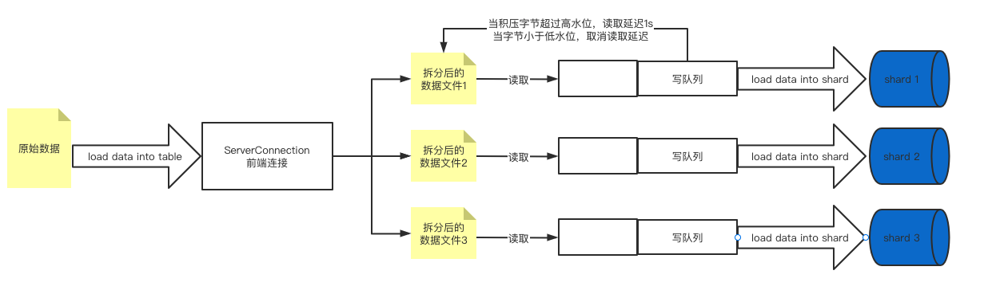
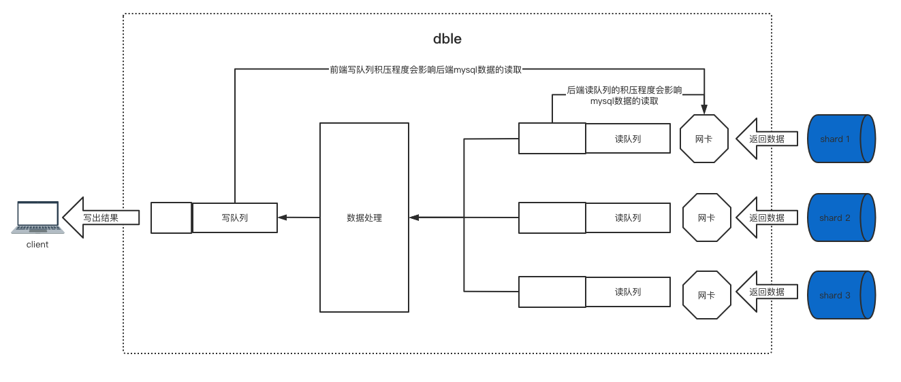

# 2.25 dble流量控制
## 背景
   在之前的dble版本中，当进行大文件load以及大结果集查询的过程中，都有可能由于数据的发送不及时造成数据在dble内存中堆积，当条件足够的时候甚至有可能造成dble服务的OOM，进而影响服务的稳定运行。   
  在最初2.20.04中由社区开发者@ssxlulu提供了对于这部分流量控制的实现，通过连接级别的写队列长度，进行数据加载/获取的负反馈调节，从而实现在数据load和大结果集查询过程中的内存使用情况稳定，在此基础上，我们又做了一些改进。
 

## 原理

dble中的流量控制通过连接级别的写出队列进行负反馈调节，具体在生效的时候分成两种具体的形式：
+ Load data过程：
    - 后端连接写出队列积压字节数过大，大于后端链接的高水位(flowHighLevel)时，写出线程暂停，等积压字节被写出，降低到低水位(flowLowLevel)后恢复。逻辑示意图如下：  


+ Select过程：
    - 前端连接写出队列积压字节数过大(比如中间件和客户端之间网络不好可能会造成此现象)，大于高水位(flowControlHighLevel),后段mysql连接开始流量控制，停止读数据
    - mysql读取积压队列过长字节数过大(比如中间件和mysql在同一机器上),大于后端链接的高水位(flowHighLevel)，后段mysql连接开始流量控制，停止读数据
	- 当前端连接写出队列积压字节数小于低水位(flowControlLowLevel)并且后段连接读取积压字节数小于低水位(flowLowLevel),后段mysql连接停止流量控制，开始读数据
    - 逻辑示意图如下：  
    

*注：流量控制功能的生效级别为连接级别，不同连接之间的队列长度不会互相影响*


## 使用举例
 
本功能为默认关闭功能，需要在bootstrap.cnf中进行相关配置进行显式开启，或者通过管理端的辅助命令进行实时的调整。 
在bootstrap.cnf中使用下列参数使得功能开启并生效：
```
enableFlowControl(是否开启流量控制开关)
flowControlHighLevel：bootstrap(写队列上限阈值，写队列超限时开启流量控制)
flowControlLowLevel(写队列下限阈值，写队列低于阈值时取消流量控制)
```

+ 修改参数的管理命令为：   
`flow_control @@set [enableFlowControl = true/false] [flowControlHighLevel = ?] [flowControlLowLevel = ?]`

+ 后端属性flowLowLevel和flowHighLevel在连接池属性处配置，可以通过重载命令等来配置或者修改，开关也由bootstrap.cnf的enableFlowControl控制。     

+ 展示当前流控配置参数信息：
    - `flow_control @@show `.  

+ 展示连接是否正在被流量控制:
    - flow_control @@list 
    -  如果需要过滤结果集，可以使用`dble_information.dble_flow_control`（与`flow_control @@list`等价） 来过滤 
