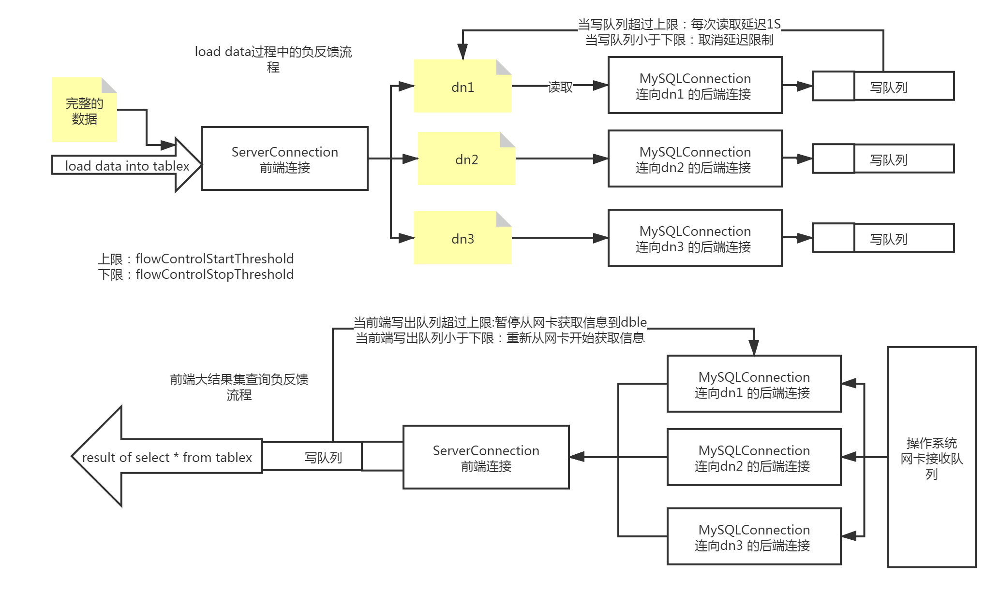

# 2.25 dble流量控制
## 背景
   在之前的dble版本中，当进行大文件load以及大结果集查询的过程中，都有可能由于数据的发送不及时造成数据在dble内存中堆积，当条件足够的时候甚至有可能造成dble服务的OOM，进而影响服务的稳定运行  
  在本版2.20.04中由社区开发者@ssxlulu提供了对于这部分流量控制的实现，通过连接级别的写队列长度，进行数据加载/获取的负反馈调节，从而实现在数据load和大结果集查询过程中的内存使用情况稳定。

  具体的issue详情请见 [#1753](https://github.com/actiontech/dble/issues/1753)

## 原理

dble中的流量控制通过连接级别的写出队列进行负反馈调节，具体在生效的时候分成两种具体的形式：
+ Load data过程中后端连接写出队列过长负反馈
+ Select过程中前端连接写出队列过长负反馈
下图中分别描述了两种负反馈具体实现的逻辑：

*注：流量控制功能的生效级别为连接级别，不同连接之间的队列长度不会互相影响*
## 使用举例
本功能为默认关闭功能，需要在bootstrap.cnf中进行相关配置进行显式开启，或者通过管理端的辅助命令进行实时的调整。 
在bootstrap.cnf中使用下列参数使得功能开启并生效：
```
enableFlowControl(是否开启流量控制开关)
flowControlStartThreshold(写队列上限阈值，写队列超限时开启流量控制)
flowControlStopThreshold(写队列下限阈值，写队列低于阈值时取消流量控制)
```
附带三个管理端命令可以修改当前的流量控制参数：
+ flow_control @@show （展示当前流控配置参数信息）
+ flow_control @@set [enableFlowControl = true/false] [flowControlStart = ?] [flowControlEnd = ?]（修改配置参数）
+ flow_control @@list （展示当前正在被流量控制的连接）

## 如何判定Select是否支持流量控制
### 算子类型
+ 缓存型算子有：AGGREGATE、DISTINCT、ORDER、NOT_IN、INNER_FUNC_ADD、JOIN、DIRECT_GROUP、NEST_LOOP、IN_SUB_QUERY、ALL_ANY_SUB_QUERY、SCALAR_SUB_QUERY
+ 合并处理型算子：MERGE、MERGE_AND_ORDER
+ 其他算子

### 判定条件
根据sql执行计划(explain)结果的TYPE列集合值，只要符合以下任意一个条件，则支持流量控制：   
1、不存在缓存型算子  
2、存在缓存算子，但最后一个合并处理中不含有缓存型算子（事实上是一个阶段性支持，见【举例3】）  

### 举例场景
【举例1】简单查询满足条件1，如下：
```
mysql> explain select * from long_sharding_test;
+----------------------------+--------------------------+--------------------------------------------------------------------------------------------------------------------------------------------------------+
| SHARDING_NODE              | TYPE                     | SQL/REF                                                                                                                                                |
+----------------------------+--------------------------+--------------------------------------------------------------------------------------------------------------------------------------------------------+
| dn1_0                      | BASE SQL                 | select `long_sharding_test`.`id`,`long_sharding_test`.`content`,`long_sharding_test`.`other1`,`long_sharding_test`.`other2` from  `long_sharding_test` |
| dn2_0                      | BASE SQL                 | select `long_sharding_test`.`id`,`long_sharding_test`.`content`,`long_sharding_test`.`other1`,`long_sharding_test`.`other2` from  `long_sharding_test` |
+----------------------------+--------------------------+--------------------------------------------------------------------------------------------------------------------------------------------------------+
2 rows in set (0.05 sec)

不存在缓存型算子 
```

【举例2】复杂查询满足条件1，如下：
```
mysql> explain select * from (select * from long_sharding_test) a;
+----------------------------+--------------------------+--------------------------------------------------------------------------------------------------------------------------------------------------------+
| SHARDING_NODE              | TYPE                     | SQL/REF                                                                                                                                                |
+----------------------------+--------------------------+--------------------------------------------------------------------------------------------------------------------------------------------------------+
| dn1_0                      | BASE SQL                 | select `long_sharding_test`.`id`,`long_sharding_test`.`content`,`long_sharding_test`.`other1`,`long_sharding_test`.`other2` from  `long_sharding_test` |
| dn2_0                      | BASE SQL                 | select `long_sharding_test`.`id`,`long_sharding_test`.`content`,`long_sharding_test`.`other1`,`long_sharding_test`.`other2` from  `long_sharding_test` |
| merge_1                    | MERGE                    | dn1_0; dn2_0                                                                                                                                           |
| shuffle_field_1            | SHUFFLE_FIELD            | merge_1                                                                                                                                                |
| rename_derived_sub_query_1 | RENAME_DERIVED_SUB_QUERY | shuffle_field_1                                                                                                                                        |
| shuffle_field_2            | SHUFFLE_FIELD            | rename_derived_sub_query_1                                                                                                                             |
+----------------------------+--------------------------+--------------------------------------------------------------------------------------------------------------------------------------------------------+
6 rows in set (0.05 sec)

不存在缓存型算子 
```

【举例3】复杂查询满足条件2，如下：
```
mysql> explain select * from long_sharding_test where id in (select id from sharding_2_t1) order by id;
+-------------------+-----------------------+------------------------------------------------------------------------------------------------------------------------------------------------------------------------------------------------------------------------------------------------------------------------+
| SHARDING_NODE     | TYPE                  | SQL/REF                                                                                                                                                                                                                                                                |
+-------------------+-----------------------+------------------------------------------------------------------------------------------------------------------------------------------------------------------------------------------------------------------------------------------------------------------------+
| dn1_0             | BASE SQL              | select DISTINCT `sharding_2_t1`.`id` as `autoalias_scalar` from  `sharding_2_t1`                                                                                                                                                                                       |
| dn2_0             | BASE SQL              | select DISTINCT `sharding_2_t1`.`id` as `autoalias_scalar` from  `sharding_2_t1`                                                                                                                                                                                       |
| merge_1           | MERGE                 | dn1_0; dn2_0                                                                                                                                                                                                                                                           |
| distinct_1        | DISTINCT              | merge_1                                                                                                                                                                                                                                                                |
| shuffle_field_1   | SHUFFLE_FIELD         | distinct_1                                                                                                                                                                                                                                                             |
| in_sub_query_1    | IN_SUB_QUERY          | shuffle_field_1                                                                                                                                                                                                                                                        |
| dn1_1             | BASE SQL(May No Need) | in_sub_query_1; select `long_sharding_test`.`id`,`long_sharding_test`.`content`,`long_sharding_test`.`other1`,`long_sharding_test`.`other2` from  `long_sharding_test` where `long_sharding_test`.`id` in ('{NEED_TO_REPLACE}') ORDER BY `long_sharding_test`.`id` ASC |
| dn2_1             | BASE SQL(May No Need) | in_sub_query_1; select `long_sharding_test`.`id`,`long_sharding_test`.`content`,`long_sharding_test`.`other1`,`long_sharding_test`.`other2` from  `long_sharding_test` where `long_sharding_test`.`id` in ('{NEED_TO_REPLACE}') ORDER BY `long_sharding_test`.`id` ASC |
| merge_and_order_1 | MERGE_AND_ORDER       | dn1_1; dn2_1                                                                                                                                                                                                                                                           |
| shuffle_field_2   | SHUFFLE_FIELD         | merge_and_order_1                                                                                                                                                                                                                                                      |
+-------------------+-----------------------+------------------------------------------------------------------------------------------------------------------------------------------------------------------------------------------------------------------------------------------------------------------------+
10 rows in set (0.00 sec)

解剖：
explain中有两个合并(以'MERGE'开头)：
MERGE：dn1_0～in_sub_query_1（存在缓存型算子如：DISTINCT、IN_SUB_QUERY），此阶段不支持流量控制
MERGE_AND_ORDER：dn1_1～shuffle_field_2（不含缓存型算子），此阶段支持流量控制
因此，该sql在最后一个合并阶段是支持流量控制的
```
