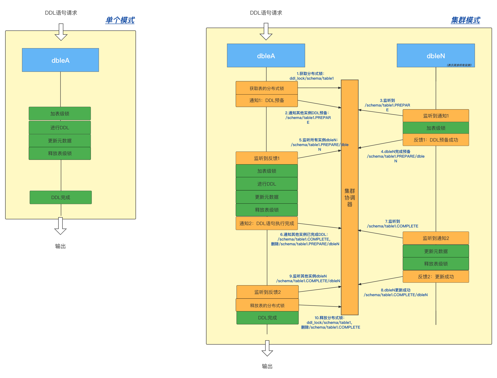

##  2.31 DDL日志解读

###适宜版本
	>=3.22.01

###DDL流程


###日志格式
	[DDL_{序号id}{.分片名}] <{阶段{.状态}}> {描述}

###SQL1

	`CREATE TABLE tableB (id int(11) DEFAULT NULL,id2 int(11) DEFAULT NULL,name varchar(100) DEFAULT NULL) ENGINE=InnoDB DEFAULT CHARSET=latin1;`

###阶段详解
<table>
    <tr>
        <th>大致阶段</th>
        <th>时间线</th>
        <th>dbleA实例</th>
        <th>dbleN实例</th>
    </tr>
    <tr>
        <td>init_ddl_trace<br/>进入DDL日志追踪</td>
        <td></td>
        <td>[DDL_2] init_ddl_trace</td>
        <td></td>
    </tr>
    <tr>
        <td rowspan='5'>notice_cluster_ddl_prepare<br/>通知集群ddl预备<br/>(架构为非集群时，跳过此阶段)</td>
        <td></td>
        <td>[DDL_2] notice_cluster_ddl_prepare.start<br/>/*通知所有实例进入ddl.PREPARE阶段*/</td>
        <td></td>
    </tr>
    <tr>
        <td></td>
        <td></td>
        <td>[DDL_NOTIFIED] receive_ddl_prepare<br/>/*接收ddl.PREPARE通知*/</td>
    </tr>
    <tr>
        <td></td>
        <td></td>
        <td>[DDL_NOTIFIED] add_table_lock.start<br/>/*开始对本实例加表级锁*/</td>
    </tr>
    <tr>
        <td></td>
        <td></td>
        <td>[DDL_NOTIFIED] add_table_lock.succ<br/>/*加锁成功*/</td>
    </tr>
    <tr>
        <td></td>
        <td>[DDL_2] notice_cluster_ddl_prepare.succ<br/>/*所有实例都成功进入ddl.PREPARE阶段*/</td>
        <td></td>
    </tr>
    <tr>
        <td rowspan='2'>add_table_lock<br/>加表级锁</td>
        <td></td>
        <td>[DDL_2] add_table_lock.start<br/>/*开始对本实例加表级锁*/</td>
        <td></td>
    </tr>
    <tr>
        <td></td>
        <td>[DDL_2] add_table_lock.succ<br/>/*加锁成功*/</td>
        <td></td>
    </tr>
    <tr>
        <td rowspan='5'>test_ddl_conn<br/>测试后端连接，执行'select 1';<br/>(如果tableB是单节点表时，跳过此阶段)</td>
        <td></td>
        <td>[DDL_2] test_ddl_conn.start<br/>/*开始进入后端连接测试阶段 */</td>
        <td></td>
    </tr>
    <tr>
        <td></td>
        <td>[DDL_2.dn1] test_ddl_conn.start<br/>/*开始进入dn1对应后端连接的测试阶段 */</td>
        <td></td>
    </tr>
    <tr>
        <td></td>
        <td>[DDL_2.dn1] test_ddl_conn.get_conn<br/>/*成功获取dn1对应后端连接，dn2~4同样 */</td>
        <td></td>
    </tr>
    <tr>
        <td></td>
        <td>[DDL_2.dn1] test_ddl_conn.succ<br/>/*dn1对应后端连接执行select 1成功，dn2~4同样 */</td>
        <td></td>
    </tr>
    <tr>
        <td></td>
        <td>[DDL_2] test_ddl_conn.succ<br/>/*所有分片对应的后端连接执行select 1成功，dn2~4同样 */</td>
        <td></td>
    </tr>
    <tr>
        <td rowspan='5'>exec_ddl_sql<br/>执行ddl语句</td>
        <td></td>
        <td>[DDL_2] exec_ddl_sql.start<br/>/*开始执行sql */</td>
        <td></td>
    </tr>
    <tr>
        <td></td>
        <td>[DDL_2.dn1] exec_ddl_sql.start<br/>/*开始进入dn1对应后端连接的执行ddl阶段，dn2~4同样 */</td>
        <td></td>
    </tr>
    <tr>
        <td></td>
        <td>[DDL_2.dn1] exec_ddl_sql.get_conn<br/>/*成功获取dn1对应后端连接，dn2~4同样*/</td>
        <td></td>
    </tr>
    <tr>
        <td></td>
        <td>[DDL_2.dn1] exec_ddl_sql.succ<br/>/*dn1对应后端连接执行ddl成功，dn2~4同样*/</td>
        <td></td>
    </tr>
    <tr>
        <td></td>
        <td>[DDL_2] exec_ddl_sql.succ<br/>/*执行ddl成功 */</td>
        <td></td>
    </tr>
    <tr>
        <td rowspan='2'>update_table_metadata<br/>更新元数据</td>
        <td></td>
        <td>[DDL_2] update_table_metadata.start<br/>/*开始更新本实例中表的元数据*/</td>
        <td></td>
    </tr>
    <tr>
        <td></td>
        <td>[DDL_2] update_table_metadata.succ<br/>/*更新成功*/</td>
        <td></td>
    </tr>
    <tr>
        <td rowspan='6'>notice_cluster_ddl_complete<br/>通知集群DDL已完成<br/>(架构为非集群时，跳过此阶段)</td>
        <td></td>
        <td>[DDL_2] notice_cluster_ddl_complete.start<br/>/*通知所有实例进入ddl.COMPLETE阶段*/</td>
        <td></td>
    </tr>
    <tr>
        <td></td>
        <td></td>
        <td>[DDL_NOTIFIED] receive_ddl_complete<br/>/*接收ddl.COMPLETE通知*/</td>
    </tr>
    <tr>
        <td></td>
        <td></td>
        <td>[DDL_NOTIFIED] update_table_metadata.start<br/>/*开始更新本实例中表的元数据*/</td>
    </tr>
    <tr>
        <td></td>
        <td></td>
        <td>[DDL_NOTIFIED] update_table_metadata.succ<br/>/*更新成功*/</td>
    </tr>
    <tr>
        <td></td>
        <td></td>
        <td>[DDL_NOTIFIED] release_table_lock.succ<br/>/*本实例释放表级锁*/</td>
    </tr>
    <tr>
        <td></td>
        <td>[DDL_2] notice_cluster_ddl_complete.succ<br/>/*所有实例都成功进入ddl.COMPLETE阶段*/</td>
        <td></td>
    </tr>
    <tr>
        <td>release_table_lock<br/>释放表级锁</td>
        <td></td>
        <td>[DDL_2] release_table_lock.succ<br/>/*本实例释放表级锁*/</td>
        <td></td>
    </tr>
    <tr>
        <td>finish_ddl_trace<br/>结束DDL日志追踪</td>
        <td></td>
        <td>[DDL_2] finish_ddl_trace</td>
        <td></td>
    </tr>
</table>

###状态
| 状态       | 描述       |
|----------|----------|
| succ     | 成功       |
| fail     | 失败       |
| get_conn | 成功获取后端连接 |


###集群模式
架构：分别有dbleA、dbleN(表示其余实例)；在dbleA中执行SQL1

####dbleA实例日志
```
2021-12-23 10:42:05,425 [INFO ][BusinessExecutor1] ================ init_ddl_trace [DDL_2] ================  (:)
2021-12-23 10:42:05,425 [INFO ][BusinessExecutor1] [DDL_2] <init_ddl_trace> Routes end and Start ddl{CREATE TABLE `tableB` (`id` int(11) DEFAULT NULL,`id2` int(11) DEFAULT NULL,`name` varchar(100) DEFAULT NULL) ENGINE=InnoDB DEFAULT CHARSET=latin1} execution stage. In FrontendConnection[id = 1 port = 8066 host = 127.0.0.1 local_port = 52436 isManager = false startupTime = 1640227316027 skipCheck = false isFlowControl = false]  (:)
2021-12-23 10:42:05,425 [INFO ][BusinessExecutor1] [DDL_2] <notice_cluster_ddl_prepare.start> Notify and wait for all instances to enter phase PREPARE  (:)
2021-12-23 10:42:05,547 [INFO ][BusinessExecutor1] [DDL_2] <notice_cluster_ddl_prepare.succ> All instances have entered phase PREPARE  (:)
2021-12-23 10:42:05,547 [INFO ][BusinessExecutor1] [DDL_2] <add_table_lock.start>   (:)
2021-12-23 10:42:05,547 [INFO ][BusinessExecutor1] [DDL_2] <add_table_lock.succ>   (:)
2021-12-23 10:42:05,548 [INFO ][BusinessExecutor1] [DDL_2] <test_ddl_conn.start> Start execute 'select 1' to detect a valid connection for shardingNodes[dn1,dn3,dn2,dn4]  (:)
2021-12-23 10:42:05,548 [INFO ][BusinessExecutor1] [DDL_2.dn1] <test_ddl_conn.start> In shardingNode[dn1],about to execute sql{select 1}  (:)
2021-12-23 10:42:05,548 [INFO ][BusinessExecutor1] [DDL_2.dn1] <test_ddl_conn.get_conn> Get BackendConnection[id = 9 host = 10.186.63.8 port = 24801 localPort = 52423 mysqlId = 5924 db config = dbInstance[name=instanceM1,disabled=false,maxCon=10,minCon=3]  (:)
2021-12-23 10:42:05,548 [INFO ][BusinessExecutor1] [DDL_2.dn2] <test_ddl_conn.start> In shardingNode[dn2],about to execute sql{select 1}  (:)
2021-12-23 10:42:05,548 [INFO ][BusinessExecutor1] [DDL_2.dn2] <test_ddl_conn.get_conn> Get BackendConnection[id = 11 host = 10.186.63.7 port = 24801 localPort = 52426 mysqlId = 3282 db config = dbInstance[name=instanceM2,disabled=false,maxCon=10,minCon=3]  (:)
2021-12-23 10:42:05,548 [INFO ][BusinessExecutor1] [DDL_2.dn3] <test_ddl_conn.start> In shardingNode[dn3],about to execute sql{select 1}  (:)
2021-12-23 10:42:05,548 [INFO ][BusinessExecutor1] [DDL_2.dn3] <test_ddl_conn.get_conn> Get BackendConnection[id = 8 host = 10.186.63.8 port = 24801 localPort = 52424 mysqlId = 5925 db config = dbInstance[name=instanceM1,disabled=false,maxCon=10,minCon=3]  (:)
2021-12-23 10:42:05,548 [INFO ][BusinessExecutor1] [DDL_2.dn4] <test_ddl_conn.start> In shardingNode[dn4],about to execute sql{select 1}  (:)
2021-12-23 10:42:05,548 [INFO ][BusinessExecutor1] [DDL_2.dn4] <test_ddl_conn.get_conn> Get BackendConnection[id = 10 host = 10.186.63.7 port = 24801 localPort = 52427 mysqlId = 3281 db config = dbInstance[name=instanceM2,disabled=false,maxCon=10,minCon=3]  (:)
2021-12-23 10:42:05,550 [INFO ][complexQueryExecutor4] [DDL_2.dn1] <test_ddl_conn.succ>   (:)
2021-12-23 10:42:05,550 [INFO ][complexQueryExecutor4] [DDL_2.dn3] <test_ddl_conn.succ>   (:)
2021-12-23 10:42:05,553 [INFO ][complexQueryExecutor4] [DDL_2.dn4] <test_ddl_conn.succ>   (:)
2021-12-23 10:42:05,553 [INFO ][complexQueryExecutor2] [DDL_2.dn2] <test_ddl_conn.succ>   (:)
2021-12-23 10:42:05,553 [INFO ][complexQueryExecutor2] [DDL_2] <test_ddl_conn.succ>   (:)
2021-12-23 10:42:05,553 [INFO ][complexQueryExecutor2] [DDL_2] <exec_ddl_sql.start> This ddl will be executed separately in the shardingNodes[dn1,dn3,dn2,dn4]  (:)
2021-12-23 10:42:05,553 [INFO ][complexQueryExecutor2] [DDL_2.dn1] <exec_ddl_sql.start> In shardingNode[dn1],about to execute sql{CREATE TABLE `tableB` (`id` int(11) DEFAULT NULL,`id2` int(11) DEFAULT NULL,`name` varchar(100) DEFAULT NULL) ENGINE=InnoDB DEFAULT CHARSET=latin1}  (:)
2021-12-23 10:42:05,553 [INFO ][complexQueryExecutor2] [DDL_2.dn1] <exec_ddl_sql.get_conn> Get BackendConnection[id = 9 host = 10.186.63.8 port = 24801 localPort = 52423 mysqlId = 5924 db config = dbInstance[name=instanceM1,disabled=false,maxCon=10,minCon=3]  (:)
2021-12-23 10:42:05,553 [INFO ][complexQueryExecutor2] [DDL_2.dn2] <exec_ddl_sql.start> In shardingNode[dn2],about to execute sql{CREATE TABLE `tableB` (`id` int(11) DEFAULT NULL,`id2` int(11) DEFAULT NULL,`name` varchar(100) DEFAULT NULL) ENGINE=InnoDB DEFAULT CHARSET=latin1}  (:)
2021-12-23 10:42:05,553 [INFO ][complexQueryExecutor2] [DDL_2.dn2] <exec_ddl_sql.get_conn> Get BackendConnection[id = 11 host = 10.186.63.7 port = 24801 localPort = 52426 mysqlId = 3282 db config = dbInstance[name=instanceM2,disabled=false,maxCon=10,minCon=3]  (:)
2021-12-23 10:42:05,554 [INFO ][complexQueryExecutor2] [DDL_2.dn3] <exec_ddl_sql.start> In shardingNode[dn3],about to execute sql{CREATE TABLE `tableB` (`id` int(11) DEFAULT NULL,`id2` int(11) DEFAULT NULL,`name` varchar(100) DEFAULT NULL) ENGINE=InnoDB DEFAULT CHARSET=latin1}  (:)
2021-12-23 10:42:05,554 [INFO ][complexQueryExecutor2] [DDL_2.dn3] <exec_ddl_sql.get_conn> Get BackendConnection[id = 8 host = 10.186.63.8 port = 24801 localPort = 52424 mysqlId = 5925 db config = dbInstance[name=instanceM1,disabled=false,maxCon=10,minCon=3]  (:)
2021-12-23 10:42:05,554 [INFO ][complexQueryExecutor2] [DDL_2.dn4] <exec_ddl_sql.start> In shardingNode[dn4],about to execute sql{CREATE TABLE `tableB` (`id` int(11) DEFAULT NULL,`id2` int(11) DEFAULT NULL,`name` varchar(100) DEFAULT NULL) ENGINE=InnoDB DEFAULT CHARSET=latin1}  (:)
2021-12-23 10:42:05,554 [INFO ][complexQueryExecutor2] [DDL_2.dn4] <exec_ddl_sql.get_conn> Get BackendConnection[id = 10 host = 10.186.63.7 port = 24801 localPort = 52427 mysqlId = 3281 db config = dbInstance[name=instanceM2,disabled=false,maxCon=10,minCon=3]  (:)
2021-12-23 10:42:05,581 [INFO ][complexQueryExecutor4] [DDL_2.dn3] <exec_ddl_sql.succ>   (:)
2021-12-23 10:42:05,581 [INFO ][complexQueryExecutor2] [DDL_2.dn1] <exec_ddl_sql.succ>   (:)
2021-12-23 10:42:05,583 [INFO ][complexQueryExecutor2] [DDL_2.dn4] <exec_ddl_sql.succ>   (:)
2021-12-23 10:42:05,604 [INFO ][complexQueryExecutor2] [DDL_2.dn2] <exec_ddl_sql.succ>   (:)
2021-12-23 10:42:05,605 [INFO ][complexQueryExecutor2] [DDL_2] <exec_ddl_sql.succ>   (:)
2021-12-23 10:42:05,606 [INFO ][complexQueryExecutor2] [DDL_2] <update_table_metadata.start>   (:)
2021-12-23 10:42:05,608 [INFO ][complexQueryExecutor2] [DDL_2] <update_table_metadata> Start execute sql{show create table} in the shardingNodes[dn4] to get table[tableB]’s information  (:)
2021-12-23 10:42:05,615 [INFO ][complexQueryExecutor4] [DDL_2] <update_table_metadata> In shardingNode[dn4], fetching success.  (:)
2021-12-23 10:42:05,616 [INFO ][complexQueryExecutor4] [DDL_2] <update_table_metadata.succ> Successful to update table[testdb.tableB]metadata  (:)
2021-12-23 10:42:05,616 [INFO ][complexQueryExecutor2] [DDL_2] <notice_cluster_ddl_complete.start> Notify and wait for all instances to enter phase COMPLETE  (:)
2021-12-23 10:42:05,735 [INFO ][complexQueryExecutor2] [DDL_2] <notice_cluster_ddl_complete.succ> All instances have entered phase COMPLETE  (:)
2021-12-23 10:42:05,735 [INFO ][complexQueryExecutor2] [DDL_2] <release_table_lock.succ>  (:)
2021-12-23 10:42:05,817 [INFO ][complexQueryExecutor2] [DDL_2] <finish_ddl_trace> Execute success  (:)
2021-12-23 10:42:05,817 [INFO ][complexQueryExecutor2] ================ finish_ddl_trace [DDL_2] ================  (:)
```
####dbleN实例日志
```
2021-12-23 10:47:21,358 [INFO ][Curator-PathChildrenCache-4] [DDL_NOTIFIED] <receive_ddl_prepare> Received: initialize ddl{CREATE TABLE `tableB` (`id` int(11) DEFAULT NULL,`id2` int(11) DEFAULT NULL,`name` varchar(100) DEFAULT NULL) ENGINE=InnoDB DEFAULT CHARSET=latin1} of table[testdb.tableB]  (:)
2021-12-23 10:47:21,358 [INFO ][Curator-PathChildrenCache-4] [DDL_NOTIFIED] <add_table_lock.start>   (:)
2021-12-23 10:47:21,358 [INFO ][Curator-PathChildrenCache-4] [DDL_NOTIFIED] <add_table_lock.succ>   (:)
2021-12-23 10:47:21,461 [INFO ][Curator-PathChildrenCache-4] [DDL_NOTIFIED] <receive_ddl_complete> Received: ddl execute success notice for table[testdb.tableB]  (:)
2021-12-23 10:47:21,461 [INFO ][Curator-PathChildrenCache-4] [DDL_NOTIFIED] <update_table_metadata.start>   (:)
2021-12-23 10:47:21,465 [INFO ][Curator-PathChildrenCache-4] [DDL_NOTIFIED] <update_table_metadata> Start execute sql{show create table} in the shardingNodes[dn1,dn2,dn3,dn4] to get table[tableB]’s information  (:)
2021-12-23 10:47:21,469 [INFO ][complexQueryExecutor4] [DDL_NOTIFIED] <update_table_metadata> In shardingNode[dn1], fetching success.  (:)
2021-12-23 10:47:21,469 [INFO ][complexQueryExecutor7] [DDL_NOTIFIED] <update_table_metadata> In shardingNode[dn4], fetching success.  (:)
2021-12-23 10:47:21,469 [INFO ][complexQueryExecutor5] [DDL_NOTIFIED] <update_table_metadata> In shardingNode[dn3], fetching success.  (:)
2021-12-23 10:47:21,470 [INFO ][complexQueryExecutor5] [DDL_NOTIFIED] <update_table_metadata> In shardingNode[dn2], fetching success.  (:)
2021-12-23 10:47:21,471 [INFO ][complexQueryExecutor5] [DDL_NOTIFIED] <update_table_metadata.succ> Successful to update table[testdb.tableB]metadata  (:)
2021-12-23 10:47:21,471 [INFO ][complexQueryExecutor5] [DDL_NOTIFIED] <release_table_lock.succ>  (:)
```
###单个模式
仅看上面dbleA实例日志，忽略集群相关日志即可。

###日志检索方式
	cat dble.log | grep '[DDL_2' | grep '[DDL_NOTIFIED]'
