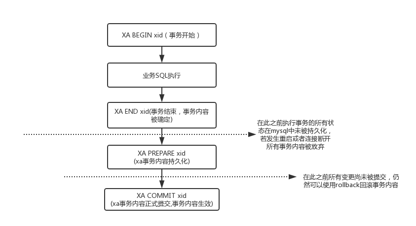

### 2.5.1 XA事务概述

#### 2.5.1.1 XA事务概述

   普通事务只能在单节点内部保证事务的完整性，如果事务要在不同的节点上执行，无法保证数据一致性，具有跨节点的数据一致性要求的场景需要使用2阶段协议实现分布式事务。 
   由于以上普通事务的缺陷所以Dble引入了Mysql的XA事务来解决这个问题，MySQL5.7之前版本的XA事务存在一些问题，启用需要MySQL 5.7版本，否则无法保证数据不丢失。dble提供的分布式事务采用两阶段提交协议，目前还是弱XA事务，不能绝对保证跨节点数据的强一致性。

   1. 事务开始前需要设置手动提交：set autocommit=0;
   2. 使用命令开启XA 事务：set xa=on;
   3. 执行相应的SQL 语句。
   4. 对事务提交或者回滚，事务结束：commit/rollback;      
   
分布式事务的性能开销比较大，所以只推荐在全局表的事务以及其他一些对一致性要求比较高的场景中使用。一般情况下尽量不要在同一个事务中运行跨节点的SQL语句。 dble支持大事务，但一方面大事务会造成事务执行时间上升，事务信息规模扩大，导致系统性能下降；另一方面，大事务也容易造成潜在的事务数据不一致问题。因此，大事务一定要谨慎使用，一般建议单个事务的 SQL 语句不要超过100条。

   以下提供一个JDBC使用XA事务的实例
```
public class XaDemo {
  
    public static final String URL = "jdbc:mysql://localhost:8066/testdb";
                                     //在这里也可以使用jdbc:mysql://127.0.0.1:8066?sessionVariables=xa=1
                                     //进行替代，在这种情况下不需要执行set xa = 1
    public static final String USER = "root";
    public static final String PASSWORD = "123456";
  
    public static void main(String[] args){
        try {
            //1.加载驱动程序
            Class.forName("com.mysql.jdbc.Driver");
            //2. 获得数据库连接
            Connection conn = DriverManager.getConnection(URL, USER, PASSWORD);
            //3.操作数据库，实现增删改查
            Statement stmt = conn.createStatement();
            stmt.execute("set xa = 1");
            //开始一个xa事务
            stmt.execute("begin");
            try {
                //执行相关数据操作的时候需要对于可能出现的错误进行catch
                //并在错误出现的时候对于整个事务进行rollback
                stmt.execute("insert into xa_test set id = 11,name = '3333'");
                stmt.execute("insert into xa_test set id = 22,name = '333'");
                stmt.execute("insert into xa_test set id = 3,name = '33'");
                //数据执行完成提交
                stmt.execute("commit");
            }catch (Exception e){
                System.out.println(" error "+e);
                //如果在数据操作的时候出现错误，将整个事务的操作回滚
                stmt.execute("rollback");
            }finally {
                stmt.close();
                conn.close();
            }
  
        }catch(Exception e){
  
        }
    }
}
```

#### 2.5.1.2 XA事务的基础
 　 xa事务基于mysql5.7的xa事务的特性，其流程和特性由以下图所示：  
 
    

