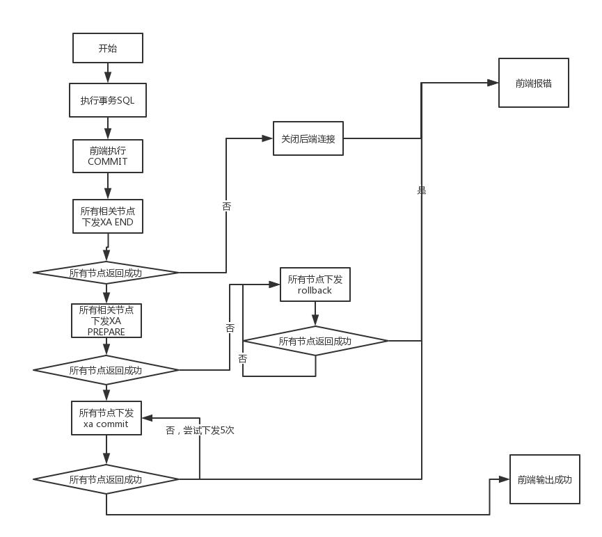
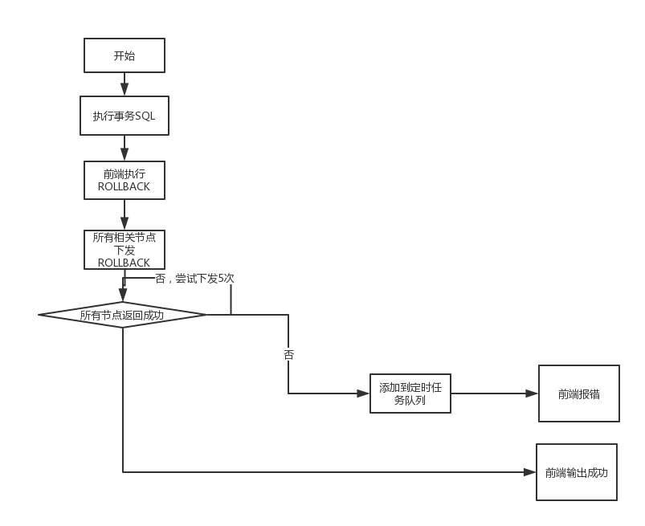

###  2.5.2 XA事务的提交以及回滚
####  2.5.2.1  XA事务的提交

在Dble中采用二段提交的方式对于XA事务进行提交
具体的逻辑可见下图  

 

整体来说的处理原则如下：
 1. 将XA事务的提交分为END PREPARE COMMIT三个部分
 2. 如果在PREPARE下发之前有节点失败或报错，关闭所有后端连接放弃事务数据
 3. 如果在PREPARE下发过程中发生失败，则回滚事务，所有节点下发ROLLBACK
 4. 如果在COMMIT节点发生失败，则尝试重新下发，几次尝试未果将事务交给定时任务来继续重试

####  2.5.2.2  XA事务的回滚
  相对来说回滚的逻辑就容易的多，直接在所有节点下发rollback，如果发现下发失败那么就继续执行5次，不行再交给定时任务一直重试  
  
 

