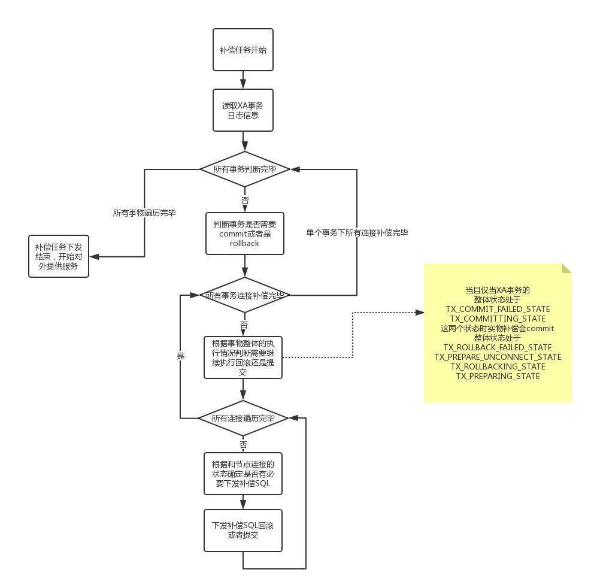

### 2.5.3 XA事务的后续补偿以及日志清理

#### 2.5.3.1  XA事务的补偿逻辑
由于XA事务是通过多次提交来达成最终的提交和回滚的，所以就会出现由于服务下线或者其他原因导致的提交或是回滚任务被执行了一半
在这种情况发生的时候dble通过XA事务记录的日志进行日志的处理以及补偿
详细通过在dble重启的时候在重启之前对于XA日志进行读取，并根据里面的内容对于XA事务进行回滚或者补偿
具体的补偿流程如下图所示：
 
注：XA事务的补偿不保证所有事务都能在补偿期间正确提交，若补偿期间依然因为SQL执行造成失败，只会在dble普通日志中体现或者告警（如果有配置告警功能）

#### 2.5.3.2  XA事务的日志清理逻辑（xaLogClean）
xa事务的日志只保存最近一段时间的，所以需要有定期的清理已经正确提交或者是正确回滚的日志数据
会根据server.xml中的配置信息xaLogCleanPeriod定时将没有后续作用的数据做清除

#### 2.5.3.3  XA事务定期连接检查（xaSessionCheck）
在dble提供服务期间如果发生commit(狭义commit,特指XA事务中prepare之后的commit动作)失败或者是rollback失败，那么失败的事务将被存储到内存队列中
并且进行定时的提交或回滚，直到事务被正确的提交或回滚
这是由于在xa事务的逻辑中prepare全部完成之后的事务已经都被成功持久化，仅需要提交即可

