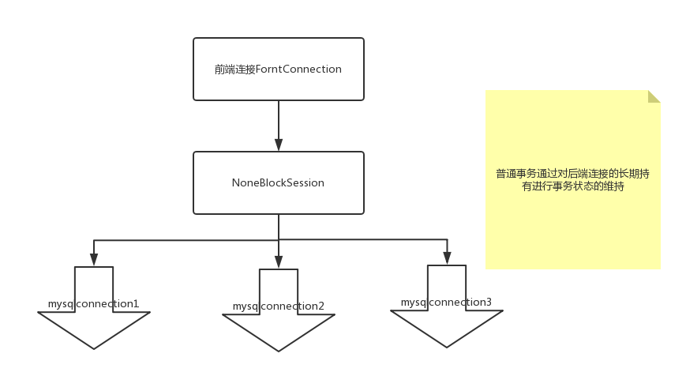

### 2.5.5 一般分布式事务概述
   在分布式事务中整体的逻辑和mysql的事务逻辑类似，通过长期持有的连接来进行，每个前端连接frontconnection对应一个session，在dble的每个session中有对应的事务状态以及session所持有的后端连接集合target，在非事务状态下或者是autocommit状态下每次后端连接被使用完毕之后就会被移除target并释放回空闲连接池，但是在事务开启的状态下，在SQL执行完毕的时候connection会在target中长期储存，直到session发起commit或者是rollback。

   综上我们可以看到，Dble中的普通分布式事务其实就是后端mysql事务的集合，并且这个事务是没有文件记录的，由于mysql的事务特性在事务发生的过程中若断开连接等同于放弃事务，所以可能出现在commit的过程中由于各种意外情况导致事务的部分提交，例如连接后端四个节点dn1,dn2,dn3,dn4在提交commit进行依次下发的时候dn1,dn2,dn3都提交成功，但是dn4由于网络意外提交失败，导致了预期执行的部分内容丢失，并且由于dn1,dn2.dn3已经提交成功无法进行数据回滚，只能进行人工的数据补偿。

   其逻辑图如下：  
   
   : 

