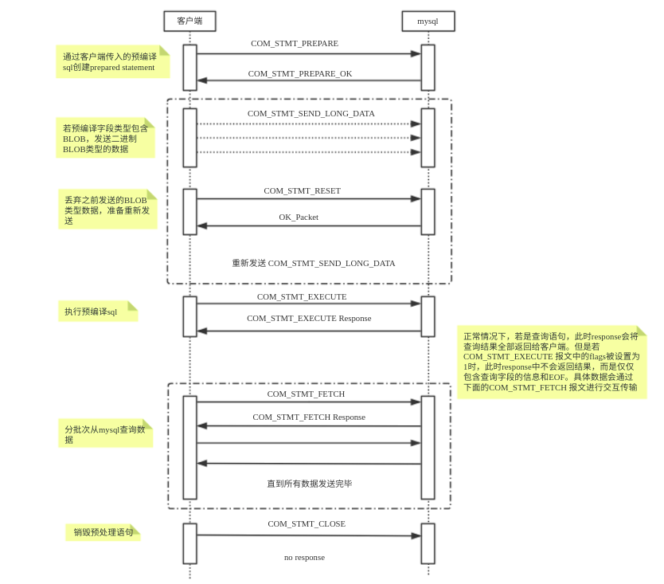
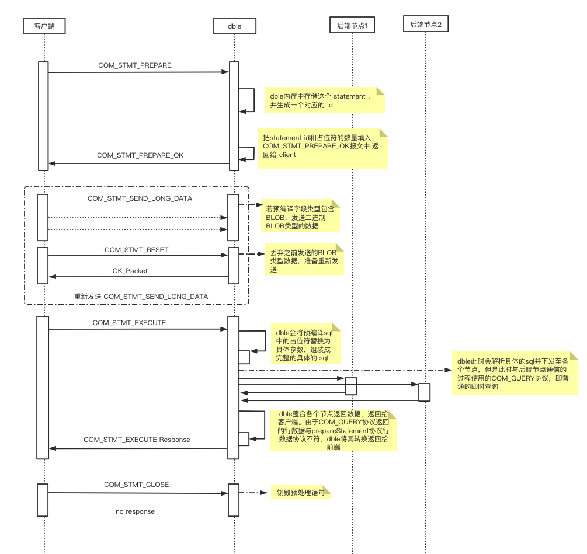
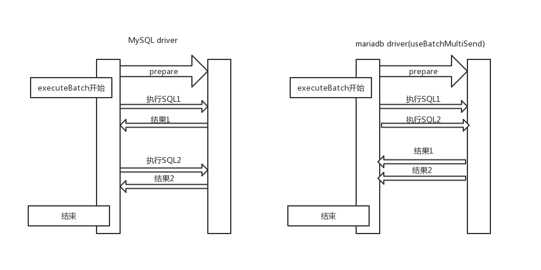

## 4.4 二进制协议 (Prepared Statements)

### 4.4.1 Supported  

* COM\_STMT_CLOSE  
Closes a previously prepared statement.  
* COM\_STMT_EXECUTE  
Executes a previously prepared statement.  

* COM\_STMT_RESET   
Resets a prepared statement on client and server to state after preparing.   
* COM\_STMT\_SEND\_LONG_DATA  
When data for a specific column is big, it can be sent separately.  

* COM\_STMT\_PREPARE  
  Prepares a statement on the server
  
  NOTICE: Although COM_STMT_PREPARE  works , but it will not do pre-compile .

* COM\_STMT_FETCH  
  Fetches rows from a prepared statement

### 4.4.2 MySQL Flow

注意点：

- 可通过url方式指定useCursorFetch=true，开启分批从server查询数据。
- 但是jdbc中默认fetchSize为0，jdbc中必须fetchSize > 0才会发送fetch包分批查询数据，否则和普通prepareStatement没有区别。

### 4.4.3 Dble Flow

### 4.4.4 额外限制

在使用mariadb-java-client版本1.5.0及以上版本连接dble的时候，executeBatch使用的时候存在注意事项，需要禁用driver的useBatchMultiSend选项，否则会出现不固定的错误  
原因是在mariadb-java-client版本1.5.0及以上版本中添加了一个新的优化功能useBatchMultiSend，具体的优化在executeBatch的时候driver在未收到上一条数据执行结果的情况下提前下发后续的执行语句，这个优化与当前版本的dble内部实现不兼容  
大致情况如下图所示：  

原文详情: https://mariadb.com/kb/en/library/option-batchmultisend-description/

