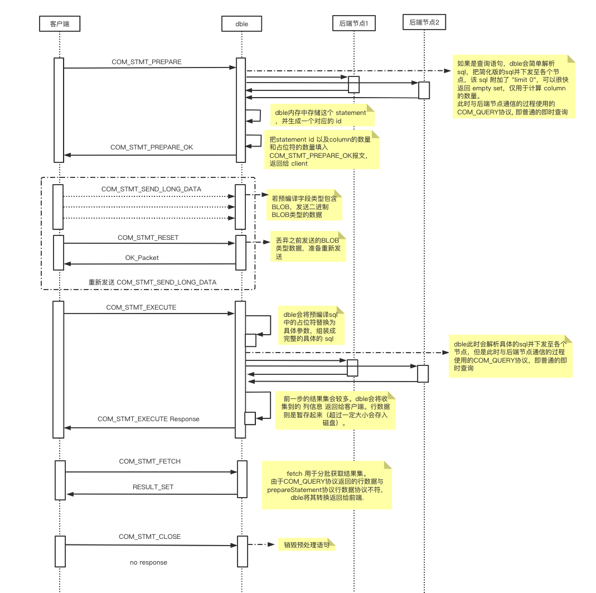

## 4.4 预编译语句 (Prepared Statements)


### 4.4.1 开启方式
**客户端**
- 如果是jdbc需开启useServerPrepStmts，此时才会使用 server-side prepare，否则属于 client-side prepare。
- 其他语言的 driver通常不用配置选项。

**验证是否开启了**

只提供 java 版本的
``` java
PreparedStatement preparedStatement = con.prepareStatement("select t1.id from no_sharding_t1 t1 where t1.id=?"); //可用于验证是否使用了dble 侧 prepare assert preparedStatement instanceof ServerPreparedStatement;
```

### 4.4.2 使用方式
和直连 mysql 一样


### 4.4.4 分类
- server-side prepare：通过 client发送 PS 协议的报文给server，由 server来完成拼装参数、优化、执行。 
- client-side prepare : 由 client 来实现 PS 接口，prepare 阶段完成拼装参数，拼装完后，一次性发送 即时 SQL给 server，由 server 来完成优化、执行。这本质上是一个伪预编译，上述的 ”省去了每次都要解析优化的过程“ 这个优点无法实现。


### 4.4.5 MySQL流程


注意点：

- 可通过url方式指定useCursorFetch=true，开启分批从server查询数据。
- 但是jdbc中默认fetchSize为0，jdbc中必须fetchSize > 0才会发送fetch包分批查询数据，否则和普通prepareStatement没有区别。

### 4.4.6 Dble流程


可以看到  client <-> dble 通讯使用了 server-side prepare，dble  <-> mysql 通讯使用了 client-side prepare，也就是说后端通讯和普通的即时查询无异，只是需要做一些协议上的包上的转换。


### 4.4.7 通讯协议介绍

* COM\_STMT_CLOSE  
  Closes a previously prepared statement.
* COM\_STMT_EXECUTE  
  Executes a previously prepared statement.

* COM\_STMT_RESET   
  Resets a prepared statement on client and server to state after preparing.
* COM\_STMT\_SEND\_LONG_DATA  
  When data for a specific column is big, it can be sent separately.

* COM\_STMT\_PREPARE  
  Prepares a statement on the server
  > NOTICE:  Although COM_STMT_PREPARE  works , but dble will not do pre-compile .

* COM\_STMT_FETCH  
  Fetches rows from a prepared statement


### 4.4.8 Dble 游标

> 不支持读写分离场景

#### 4.4.8.1 游标分类
- server-side  cursor：server把结果集暂存起来，维护一个游标，client 根据需要读取指定的行数
- client-side cursor: client 从 tcp 层面 控制报文的读取，当报文较大时暂停读取 socket。(不推荐，因为server 需要等待所有数据发送给 client 后，才能释放资源。）
- 另一种 client-side cursor：client 把所有结果集读取到本地缓存，client每次从缓存读取指定行数（不推荐，本质上是个伪 cursor，只实现了 cursor API。并且在数据量较大时很容易撑爆 client 的内存）
#### 4.4.8.2 游标开启必要条件
**DBLE 端**

- 如果版本<3.21.02, 不支持。
- 如果版本=3.21.02,无需设置
- 如果版本>3.21.02,需在 bootstrap.cnf开启-DenableCursor=true

**客户端**

1. 使用支持游标的driver（mysql官方的jdbc driver就支持）
2. 如果是jdbc需开启useServerPrepStmts和useCursorFetch选项
3. 执行 prepareStatement 后设置 fetchSize，必须大于 0.
4. 执行 execute

此时是开启游标的，如果对结果集 resultSet进行遍历，会按 fetchSize 的大小一次次地从 dble 取回数据。

**验证是否开启了游标**

客户端执行第4步后, 调用私有方法 useServerFetch 可验证。

``` java
final ResultSet resultSet = preparedStatement.executeQuery();
//可用于验证是否使用了server-side 游标
Method method = com.mysql.cj.jdbc.StatementImpl.class.getDeclaredMethod("useServerFetch");
method.setAccessible(true);
Boolean useServerFetch = (Boolean) method.invoke(preparedStatement);
assert useServerFetch==true;
```


#### 4.4.8.3 Dble Server-side Cursor Flow



原理：

1. prepare阶段下发特殊语句。用于计算sql 中的列数，这是client 所需的开启游标的必要条件。
2. execute阶段把结果集存储到临时文件
3. fetch阶段把结果集分批次一次次取出来

#### 4.4.8.4 相关参数
- maxHeapTableSize
- heapTableBufferChunkSize

见文档 https://actiontech.github.io/dble-docs-cn/1.config_file/1.02_bootstrap.cnf.html

